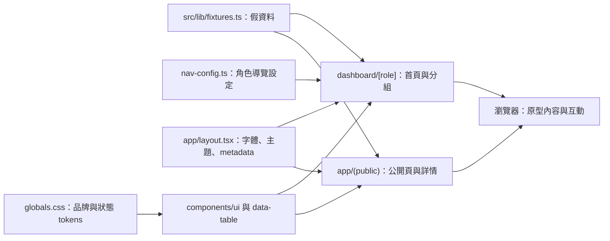
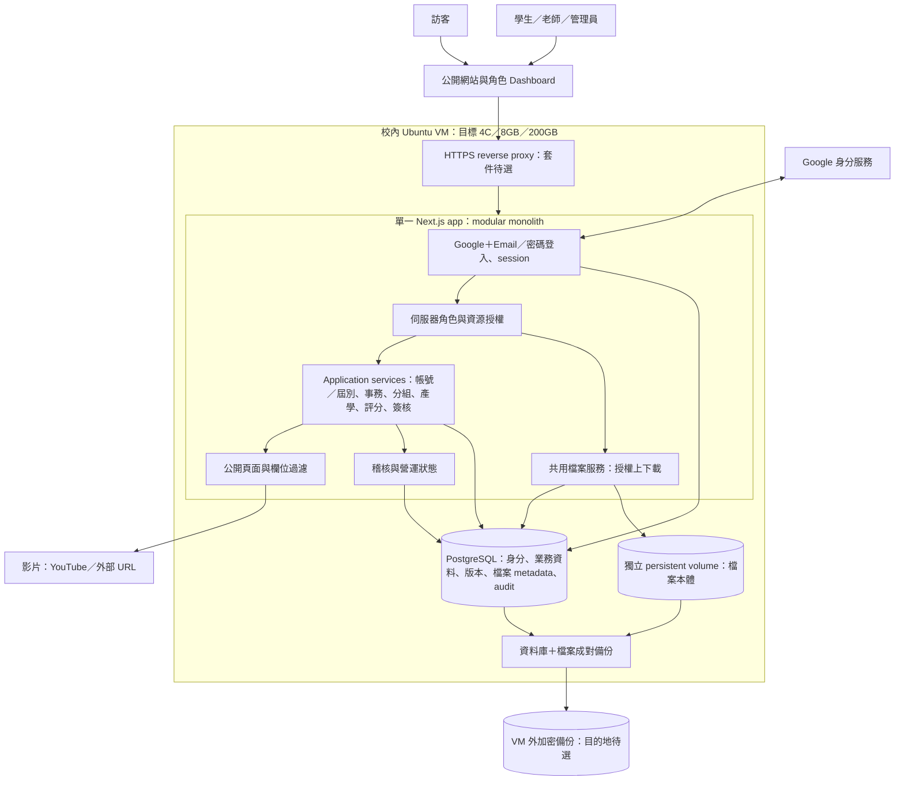
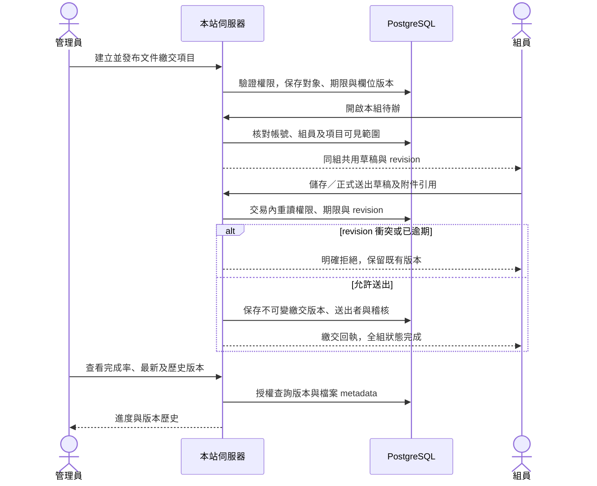
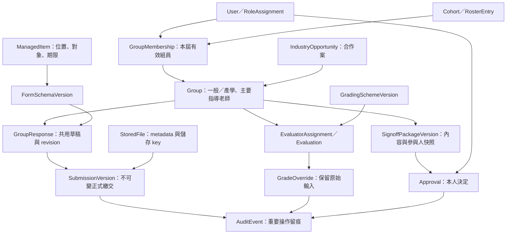
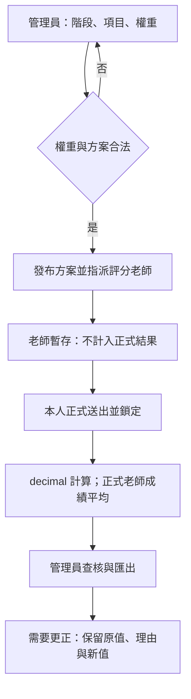
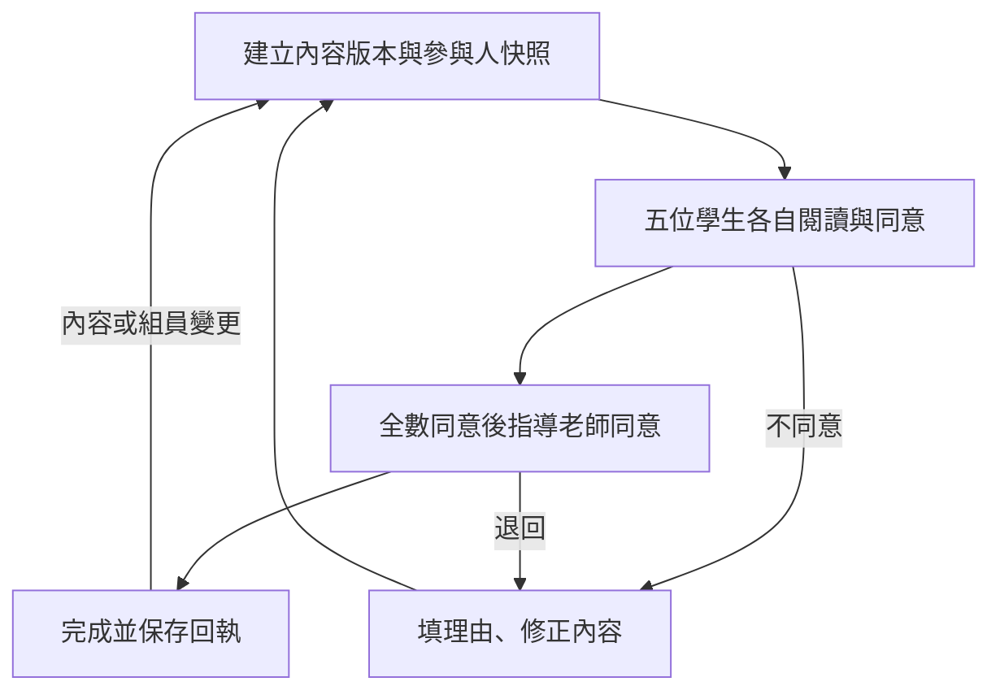
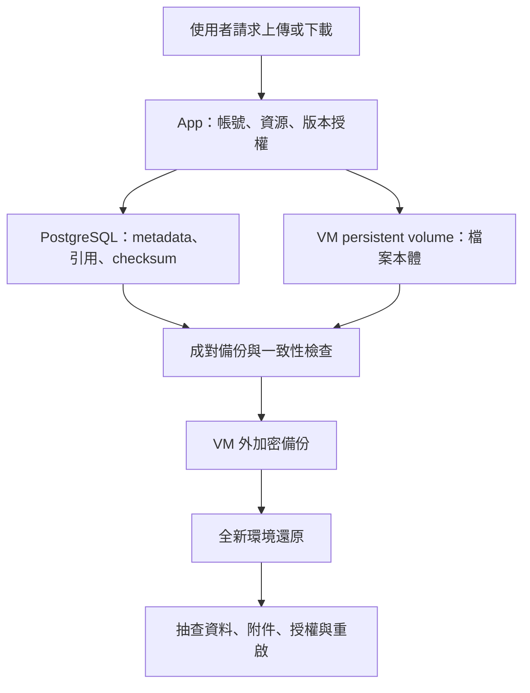

> 2026-09-12 文件鏡像（第三輪）。編輯來源：[Vault 正文](</Users/lubaiyu/Documents/roy422的人生online/專案/🌐 網站與互動/📁 輔大資管系專題網站/🛠️ 工程開發/🏗️ 系統架構與資料流.md>)。連結已轉為 repo 路徑，未鏡像的檔案指向 Vault。工程母 spec v3.3（依 Codex 第二輪 RR01–RR12 修訂），整套工程文件待 Roy 與 Codex review；同版文件以文件 PR 收錄，母 spec issue #6 串起十份子 spec review issue 與五份契約。

# 🏗️ 系統架構與資料流（工程母 spec v3.3）

> **狀態（2026-09-12 v3.3）**：v3.3 依 Codex 第二輪審查（RR01–RR12 與六個小項）修正：逐表權限矩陣（4.6、契約 01 §5）、資料字典欄位錯配與九張輔助表逐欄（子 spec 附錄 A）、切片出場與年度案例 PASS 分界（§5、切片總圖）、主線 S02 改密碼註冊（P02）、簽核只失效不自動建版（4.7、模組 07）、公開授權涵蓋範圍（4.13、模組 07／09）、分支劇本前置（B01–B07）、撤權與 worker 順序（B07）、S01 最小檔案能力（4.14）、評分預覽 basis_hash（4.7、模組 06）、副本一致性窗口（4.16、SOP 04）、Server Action 邊界（4.3、契約 02）；整套仍待 Roy 與 Codex review，review 通過前不拆 ticket。v3.2 修 Codex 對 v3.1 的兩點（簽核版本內容與狀態分表、附錄 B 改歷史參考）並作為整套契約與子 spec 修訂的基準；依 Codex v2 審查（R01–R17）與 Roy 同日指示改寫；v3.1 修正 Roy 對 v3 的五點（DB 權限矩陣、pending 與必須改密的重新登入路徑、責任表補新表並移回正文、CSP 選項比較、測試接縫的決策狀態）；沿用 to-spec 的七段結構（Problem、Solution、User Stories、Implementation Decisions、Testing Decisions、Out of Scope、Further Notes）落在這一份既有文件，**不另生第二份母 spec**。這是唯一的工程母 spec；五份共用契約與十份子 spec 隨後依本文修訂；切片圖與 SOP 保留並依本文核對。全部仍是「文件已寫、待 review」：正式碼 `web/` 不存在，149 個產品案例全部 NOT_RUN，沒有任何功能、保存、權限、VM、部署或校方驗收通過。產品規則與案例 ID 只在 [🎯 專案目標](<product/🗺️ 專案目標與產品規劃.md>)；校方待辦在 [校方確認清單](<product/💬 討論與決策/2026-09-12 校方確認清單.md>)。2026-09-07 原稿保留在文末附錄，只作歷史閱讀。

## 0. 這份文件是什麼、不是什麼

- **母 spec** 回答全案的問題、範圍、整體流程、架構依賴、模組邊界、跨模組不變量、交付與測試策略、決策與風險。它不重抄十張資料字典、每個 UI 欄位或每條 SOP 命令。
- **MOC／文件索引**（Vault [🗺️ 開發工作台](</Users/lubaiyu/Documents/roy422的人生online/專案/🌐 網站與互動/📁 輔大資管系專題網站/🛠️ 工程開發/🗺️ 開發工作台.md>)、repo `docs/README.md`）只回答文件在哪、閱讀順序、目前狀態、誰是來源、未決與 Gate；不承擔第二份架構或資安正文。
- **共用契約 01–05** 是所有模組必須一致的資料、介面、安全、測試、部署規則；**子 spec 01–10** 寫各模組的使用者工作、規則、狀態、用例、資料所有權、授權、介面與具體驗收；**切片圖與 SOP** 分別核對依賴與說明人怎麼操作；正式 ticket 等 review 後再拆。
- 沿用既有文件：本輪只補正文與修正矛盾，不搬家、不改名、不刪歷史；被取代的段落標明取代關係。

## 1. Problem Statement

系上專題一年要跑完註冊、分組、找指導老師、繳交、評分、簽核、成果公開與封存。舊網站入口難找、帳號靠 LDAP 快照、文件靠 Email 與 Google Form、成績靠人工搬 Excel、簽核靠紙本，且校方無法掌握資料與檔案。學生不知道現在該做什麼，老師找不到自己該評與該簽的東西，系辦在多個不一致的頁面之間來回；任何人都不容易追查「誰在什麼時候交了什麼版本、誰同意過哪一版」。

工程要解決的不是「做出十個功能」，而是讓同一批資料在整個年度裡保持一致：身分與資格只有一份真相、每次正式動作都有不可變版本與可讀回執、每個讀寫都在伺服器依當下事實授權、時間到了該發生的事會可靠發生、失敗與重試不會製造重複或假成功、資料與檔案留在校方的 VM 並可還原。

## 2. Solution

一個校方 VM 上的 Next.js modular monolith（PostgreSQL、檔案 volume、Caddy、Docker Compose；另跑同映像的 worker 與一次性 migrate 容器），十個業務模組共用一套身分、屆別、事件、稽核與檔案基礎，沿著產品的年度主線串起來：

只 seed 管理員 A1 → A1 建屆別、匯入名單、建老師 → 學生註冊、系辦核實核准 → 個人收件（意向、出席）→ 提案逐人確認成組、例外組 → 老師認領或系辦指派主指導、合作案連結 → 發布公告與收件 → 組別共用草稿、上傳、正式送出、重送、指定重開 → 評分方案、指派、暫存、正式、更正 → 簽核版本逐人同意、老師最後同意 → 精選成果依授權公開 → 封存、下一屆隔離。每一步都留下不可變版本、回執、稽核與事件；通知、日曆、彙整與截止處理由事件表與到期工作表驅動，不由畫面直接寫。

使用者看到的是：學生首頁一眼知道現在階段與待辦，老師只看到自己該指導、該評、該簽的組，系辦在同一個工作台完成發布、審核、指派與查歷史，訪客不用登入就找到消息與成果。

## 3. User Stories

編號 US-xx 是本文的故事編號，只用於工程對照；產品驗收仍以 149 個案例 ID 為準，故事後面括號列它主要對應的案例。故事描述使用者要完成的工作，不等於案例本身；一個故事可對應多個案例，一個案例也可能服務多個故事。

**訪客**

1. 身為訪客，我想不用登入就看到最新公告、專題規則、優秀專題與榮譽，這樣我能找到系上的專題資訊（SHW-01、SHW-05、SHW-10）。
2. 身為訪客，我不應看到產學合作、歷屆一覽、任何組別文件或個資，這樣私有內容不會外洩（SHW-02、GRP-08）。

**學生**

3. 身為新生，我想用 Google 或 Email 密碼註冊，並在等待審核頁看到目前狀態、退回理由與下一步，還能修正打錯的學號，這樣我不用跑系辦（ACC-02、ACC-03、ACC-17）。
4. 身為已核准的學生，我想在登入後把另一種登入方式連結到同一個帳號，並知道別人不能搶綁我的 Google 身分，這樣我下次用哪種方式都回到同一個我（ACC-13、ACC-16、ACC-18）。
5. 身為學生，我想改手機與聯絡 Email，但學號與屆別由系辦維護，這樣資料正確又不會被誤改（ACC-11）。
6. 身為學生，我想在首頁看到現在是哪個階段、本組完成了什麼、接下來的截止與活動，這樣我知道該做什麼（COH-04、NTF-13）。
7. 身為未分組學生，我想開關「公開找組員」，只讓同屆看到我的姓名、學號與聯絡 Email，這樣我能找到組員又不外洩電話（GRP-01）。
8. 身為組長，我想發起五人提案，讓每位組員各自確認；有人拒絕或逾期時整份提案作廢並釋放大家，我能重新發起，這樣不會卡住半套組（GRP-03、GRP-04、GRP-12）。
9. 身為學生，我想在成組前填個人收件並在截止前重送，這樣意向與出席能反映最新想法（SUB-01、SUB-19）。
10. 身為組員，我想和同組共用一份草稿，別人先存時我看得到衝突而不是被無聲覆蓋，這樣我們不會互相蓋掉內容（SUB-05、SUB-06）。
11. 身為組員，我想上傳 PDF 並看到進度與清楚的拒絕理由，這樣我知道檔案是否真的存好（SUB-07、FIL 上傳案例）。
12. 身為組員，我想正式送出後拿到含版本、時間、送出者的回執，全組同時看到已繳，這樣我們確定交了（SUB-08、SUB-14、SUB-18）。
13. 身為組員，當送出時斷線，我想用同一個請求查回結果或安全重送，不會產生兩個版本，也不會被騙說沒送出（SUB-15、SUB-16）。
14. 身為組員，我想看歷史版本與每版附件，知道現在採計的是哪一版（SUB-09、SUB-10）。
15. 身為被移出組別或組別已解散的學生，我想唯讀看到自己送過的正式版本與附件，但拿不到目前項目與他人資料（SUB-25、GRP-20）。
16. 身為學生，我想在簽核頁讀全文、看附件版本，按同意或填理由不同意；版本被取代時我的舊頁不能誤簽（SGN-02、SGN-05、SGN-09）。
17. 身為學生，我想在通知匣看到跟我有關的收件、期限、重開、輪到我同意，已讀跨裝置保存；失權後舊通知不再露出內容（NTF-02、NTF-04、NTF-05、NTF-08、NTF-14、NTF-20）。
18. 身為學生，我想在 360 px 手機上完成核心流程並能用鍵盤操作（SHW-08、SHW-09）。

**老師**

19. 身為被預授權的老師，我想第一次登入補姓名與聯絡資料就開始使用，不需學號（ACC-07）。
20. 身為老師，我想認領尚未指派的產學組，兩人同時按時只有一人成功且另一人得到明確訊息（GRP-09、GRP-10）。
21. 身為老師，我想建立、發布、下架自己的合作案，公司聯絡資料只有我和系辦看得到（GRP-08、GRP-15、GRP-19）。
22. 身為主指導，我想看我指導組別的繳交矩陣與同一版本內容，但看不到不是我的組（SUB-10、SUB-17）。
23. 身為受指派的評分老師，我想暫存再正式送出，正式後鎖定；被退回時看到理由並重送（GRD-03、GRD-04、GRD-07）。
24. 身為主指導，我想在全體組員同意後最後同意，提前按會被拒（SGN-03、SGN-04）。
25. 身為主指導，我只在管理員明示開放且學生填寫前已被告知的個人收件裡看到正式回答，換老師後我看不到（SUB-24）。
26. 身為老師，我不應以任何方式取得非指派組別的評分或私有繳交（GRD-02、GRD-12）。

**管理員（系辦）**

27. 身為 A1，我想建立屆別、階段開始日、年度結束日與獨立活動，並設定預設工作屆別與開放註冊屆別（COH-01、COH-02、COH-03）。
28. 身為系辦，我想匯入名單 CSV，先看到有效、重複、缺欄的預覽再匯入（ACC-01）。
29. 身為系辦，我想在待審清單看到名單比對結果與 Email 相同或不同，選核實方式核准或填理由退回；學生在我核准前改了資料，我必須重新載入（ACC-02、ACC-04、ACC-05、ACC-17）。
30. 身為系辦，我想停用帳號並立即讓其舊 session 失效，發一次性臨時密碼並要求對方改密；秘密不會留在任何紀錄裡（ACC-08、ACC-09、ACC-14）。
31. 身為系辦，我想建立例外組並記錄核可依據與組長，測試環境的模擬核可資料要明確標示（GRP-06）。
32. 身為系辦，我想逐組或批次指派主指導、重派並看到影響，重派時勾選是否連動評分指派（GRP-07、GRP-11、GRP-17）。
33. 身為系辦，我想換成員、換組長、解散組別，先看影響預覽，歷史快照保留，既有簽核版本失效、由系辦建立新版重簽（GRP-13、GRP-18、GRP-20、SGN-09）。
34. 身為系辦，我想在同一個工作台快速建立、完整編輯、發布公告、資源與個人或組別收件，發布檢查會擋掉空收件與錯誤日期（PUB-01–PUB-14）。
35. 身為系辦，我想看每個收件的目前名單、免填、已移出與加入時間，並能免填、移出、加回、對個別人或組指定重開（SUB-02、SUB-12、SUB-20–SUB-23）。
36. 身為系辦，我想看截止當刻的名單與完成率快照，之後的補交另列不覆寫（SUB-21）。
37. 身為系辦，我想設評分方案、要求份數與指派；改派時逐筆選保留、替換或新增；更正保留原值並在基礎改變時進入待復核（GRD-01、GRD-02、GRD-08、GRD-13、GRD-15）。
38. 身為系辦，我想建立簽核版本、看缺誰、重開或作廢，並匯出可列印頁與 CSV（SGN-01、SGN-08、SGN-11）。
39. 身為系辦，我想在授權涵蓋、素材已核可、個資檢查通過後才發布精選成果，授權失效時立即不可公開（SHW-03、SHW-06、SHW-11）。
40. 身為系辦，我想封存屆別前看到未完成清單，封存後只讀，必要時填理由解封；下一屆與舊屆並行不混（COH-05、COH-06、COH-09）。
41. 身為 staging 管理員，我想把業務日期撥到任何時刻並留紀錄，驗證截止前後行為，正式環境沒有這個入口（COH-10）。
42. 身為系辦，我想匯出帳號、分組、成績，且學生永遠拿不到分數（ACC-15、GRP-16、GRD-10、GRD-11）。
43. 身為系辦，我想在儀表板看到真實的最近備份、還原演練、儲存用量與 worker 狀態；備份失敗才通知我（FIL 案例、NTF-18）。

**Roy 與維運**

44. 身為維運者，我想一條命令部署、失敗自動回到前一版，且部署後能確認 app、worker、schema 都是預期版本（SOP 03）。
45. 身為維運者，我想每日 DB 備份到異地並定期在隔離環境還原演練，報告寫明附件不在範圍（SOP 04）。
46. 身為維運者，我想在 health、磁碟、備份、worker 異常時收到告警（SOP 05）。
47. 身為 Roy，我想在 staging 轉正式時知道清除範圍、備份與放行條件（SOP 06）。

**校方與驗收**

48. 身為系辦或主任，我想清楚知道要提供哪些名單、素材、核可與 SOP，以及未提供時系統怎麼過渡（校方確認清單）。
49. 身為 Codex，我想只 seed A1 就從介面跑完整年度，並對每個重要動作留下 UI、操作邏輯、持久化、授權四欄證據（契約 04、操作手冊）。

## 4. Implementation Decisions

### 4.1 範圍與環境

| 項目 | 決定或事實 | 來源 |
|---|---|---|
| 程式位置 | 正式碼 `web/`（目前不存在），與 `prototype/` 並列；原型是固定參考 | 9/11 定案 |
| 部署形態 | 單一 Next.js modular monolith；Compose 服務 `app`、`worker`、`migrate`（一次性）、`postgres`、`caddy`、`backup` | ADR 0001、0004、0005（proposed） |
| VM | `140.136.155.167`，Ubuntu 24.04.4，4 核、7.8 GB、磁碟 97 GB（可用 85 GB）；**2026-09-11 快照，未重驗** | 📍 目前進度 |
| 環境 | local、staging（現階段唯一 VM）、production（同 VM 經 SOP 06 切換）；模擬業務日期只在 staging | 契約 05 |
| 網域與 TLS | 暫用 `fju.roy422.dev`；正式網域待校方 | TBD-01 |
| 身分 | Google OAuth＋Email／密碼，Better Auth；首次註冊一律人工核准 | ADR 0004、Q-ACC01 |
| 延後 | Email 寄送、自助重設、Google Calendar／.ics、匿名信箱 | 產品總規格 §1 |
| 備份 | DB 每日加密到 R2 保留 30 天；本機快照 7 天；附件無異地（已接受） | 產品總規格 §6 |
| 監測 | health cron、磁碟 80%、備份失敗、worker 停擺 | 契約 05 |

### 4.2 技術棧

Next.js 16.3.x（App Router）、React 19、TypeScript 5、Tailwind 4、shadcn（base-nova）＋Base UI、TanStack Table、Zod 4、Tiptap；Better Auth 1.7.x（Drizzle adapter、admin plugin、Google provider，安裝時 pin 版本）；PostgreSQL 16、Drizzle ORM 與 drizzle-kit 純 SQL migration；`decimal.js` 為 domain 唯一外部套件；Caddy；Docker Compose；ESLint 9（`eslint-plugin-boundaries`、`no-restricted-imports`、`import/no-cycle`）、`server-only`、Vitest、Playwright、pnpm。版本以 lockfile 為準；本地 Next 文件優先於訓練知識。

### 4.3 四層架構與可執行的依賴規則

```
web/src/
  domain/<module>/         純 TypeScript：實體、值物件、不變規則、領域錯誤；index.ts 公開入口
  application/<module>/    用例、port 介面、DTO、錯誤碼、授權政策；index.ts 公開入口
  infrastructure/          Drizzle schema／repository、Better Auth 設定、檔案儲存、worker、Clock
  app/                     Next App Router：routes、actions.ts、Route Handlers、UI
  composition/             組裝根（server-only）：注入 infrastructure 到 application
  shared/                  純型別與工具：ID、Result、錯誤碼、臺灣時間演算
```

| 層 | 可以引用 | 不可以引用 |
|---|---|---|
| domain | 本模組 domain、`shared`、他模組 domain 公開入口（type-only） | 其他層、任何框架；外部套件只有 `decimal.js` |
| application | 本模組 domain 與 application、`shared`、他模組 application／domain 公開入口（type-only） | infrastructure、app、composition、Next、Drizzle、Better Auth |
| infrastructure | domain 與 application 公開入口（實作 port）、`shared` | app、composition |
| app（server） | `composition`、application 公開入口（type-only）、`shared` | infrastructure 直接引用；重寫任何領域判斷 |
| app（client，`'use client'`） | 同功能目錄的 `actions.ts`（檔頭 `'use server'`，只匯出 async Server Functions，Client 拿到的是遠端參照）、application 的 DTO 型別（type-only）、`shared` 純型別、UI 套件 | `composition`、infrastructure、任何 `server-only` 檔 |

規則落實：跨模組執行期呼叫一律透過 composition 注入的 port 實例；`boundaries/element-types`、`boundaries/no-private`、`boundaries/entry-point`、`no-restricted-imports`、`import/no-cycle`；`composition/*`、`infrastructure/**` 檔頭 `import 'server-only'`；`app/**/actions.ts` 檔頭是 `'use server'` 指令（不是 `server-only`），只允許匯出 async 函式，函式內才引用 `composition`；lint 對「Client 匯入 `actions.ts`」採明確例外（compiler 把匯出轉成 Server Action 參照），其餘 `server-only` 模組流入 Client 一律擋下，`lint-fixtures` 各放一個合法例（Client 表單呼叫 Action）與反例（Client 直接匯入 composition）；`web/lint-fixtures/` 放七個反例與三個合法例並以測試斷言結果；`dependency-cruiser` 產生依賴圖存證。路徑統一 `web/src/app`。真正的驗收是：反向 import 被 lint 擋、command 共用同一 UoW、失敗時跨模組副作用一起回滾、UI adapter 不繞過用例寫 DB。

### 4.4 模組邊界、資料所有權與資料字典政策

十個模組沿用產品編號；每張表只有一個擁有模組；跨模組讀走 query port、跨模組變更走 command port，都在同一個 UoW 內。現行責任表如下（附錄 B 的舊表只作歷史）；4.5 新增的占用表、4.13 的外部授權表、4.7 的評分頭列調整已納入。

| 模組 | 擁有的資料（主要表） | 對外提供的 port | 依賴（只透過 port） |
|---|---|---|---|
| 01 帳號與權限 | Better Auth 的 `users／accounts／sessions／verifications`（業務擴充欄 `status`、`must_change_password`）；`user_profiles`、`registration_applications`、`application_revisions`、`roster_versions`、`roster_entries`、`role_assignments`、`user_status_events`、**`student_identities`（有效學號占用）** | `ActorResolver`、`UserDirectoryQuery`、`EligibleStudentsQuery`、`RegistrationCommand`、`AccountCommand`、`SelfAccountCommand`、`RosterCommand` | 02（開放註冊屆別）、08、10 |
| 02 屆別與年度流程 | `cohorts`（狀態、預設工作、開放註冊、年度結束日）、`cohort_stages`、`project_events`、`business_clock_overrides`、`cohort_status_events` | `BusinessClock`、`CohortStatusQuery`、`StageQuery`、`CalendarSourceQuery`、`CohortCommand` | 05／06／07 的 `UnfinishedWorkQuery`、10 |
| 03 分組、指導與產學 | `group_proposals`、`proposal_invitations`（歷史）、**`proposal_occupancy`（開放提案占用）**、`groups`、`group_memberships`、`group_leaders`、`advisor_assignments`、`industry_opportunities`、`opportunity_links` | `GroupCommand`、`OpportunityCommand`、`GroupMembershipQuery`、`AdvisorQuery`、`GroupLifecycleQuery` | 01、02、05（`freezeForDissolution`）、06（`applyAdvisorReassignment／stopForDissolution`）、07（`supersedeForParticipantChange／voidForDissolution`）、08、10 |
| 04 專題事務發布與編輯 | `managed_items`、`item_audience_groups`、`item_versions`、`form_schema_versions`、`item_attachments`、`item_publications` | `ItemCommand`、`ItemQuery`、`AudienceResolver`、`ReceiverResolver` | 01、02、03、05（`buildRoster／applyAudienceChange`）、08、10 |
| 05 個人與組別繳交 | `response_rosters`、`roster_snapshots`、`snapshot_annotations`、`drafts`、`submission_versions`、`submission_files`、`targeted_reopens`、`advisor_visibility_settings` | `SubmissionCommand`、`SubmissionQuery`、`CompletionQuery`、`UnfinishedWorkQuery` | 01、02、03、04、08（含 `due_work(snapshot_reconcile)`）、10 |
| 06 評分與成績 | `grading_schemes`、`grading_scheme_versions`、`stage_requirements`、`evaluator_assignments`、`evaluations`、**`evaluation_status`（含 `assignment_id`，部分唯一 `state='counted'`）**、`evaluation_status_events`、`grade_overrides`、`override_review_state` | `GradingCommand`、`GradingStatusQuery`、`AssignmentsForTeacherQuery`、`UnfinishedWorkQuery` | 01、02、03、08、10 |
| 07 線上簽核 | `signoff_packages`（頭列）、`signoff_package_versions`（不可變內容：全文、checksum、附件版本、參與者集合）、**`signoff_version_status`（可變狀態頭列：collecting／teacher_pending／complete／revision／superseded／void）**、`approvals`、`signoff_exports` | `SignoffCommand`、`SignoffStatusQuery`、`PublicationAuthorizationQuery`、`UnfinishedWorkQuery` | 01、02、03、08、10 |
| 08 站內通知與日曆 | `domain_events`、`event_projections`、`notifications`、`digest_events`、`due_work`（含 `snapshot_reconcile`、`proposal_expiry`、`deadline_snapshot`、`overdue_digest`、`stage_end_unassigned`、`file_gc`） | `EventPublisher`、`DueWorkScheduler`、`InboxQuery`、`InboxCommand`、`CalendarQuery` | 01、02 與各事件來源；handler 呼叫各模組 command |
| 09 公開展示與共用介面 | `showcase_entries`、`showcase_versions`、**`external_authorizations`（歷屆外部授權依據）**、`asset_reviews`（海報等圖片人工核閱）、`honors`、`public_assets_meta`、`page_meta` | `ShowcaseCommand`、`PublicContentQuery`、`SignedInContentQuery`、`PublicationGate`、`PageMetaQuery` | 04、07（`PublicationAuthorizationQuery`）、10 |
| 10 檔案與服務維運 | `stored_files`、`file_references`、`audit_events`、`operation_records`、`schema_meta`、`backup_runs`、`restore_drills`、`storage_stats` | `FileStorage`、`AuditWriter`、`OperationLedger`、`OpsStatusQuery`、`OpsCommand` | 01 與全部引用者 |

依賴方向：01、02、10 是基礎；03 依賴 01／02；04 依賴 01／02／03／10；05 依賴 01–04／10；06、07 依賴 01–03／05；08 依賴事件來源；09 依賴 04／07／10。基礎模組不引用業務模組實作；02 封存前要問 05／06／07 的未完成清單，走各模組實作的 `UnfinishedWorkQuery` port。

**資料字典政策（回覆 Codex 第 2 節與 Roy 指示）**：
- 契約 01 §2 是概念 ERD，§3 是表目錄與所有權；**完整實體欄位字典放在各子 spec 的「附錄 A 資料字典」**，由擁有模組定義：每欄型別、NULL、default、FK 與刪改動作、CHECK、唯一與索引、業務理由與不變量；共用基礎表（Better Auth 四表的業務擴充欄、`cohorts` 最小欄、`audit_events`、`operation_records`、`domain_events`、`event_projections`、`due_work`、`schema_meta`）由契約 01 完整定義。契約 01 不再寫「見模組 §4」，模組也不再寫「見契約 01」而不給欄位。
- 整套 spec 交回 review 時，十個模組的附錄 A 都必須完整；不把後面模組延到實作再決定。
- `web/` 建立後，由腳本從 Drizzle schema 產生對照表回填文件並在 CI 比對；產生物只用來核對實作，業務理由、授權與不變量仍留在 spec。

### 4.5 身分、ID、actor 與占用表（回覆 R01、R07）

- 所有主鍵都是應用產生的 uuidv7，**包含 Better Auth 的表**：以 `advanced.database.generateId` 提供自訂函式，安裝後以實際版本核對簽章。因此 `users.id` 是 uuid，所有 user FK、`recipients uuid[]` 都能直接引用。
- actor 統一為 `actor_kind`（user／system／worker）＋`actor_user_id uuid NULL`；不再以字串 `system` 塞進 uuid 欄。
- 沒有屆別的事件與稽核（帳號操作、維運）用 `scope`（cohort／global）＋`cohort_id NULL`。
- 跨狀態的唯一性用**占用表**模式，不用跨表的部分索引：`student_identities(cohort_id, student_no, user_id)`，唯一 `(cohort_id, student_no)`，核准時插入、停用或刪除時移除、恢復時重插（重複即拒）；`proposal_occupancy(user_id unique, proposal_id)`，提案建立時插入、成立或終止時在同一交易刪除；成立後由 `group_memberships` 的部分唯一（`valid_to IS NULL`）限制。
- 含 NULL 欄位的唯一鍵在附錄 A 逐一寫明 NULL 語義（PostgreSQL 預設 NULL 互不相等）。

### 4.6 資料庫角色與逐類表權限（回覆 R02；v3.1 修正）

| 角色 | 持有者 | 用途 |
|---|---|---|
| `fju_owner` | 只在 `migrate` 與 reset 容器 | schema owner；DDL；migration；不掛進 app／worker；runtime 不能 `SET ROLE` 成它 |
| `fju_app` | app 與 worker 共用（預設；拆成兩個角色為待 Roy 決定的選項） | 業務讀寫，依下表逐類限制 |
| `fju_backup` | backup 服務 | `pg_read_all_data` |
| 演練 | 獨立資料庫與獨立憑證 | 不指向正式資料 |

`fju_app` 的權限**逐表**給（唯一正文位置：契約 01 §5 的矩陣，migration 由它產生；v3.3 依 Codex RR01 補齊 Better Auth 四表、`user_profiles`、`registration_applications`、`role_assignments`、`group_proposals`、`proposal_invitations`、`group_memberships`、`advisor_assignments`、`group_leaders` 等原本漏掉 UPDATE 的表）；本節只定類別規則：

| 表類別 | 例子 | `fju_app` 允許 | `fju_app` 禁止 |
|---|---|---|---|
| 可變頭列 | `drafts`、`groups`、`cohorts`、`managed_items`、`evaluation_status`、`override_review_state`、`signoff_packages`、`signoff_version_status`、`response_rosters`、`grading_schemes`、`registration_applications`、`user_profiles` | SELECT、INSERT、UPDATE | DELETE、TRUNCATE、DDL |
| 有效區間列 | `group_memberships`、`group_leaders`、`advisor_assignments`、`opportunity_links`、`role_assignments`、`evaluator_assignments` | SELECT、INSERT、**欄級 UPDATE 只限結束欄**（`valid_to`／`revoked_*`、理由、`revision`） | 其他欄 UPDATE、DELETE、TRUNCATE、DDL |
| 不可變歷史 | `submission_versions`、`submission_files`、`roster_snapshots`、`snapshot_annotations`、`evaluations`、`evaluation_status_events`、`grade_overrides`、`approvals`、`signoff_package_versions`、`item_versions`、`form_schema_versions`、`item_publications`、`audit_events`、`domain_events`、`user_status_events`、`cohort_status_events`、`application_revisions`、`business_clock_overrides`、`showcase_versions`、`asset_reviews` | SELECT、INSERT | UPDATE、DELETE、TRUNCATE、DDL（另加 trigger 拒絕） |
| 占用表與集合表 | `student_identities`、`proposal_occupancy`、`item_audience_groups`、`item_attachments` | SELECT、INSERT、DELETE（只由釋放／變更用例執行） | UPDATE（`item_attachments.sort` 除外）、TRUNCATE、DDL |
| 投影與工作 | `event_projections`、`due_work`、`session_revocations`、`notifications`（`read_at`）、`operation_records`（`receipt` 到期清空、`state`）、`worker_heartbeat` | SELECT、INSERT、UPDATE | DELETE、TRUNCATE、DDL |
| 檔案 metadata | `stored_files`、`file_references` | SELECT、INSERT、UPDATE（狀態欄、`released_at`） | DELETE（purge 是狀態加實體檔）、TRUNCATE、DDL |
| Better Auth 表 | `users`、`accounts`、`sessions`、`verifications` | `users`／`accounts` SELECT、INSERT、UPDATE；`sessions`／`verifications` 另加 DELETE | `accounts` DELETE（unlink 不在範圍）、DDL |
| 維運紀錄 | `backup_runs`（只由 `fju_backup` INSERT）、`restore_drills`、`storage_stats` | `fju_app` SELECT；`restore_drills`、`storage_stats` 另有 INSERT | 其他 |
| 基礎 | `schema_meta` | SELECT | 其他 |

以 `REVOKE ALL` 後逐表 `GRANT`（含欄級 `GRANT UPDATE (欄) ON 表`）落實，並對不可變歷史表加拒絕 UPDATE／DELETE／TRUNCATE 的 trigger 作第二層；`fju_backup` 除 `pg_read_all_data` 外只多 `backup_runs` 的 INSERT（備份結果的寫入通道）。契約 05 的憑證分成三組。驗收（契約 04 §4）：用 `fju_app` 連線逐表執行允許操作成功、未列操作被拒；再以 `fju_app` 跑正向用例（核准、改密、修改個資、確認提案、移出、重派、送分、簽核、發布）全部成功；只測「禁止操作被拒」不算通過。

### 4.7 UoW、鎖與競態（回覆 R03 交易部分、R06）

- `UnitOfWork.run(ctx, fn)` 是唯一開交易處；`tx.ports` 提供綁定同一連線的 repository、query、command；被呼叫的 command 接受 `tx`。交易內禁止外部 I/O。
- Read Committed＋明確列鎖；固定鎖順序 `cohorts` → `groups` → `managed_items` → 頭列（`drafts`、`signoff_version_status`、`evaluator_assignments`、`group_proposals`、`showcase_entries`）→ `stored_files`。
- 競態規則（封存×寫入、移出×送出、改指導×同意、兩人同版、兩老師認領、GC×attach）沿用 v2 §5.3。**修正**：任何會改變「目前有效評分」的動作對 `evaluator_assignments` 列取 `FOR UPDATE`（不是 `FOR SHARE`），且 `evaluation_status` 帶 `assignment_id` 並建部分唯一索引 `(assignment_id) WHERE state='counted'`，由資料庫保證同一指派只有一筆採計。**簽核同理（v3.2）**：`signoff_package_versions` 只存不可變內容（全文、checksum、附件版本、參與者集合、建立者），整表禁 UPDATE／DELETE；狀態放在 `signoff_version_status(version_id PK, state, revision, cause, updated_at)`，允許的轉移只有 collecting→teacher_pending→complete、collecting／teacher_pending→revision、任一→superseded、任一→void；同意時對 `signoff_version_status` 取 `FOR UPDATE` 並檢查 `signoff_packages.current_version_id`。契約 01 與模組 07 依此對齊。**簽核只失效、不自動建版（v3.3，RR05）**：成員、主指導或內容改變只把目前版本標 superseded 並發事件，新版本一律由系辦建立；舊頁顯示「此版本已失效（原因），等待管理員建立新版」，只有 `current_version_id` 已指向新的 collecting 版本時才顯示新版入口（B02 步驟 10、B05 依此）。**評分預覽（v3.3，RR10）**：改派預覽綁定「該組該階段」的 `basis_hash`（有效指派 ID 集合、counted 評分 ID 集合、`required_count`、方案版本），執行時在鎖內（該組該階段全部 `evaluator_assignments` 列依 id 順序 `FOR UPDATE`）重算比對，不同即 `CONFLICT`；因此任何正式送分（同指派或其他指派）、退回、改派、方案套用都會使舊預覽失效，而正式送分只鎖自己的指派列，與執行互相排隊不死鎖。

### 4.8 跨模組命令編排

編排所有者是發起的用例；03 的成員異動、重派、解散在同一交易呼叫 07 `supersedeForParticipantChange`、06 `applyAdvisorReassignment／stopForDissolution`、05 `freezeForDissolution`；02 封存只改自己的表，其他模組寫入時自行讀屆別狀態並持 `FOR SHARE`；05 送出在同交易呼叫 10 的 attach、audit 與 08 的 publish。Better Auth 的 session 撤銷等外部呼叫在 commit 後執行並留 audit，失敗可重試；業務狀態已 commit，入口層依業務狀態同步拒絕（4.12）。

### 4.9 冪等、結果未知與帳本（回覆 R08）

- 每個副作用動作帶前端 `requestId`（UUID）；`operation_records` 唯一鍵 `(actor_user_id, operation_kind, request_id)`，另存 `fingerprint`、`state`、`result_ref`、`receipt`、`committed_real_at`。
- 交易內以 `INSERT … ON CONFLICT (actor_user_id, operation_kind, request_id) DO NOTHING RETURNING id` 寫入：並發的相同 key 會等前者結束；前者 commit 則本次沒有回傳列，用例在同一交易 `SELECT` 讀回紀錄（交易不會進入 aborted），`fingerprint` 相同就回原回執並重做當下讀取授權，不同回 `REQUEST_MISMATCH`；前者 rollback 則本次正常執行。不用 savepoint。
- 保留分兩層：**去重 key**（key、fingerprint、state、result_ref）隨資料永久保留，屆別封存不清、帳號停用不清，因此封存後舊請求重播只會得到「屆別已封存」而不會再次生效；帳號操作屬 global scope，同樣永久保留。**回執本體**（`receipt` JSON）30 天後清空，之後查詢回「回執已清除，結果參照仍在」，不重做副作用。
- 一次性秘密（臨時密碼）例外見 4.12。
- 用戶端 commit 後斷線：顯示「結果尚未確認」，以同一 `requestId` 查 `getOperationResult`，有紀錄顯示原回執，沒有才允許同 ID 重送；永遠不顯示「未送出」。

### 4.10 事件、投影與到期工作（回覆 R05、R15 worker 部分；ADR 0005 proposed）

- `domain_events` insert-only 兼 outbox；事件在業務交易內寫入，`recipients uuid[]` 與 `recipient_basis` 在寫入時固定；payload 只含 ID 與標題。
- `event_projections(event_id, consumer, state, attempts, claimed_at, last_error)` 可變；單一 `worker`（advisory lock）以 `FOR UPDATE SKIP LOCKED` 認領，寫通知與標 done 同交易；attempts≥5 標 failed 並產生管理員告警事件；重跑 SOP 04。
- `due_work(kind, subject_type, subject_id, deadline_version, due_business_at, state)` 唯一 `(kind, subject_type, subject_id, deadline_version)`；期限變更在同交易寫新版本並取消舊版本；worker 以業務鐘 tick 認領；停機後補跑；回撥不重跑已 done。
- **截止快照對帳（修正）**：正式送出交易內寫 `due_work(kind=snapshot_reconcile, subject=submission_version, deadline_version)`；worker 處理時：快照已存在且該版本準時但不在快照內 → 追加 `snapshot_annotations`（唯一 `(snapshot_id, submission_version_id)`）後 done；快照已存在且已含該版本 → done；**快照尚不存在 → 保持 pending 並依退避重試**，直到快照產生，或該 `deadline_version` 被新版本取消（此時標 cancelled，由新版本的快照涵蓋）。不把「目前查不到快照」當成不需處理。快照工作本身在截止分鐘結束後加 60 秒寬限執行，只是降低碰撞，不是正確性依據。

### 4.11 時間與接收

`RealClock` 供登入、稽核、備份、GC；`BusinessClock` 供階段、開放、截止、到期；`timestamptz` 存 UTC，日界與分鐘界固定 +08:00。伺服器入口在完整請求 body 解析完成的那一刻建立 `OperationContext{actor, sessionId, loginMethod, requestId, receivedRealAt, receivedBusinessAt}`；準時只看 `receivedBusinessAt`；客戶端宣告的時間一律忽略。截止判定 `receivedBusinessAt < deadline_minute_start + 1 分鐘`；階段以日期判定，年度結束日含當天。

### 4.12 Better Auth 能力邊界與一次性秘密（回覆 R03、R04、R11）

- 掛載 `app/api/auth/[...all]`，前置白名單；契約 03 改成**矩陣**：每條原生 HTTP 路由 × 業務狀態（pending／active／disabled／must-change）× 允許或拒絕 × 是否需 fresh session。封鎖 HTTP：`update-user`、`forget-password`、`reset-password`、`send-verification-email`、`verify-email`、`change-email`、`delete-user`、全部 `admin/*`。
- **取得 session 與取得 session 後能做什麼分開寫（v3.1 修正）**。取得 session：`sign-in/email`、`sign-in/social`、`callback/*` 對 pending 與 must-change 帳號**允許**建立受限 session，這樣登出或 session 到期後仍能重新登入繼續待審或改密；disabled 帳號由 `banUser` 與 `hooks.before` 拒絕。取得 session 後：pending 只能 `get-session`、`sign-out`、`change-password`（有密碼者）與業務用例「查看自己的申請狀態與退回理由」「修改自己的申請並重新比對」（`RegistrationCommand.revise`）；must-change 只能 `get-session`、`sign-out`、`change-password`；active 才有 `link-social`、`list-accounts`、`unlink-account`（限本人、fresh session）與全部業務用例。
- **業務狀態閘門放在 Better Auth `hooks.before`**（讀 `users.status` 與 `must_change_password`），不只靠 ActorResolver；ActorResolver 再對業務用例、Route Handler 下載與通知列表做同樣檢查。驗收要包含：pending 帳號登出後再登入仍停在等待審核頁且能修改申請；must-change 帳號 session 到期後再登入直接進改密頁；兩者直接呼叫其他業務 action 與下載都被拒。
- **內部呼叫辨識**：管理員能力只經 application 用例呼叫伺服器端 `auth.api.banUser／unbanUser／setUserPassword／revokeUserSessions／createUser`；hook 以兩個條件同時成立才視為內部呼叫：`ctx.request` 不存在（官方文件：request「may not exist in server-only endpoints」）**且** composition 的內部包裝器透過 AsyncLocalStorage 設定的 internal marker 存在；不使用可偽造的 header。安裝後以實際版本核對 hook context 欄位，正反向測試：外部 HTTP 打 `admin/*` 被擋、內部包裝呼叫成功、缺 marker 的伺服器呼叫也被擋。`impersonateUser` 永不使用。
- 帳號連結：`disableImplicitLinking=true`；連結只在登入後、fresh session 內；Google 身分已綁他人拒絕；`freshAge` 設定值以 session-management 文件為準並在安裝時驗證存在。
- **一次性秘密**：發臨時密碼的回應是獨立型別，秘密只在回應本體，不進回執、帳本 fingerprint、audit、log；帳本只記「已核發、時間、核發者、核實方式」；同 requestId 重播與查詢回「已核發，無法取回」；回應遺失依產品規則重新核發並使舊密碼失效。
- **Turnstile**：門檻由伺服器計數；達門檻的註冊與登入必須附 token，後端向 siteverify 驗證並比對 action 與 hostname；缺、無效、重播、過期回 `TURNSTILE_REQUIRED`；siteverify 故障時 fail closed。

### 4.13 授權與公開授權閘門（回覆 R09、R10）

- 每個用例呼叫本模組 policy，用交易內事實判斷；角色切換與屆別切換只是 UI 狀態；私有檔案與通知列表逐筆重新授權。完整矩陣在契約 03，各子 spec 的每個 port 寫自己的授權條件。
- **公開授權閘門**：公開讀取（列表、詳頁、JSON、OG、海報下載）每次請求先問 09 的 `PublicationGate.isPublishable(entryVersion)`，它同時檢查兩種授權來源：當屆的簽核授權經 07 `PublicationAuthorizationQuery.isValid(authorization_ref)`（版本仍 complete、未 void／superseded），歷屆的外部授權經 09 自己的 `external_authorizations` 紀錄（仍有效、核可人與日期存在），並比對展示版本引用的**素材檔案版本**（checksum）與核閱紀錄一致；任一不成立就不出內容也不出檔案。**涵蓋範圍（v3.3，RR06）**：簽核授權版本必須帶不可變的 `authorization_scope`（用途、題目、摘要 checksum、素材檔案版本清單、影片連結、有效期限），歷屆外部授權帶同樣結構的 `coverage`；閘門除了「有效」還要問 07 `coverage(versionId, requested)` 是否**逐項涵蓋**展示版本實際要公開的內容，用途不符、素材替換、摘要或題目與授權不同都拒 `AUTHORIZATION_NOT_COVERED`。檢查順序固定：文字個資檢查 → 授權有效與涵蓋 → 素材核閱。因此劇本先建立精選草稿與素材、再建立授權簽核（P08 步驟 11–12），不能反過來；改素材或改摘要就要新的授權版本重簽。`'use cache'` 只快取通過閘門後的內容片段，SWR 只用於一般內容更新；worker 只做撤稿整理與 tag 失效，不是安全閘門。
- 海報等圖片檔的個資檢查是**人工核閱**：記核閱者、時間、展示版本與檔案 checksum，換檔即重核；文字欄位才用自動檢查；OCR 可選。

### 4.14 檔案

Upload（串流到 `tmp/`，`uploading`）→ Finalize（checksum、magic bytes、大小驗證完成才 `stored`）→ Attach（交易內鎖檔案列，檢查 owner、用途、狀態）→ Submit（`file_references`）→ GC（無引用且超過 24 小時者軟刪除，7 天後 purge；`FOR UPDATE SKIP LOCKED` 且交易內重查）。上傳與下載走 Route Handler 串流；Caddy 對上傳路徑 `request_body max_size 105MB`；Server Action `bodySizeLimit` 維持預設。**交付時點（v3.3，RR09）**：最小檔案能力（`stored_files`、`file_references`、ticket→upload→finalize→download、私有下載授權，無 GC handler）在 S01 交付供名單 CSV 原檔；S04 用同一機制做管理員附件；S07 補齊 attach 鎖、GC 排程與繳交檔案的下載授權鏈；GC handler 在 S12。`file_references` 為部分唯一（`released_at IS NULL`），移除再附回插入新列。

### 4.15 前後端整合、快取與 CSP（回覆 R17 CSP）

- 讀用 Server Components＋query port；寫用 Server Actions；上傳、下載、health、auth 用 Route Handler；統一 `Result` 與錯誤碼（契約 02）。
- 快取矩陣：私有查詢與權限事實不跨請求快取；回執後 `updateTag`；一般公開內容 `revalidateTag(tag,'max')`；授權相關公開內容先過 4.13 閘門。
- **CSP 決策（待 Roy；v3.1 補齊選項）**，依本地 Next 16.3.1 指南比較：

| 方案 | 做法 | 限制與代價 | 建議 |
|---|---|---|---|
| A 動態渲染＋nonce＋`strict-dynamic` | Proxy 每請求產生 nonce；所有頁動態渲染；`'use cache'` 只用在資料函式 | 指南明寫 nonce 必須動態渲染、PPR 不相容；公開頁失去靜態輸出，伺服器負載略高 | **推薦**：與 4.13 的每請求授權閘門一致，安全性最明確 |
| B 實驗性 SRI（hash） | `experimental.sri` 在建置時為腳本加 `integrity`，可保留靜態產生 | 指南標示 experimental、App Router 限定；只涵蓋外部腳本檔，Next 內嵌腳本仍需另外處理；版本升級風險 | 可作公開頁的後續選項，不建議首版 |
| C 混合 | 公開頁靜態＋SRI，私有頁動態＋nonce | 兩套設定與測試；公開授權閘門仍需每請求判斷，靜態頁的好處有限 | 不建議首版 |
| D 放寬 `'unsafe-inline'` | 保留整頁快取 | 失去 CSP 對 XSS 的主要防護 | 不建議 |

### 4.16 部署、CI／CD 與維運（回覆 R14、R15、R16）

- PR required checks：typecheck、lint（含邊界反例）、單元、真 PostgreSQL 整合（空庫 migration、runtime 角色拒絕測試、用例）、build、煙霧 E2E、`pnpm audit`；schema 變更另跑「前一版映像對新 schema」。
- CI 在 S00 啟用；CD workflow 只允許手動觸發且預設乾跑，直到選定的第一次 staging 部署階段（建議 S01 後，待 Roy）才接上憑證與 protected environment；main 保護規則未啟用前標 pending。
- `deploy.sh`：部署鎖 → 記前版 tag → pull → **`migrate` 先跑** → 成功才 `up` 新 app 與 worker → 健康判定比對 commit、映像 digest、schema 名、worker 版本與 heartbeat 新鮮度 → 失敗切回前版並再核對；DB 不回滾（expand／contract）。停機窗口目前只是估計，第一次 staging 部署要實測記錄，長鎖 migration 另排維護時段。
- 演練與分支驗收用獨立 Compose override：不同 PGDATA、DB URL、port、附件目錄副本、worker 關閉、通知不指真實通道；restore 前用 inspect 與 `current_database()` 核對。
- staging→正式（SOP 06）：清庫範圍逐項列 Auth 四表、角色、業務表、帳本、事件、上傳檔與暫存、公開資源與快取，各標刪除、保留或重建；A1 如何重建；舊 session 與舊 requestId 不得生效；人工 Gate，不在 CD。
- 備份：每日 `pg_dump` 加密上傳 R2；本機快照 7 天；`backup_runs` 由 backup 服務以 `fju_backup` INSERT（唯一寫入通道，v3.3）；還原演練結果由 Fable 以 `pnpm ops:record-drill`（app 連線）寫 `restore_drills`；失敗通知管理員。
- **副本一致性窗口（v3.3，RR11）**：驗收分支與還原演練用的副本，取樣時先 `docker compose stop app worker`（staging 主線暫停在 checkpoint），確認沒有在途上傳，再依序 `pg_dump`、`rsync files/`，並以 dump 內所有有效 `file_references` 逐一核對副本檔案存在且 sha256＝`checksum` 才算副本成立；恢復服務後主線繼續。正式備份仍只備 DB、附件無異地（既定決策不變）。
- 平台登入、開通與金鑰的現況與 Roy 待辦見 `🚀 部署與維運/00 Roy 前置工作清單`（不在本文重抄）。

### 4.17 一次完整流程：組別正式送出

沿用 v2 §8 的九項守門（屆別 active、項目發布且收件單位為組別且綁定屆別、此刻有效組員、有效收件名單、開放與截止或指定重開、草稿 revision、schema 驗證、檔案 stored 且屬本組且未被他人引用、帳本 ON CONFLICT），寫入 `submission_versions`（含成員快照、真實與業務接收時間）、`submission_files`、`file_references`、audit、事件（recipients＝其他有效組員）、**`due_work(snapshot_reconcile)`**，commit 後回執；Server Action 內 `updateTag`。錯誤碼：`COHORT_ARCHIVED`、`ITEM_NOT_OPEN`、`NOT_MEMBER`、`NOT_IN_ROSTER`、`EXEMPTED`、`DEADLINE_PASSED`、`CONFLICT`、`SCHEMA_INVALID`、`FILE_NOT_READY`、`FILE_NOT_OWNED`、`REQUEST_MISMATCH`。驗收對照 SUB-08、09、10、14、15、16、17、NTF-19。

## 5. Testing Decisions

- **主要測試接縫（Codex 建議採用，待 Roy 拍板）**：application 用例＋真 PostgreSQL。同一測試觀察授權、狀態、交易、唯一性、歷史、並行與冪等的跨 port 最終結果；不依賴私有函式、呼叫次數或預先塞滿的 fixture。
- 少量跨角色 browser E2E：表單到伺服器、session、離開重載、另一角色讀取，加直接 HTTP 負向測試。
- 純 domain 測試只留有獨立價值的計算與狀態轉移（decimal、捨入、截止分鐘、名單推導、提案與簽核狀態機）。
- 每條有副作用的故事寫四欄可觀察條件：**UI 與入口**（誰在什麼狀態看到什麼入口；送出中、成功、錯誤、未知、衝突的顯示）；**操作邏輯**（Given／When／Then 與後置狀態）；**持久化**（固定序列：儲存→離開→重載→另一角色讀取→查歷史）；**授權**（固定六種：直接請求、跨人、跨組、跨屆、失權、舊版本）。涉及時間、並行、背景工作或不可變資料的再列權威時間、鎖或唯一性、重試 key、故障注入位置、恢復後最終狀態、秘密不得出現的位置。
- 並行與故障用同步屏障，不用固定 sleep；程序中斷用注入點；外部服務（OAuth、Turnstile）用受控 adapter 測拒絕與故障，真實服務另留證據。
- 只 seed A1 的完整年度是一個 run 走到底；破壞性分支從 DB 與檔案 volume 的隔離副本起跑；子步驟證據不升為案例 PASS；案例最終責任者在切片圖的每案責任表。
- **切片出場 ≠ 年度案例 PASS（v3.3，RR03）**：每張切片的出場條件是「本切片自動測試綠、切片操作起點（只用本切片與前置切片已交付的功能）走通並留 `steps/` 證據、Fable review、Roy 看指定畫面」；產品案例的 PASS 只在 S13 出場後以同一版本一次跑完的完整年度（P00–P09、B01–B08）判定，責任表記錄的是「哪張切片對該案的缺陷負責」。出場條件不得要求後繼切片才有的功能；切片總圖逐張列出操作起點。
- 證據最小欄位：run ID、案例或子步驟、環境、commit、映像 digest、schema、操作者角色、起始資料、步驟、預期、實際、requestId／eventId／版本 ID、截圖／HTTP／DB／log 位置、結果與原因。lint、DB 整合、browser、VM、人工接受分列，不自動升級。

## 6. Out of Scope

Email 寄送與自助重設、Google Calendar 與外部 .ics、匿名信箱（延後）；LDAP、舊資料庫遷移、公司帳號、任意表單引擎、通用簽核引擎、學生查分；微服務、Kubernetes、MinIO、訊息代理；老師個人填表（Q-SUB04 待確認）；例外組人數上下限的設定值（Q-GRP05 待校方，過渡規則已定）；校方採認、素材與容量證據（校方確認清單）；正式網域、真實名單、正式 OAuth 設定（G7）。

## 7. Further Notes

**待 Roy 決定（本文預設值可先寫進契約，但標示待決）**：runtime 角色是否拆成 app 與 worker 兩個（預設共用一個）；第一次 staging 部署時點（預設 S01 後）；CSP 走動態渲染＋nonce（預設是）；ADR 0005 是否 accepted（成立前提：4.9、4.10、4.13 修訂寫進契約，且 S02 的投影冪等與到期補跑整合測試通過）。

**校方待辦**：見校方確認清單；未回覆依各模組過渡規則或受影響 Gate 阻塞。

**Codex v2 審查 R01–R17 落點**

| ID | 本文落點 | 契約與子 spec 要改的地方 |
|---|---|---|
| R01 | 4.5 | 契約 01 §1／§3；各子 spec 附錄 A；S00 |
| R02 | 4.6 | 契約 01 新節；契約 05 §8；SOP 02、03 |
| R03 | 4.12 | 契約 03 §2 矩陣；模組 01 附錄 |
| R04 | 4.12 | 契約 02 §1；模組 01 §3；S01 |
| R05 | 4.10 | 契約 01 §6；模組 05 §6；模組 08 §6 |
| R06 | 4.7 | 模組 06 §6；契約 01 §3「06」 |
| R07 | 4.5 | 契約 01 §3「03」；模組 03 §6 |
| R08 | 4.9 | 契約 01 §7；契約 02 §4 |
| R09、R10 | 4.13 | 模組 09 §2、§3、§6；契約 02 §8 |
| R11 | 4.12 | 契約 03 新節；S01 |
| R12、R13 | 第 8 節與切片圖 | 切片 01 案例責任表（149 案）；總圖 v2；S01、S04、S05、S07、S08 |
| R14 | 4.16 | SOP 04；契約 04 §4 |
| R15 | 4.16 | S00；契約 05 §3；SOP 03 |
| R16 | 4.16 | SOP 06 |
| R17 | 4.15、契約 03 | 契約 03 §5、§6、§9（ASVS 5.0 章節） |

**Codex 第二輪審查 RR01–RR12 與小項落點（2026-09-12 v3.3）**

| ID | 本文落點 | 契約、子 spec、切片、劇本要改的地方 |
|---|---|---|
| RR01 | 4.6、4.16 | 契約 01 §5 逐表矩陣；契約 05 §6；SOP 04；模組 10 §10 |
| RR02 | 4.4 | 模組 01（`revoked_real_at`、`session_revocations`）、02、03、04、05、06、07、08、09、10 附錄 A 補齊「—」欄位與九張輔助表逐欄 |
| RR03 | §5 | 契約 04 §5；切片總圖「切片出場與年度案例 PASS 的分界」與操作起點表；S00–S14 出場條件；模組 02 §3 的 S01 最小 activate 例外 |
| RR04 | — | P02（S02 密碼註冊、T2 臨時密碼、步驟 15 逐 ID 核對）；B01（Google 三案用 SG1／SG2 與 Roy 測試身分） |
| RR05 | 4.7 | 模組 07 §1、§2、§3、§6、§7、§8；B02 步驟 10；B05 |
| RR06 | 4.13 | 模組 07 `authorization_scope`、`coverage`；模組 09 閘門順序、`summary_checksum`、`external_authorizations.coverage`；P08 步驟 11–12、P09、B07 |
| RR07 | — | B01（SG1／SG2）、B02（SX6、C2 發布）、B03（副本內 FX）、B05（重置起點）、B06（SX1 註冊步驟 0） |
| RR08 | — | B07 步驟 8–12（暖快取→停 worker→作廢→直接請求→啟 worker） |
| RR09 | 4.14 | 契約 01 §12；模組 10 §12；S01、S04、S07 |
| RR10 | 4.7 | 模組 06 §3、§6、§10；B04 步驟 6 |
| RR11 | 4.16 | SOP 04 隔離副本步驟 1–4；契約 04 §6；契約 05 §7 |
| RR12 | 4.3 | 契約 02 §2、§7；S00 |
| 小項 | — | P08 §6 SQL 與 decimal 說明；P07 步驟 20 改為更正被拒（`FINAL_INCOMPLETE`）、更正移到 P08 步驟 8；模組 05 §2 送出守門順序；契約 01 §4.7 `test_noop`；契約 01 §11 `file_references` 部分唯一；契約 01 §4.1 `sessions.login_method` |

**Codex v1 審查 E01–E11**：已於 v2 處理，落點見附錄 B 原 §16（保留）。

## 8. 文件地圖、to-spec 對照與開工順序

| to-spec 段 | 母 spec | 子 spec |
|---|---|---|
| Problem Statement | §1 | 第 1 節目的與範圍 |
| Solution | §2 | 第 8 節序列 |
| User Stories | §3（US-01–49） | 引用 149 案並在第 1 節寫本模組的使用者工作 |
| Implementation Decisions | §4 | 第 2–7 節＋附錄 A 資料字典 |
| Testing Decisions | §5 | 第 10–11 節 |
| Out of Scope | §6 | 第 12 節 |
| Further Notes | §7 | 第 12 節 |

文件狀態：本文 v3.3（v3.2 再依 Codex 第二輪 RR01–RR12 修正；待 review，母 spec 的 review 不代表整套放行；§7 待 Roy 決定事項仍為待決，預設值不是核准）；契約 01–05 v2.1、子 spec 01–10 v2.1（附錄 A 資料字典含九張輔助表逐欄）、切片 00 v2.1＋01 案例責任表＋S00–S14（出場條件改寫）、SOP 01–06（04 v2.1）、操作手冊 v2.1 與劇本 P00–P09／B01–B08（P02、P07、P08、P09、B01–B07 修訂）已依本文修訂完成（2026-09-12），整套待 Roy 與 Codex review；review 通過前不拆 ticket。切片依賴修正（R12）：最小 `cohorts` 與 A1 建屆別設開放註冊移入 S01；`response_rosters` 與 `buildRoster` 由 S04 交付但歸模組 05；總圖加 S06→S07；SUB-03 最終責任在 S07；PUB-11 責任 S04；SUB-18、19 最終在 S08；FIL-05、06 在 S14；S00 的第一支 migration 含 Better Auth 四表、最小 `cohorts` 與基礎表，順序為 Auth 表 → cohorts → 基礎表 → 模組 01 表。正式 ticket 等這輪 review 通過後再拆。


---

## 附錄 B：2026-09-12 v2 正文（歷史參考；現行模組責任以正文 §4.4 為準，E01–E11 處理紀錄仍可查）


> **狀態（2026-09-12 v2）**：工程總 spec 第二版，依 Codex 2026-09-12 審查（E01–E11）修正；配套的五份共用契約、十份模組 spec、實作切片、部署 SOP 與操作手冊已在工程區各資料夾有正文（第 15 節文件地圖）。全部仍待下一輪 Codex review，正式碼未開始，沒有任何功能、保存、權限、VM 或人類驗收通過。產品規則與案例 ID 以 [🎯 專案目標](<product/🗺️ 專案目標與產品規劃.md>) 為唯一來源；校方待辦見 [校方確認清單](<product/💬 討論與決策/2026-09-12 校方確認清單.md>)，工程不得把待核可補成正式規則。2026-09-07 原稿保留在文末附錄，只作歷史閱讀，衝突處以本文為準。

### 0. 這份文件涵蓋什麼

- 系統範圍、環境、技術棧與已決選型（ADR 0001–0005）。
- 四層架構的可執行依賴規則、公開入口、lint 門檻。
- 十個業務模組的責任、資料所有權、command／query port 與依賴圖。
- 跨模組互動：UoW 與交易作用域、鎖與競態、命令編排、事件與投影、到期工作。
- 冪等與結果未知、版本分配、不可變與可變資料的分界。
- 時間取樣、身分與 Better Auth 能力邊界、每請求授權。
- 一次完整流程（組別正式送出）的守門條件、接收時間、回執與重試。
- 前後端整合、快取矩陣、檔案傳輸、安全、測試、CI/CD 的共同原則；細則在共用契約與模組 spec，兩邊互相引用但各自有正文。
- 第 16 節逐項回覆 Codex E01–E11。

### 1. 系統範圍與環境

| 項目 | 事實或決定 | 來源 |
|---|---|---|
| 程式位置 | 正式碼在 `web/`（目前不存在，正式碼未開始），與 `prototype/` 並列；原型是 2026-09-11 前的固定參考，不整包升格 | 9/11 定案；2026-09-12 核對 |
| 部署形態 | 單一 Next.js modular monolith，PostgreSQL、檔案 volume、Caddy、Docker Compose，全部在校方 VM；另跑同映像的 worker 與一次性 migrate 容器 | ADR 0001、0004、0005 |
| VM 事實 | `140.136.155.167`，Ubuntu 24.04.4，4 核、7.8 GB，磁碟 97 GB（可用 85 GB）；無 Docker、僅 22 port、sudo 需密碼、可連 GHCR。**這是 2026-09-11 快照，本輪未重新連線驗證** | 📍 目前進度 |
| 環境 | 同一台 VM 現為 staging；正式開放前另走「staging→正式」SOP 清庫重 seed，不放進日常 CD；模擬業務日期只在 staging 出現 | 9/11 定案、SOP 05 |
| 網域與 TLS | 暫用 `fju.roy422.dev`（Cloudflare DNS 灰雲，Caddy 自動取證）；正式網域待校方 | 9/11 定案、TBD-01 |
| 身分 | Google OAuth（client 由 Roy 帳號建立）＋ Email／密碼；Better Auth；首次註冊一律人工核准 | ADR 0004、定案 Q-ACC01 |
| 延後範圍 | Email 寄送、自助 Email 重設、Google Calendar／外部 .ics、匿名信箱；保留 port 與 outbox，不做假寄達 | 產品總規格 §1 |
| 備份 | DB 每日加密備份到 R2 保留 30 天；VM 本機快照 7 天；附件無異地，Roy 已接受 | 產品總規格 §6、ADR 0001／0004 補充 |
| 監測 | `/api/health` 加 GitHub Actions cron，失敗寄 Roy；磁碟 80% 告警；備份失敗站內通知管理員 | 9/11 定案、模組 10 |
| 反人機與限速 | Turnstile 只在密碼註冊、忘記密碼、連續登入失敗後；伺服器端限速覆蓋登入、註冊、重設、上傳 | 9/11 定案、契約 03 |

### 2. 技術棧

宣告版本以 `prototype/package.json` 與未來 `web/package.json` 的 lockfile 解析為準；下表是已知或已決的選型，不是安裝證據。

| 層 | 選型 | 備註 |
|---|---|---|
| 框架 | Next.js 16.3.x App Router、React 19、TypeScript 5 | 本地文件 `node_modules/next/dist/docs/`；Server Action body 預設 1 MB，檔案不走 Server Action（§10） |
| UI | Tailwind 4、shadcn（base-nova）＋ Base UI、TanStack Table、Tabler icons、next-themes、nuqs | 沿用原型 tokens 與「校務手冊」視覺語法 |
| 表單與驗證 | Zod 4；伺服器端為唯一權威 | 前端驗證只做提示 |
| 富文字 | Tiptap，存受限 HTML，伺服器清理白名單 | 契約 03 |
| 身分 | Better Auth 1.7.x（Drizzle adapter、admin plugin、Google provider） | 開放／封鎖 endpoint 白名單見 §7 與契約 03 |
| 資料 | PostgreSQL 16（Compose 固定主版本）、Drizzle ORM、drizzle-kit 產生純 SQL migration | expand／contract 政策見契約 01 |
| 純運算 | `decimal.js` 是 domain 唯一允許的外部套件；日期用 `shared/time` 的固定 +08:00 演算（臺灣無日光節約） | §3 白名單 |
| 檔案 | VM persistent volume；上傳與下載走 Route Handler 串流；Caddy 不暴露 volume | 契約 02、模組 10 |
| 執行 | Docker Compose：`app`、`worker`、`migrate`（一次性）、`postgres`、`caddy`、`backup` | SOP 03 |
| 品質 | ESLint 9（`eslint-plugin-boundaries`＋`no-restricted-imports`＋`import/no-cycle`）、`server-only`、TypeScript strict、Vitest、Playwright、pnpm | §3 |

### 3. 四層架構與可執行的依賴規則

```
web/src/
  domain/<module>/         純 TypeScript：實體、值物件、不變規則、領域錯誤；index.ts 為公開入口
  application/<module>/    用例、port 介面、DTO、錯誤碼、授權政策；index.ts 為公開入口（contracts）
  infrastructure/          Drizzle schema／repository、Better Auth 設定、檔案儲存、事件 worker、Clock、mailer stub
  app/                     Next App Router：routes、Server Actions（actions.ts）、Route Handlers、UI 元件
  composition/             組裝根（import 'server-only'）：把 infrastructure 實作注入 application 用例
  shared/                  純型別與工具：ID、Result、錯誤碼列舉、時間型別與臺灣時間演算
```

#### 3.1 公開入口與私有檔

- 每個模組只有兩個公開入口：`domain/<m>/index.ts`（型別、值物件、純規則）與 `application/<m>/index.ts`（port 介面、DTO、錯誤碼、用例型別）。其他檔案是私有檔。
- **跨模組只能 `import type` 對方的公開入口**；執行期的跨模組呼叫一律透過 composition 注入的 port 實例，不得 `import` 另一模組的用例類別或 repository 實作。
- application 層引用 domain：本模組的 domain 全部可用；他模組只能 `import type` 其 `domain/<m>/index.ts`。

#### 3.2 各層可引用什麼

| 層 | 可以引用 | 不可以引用 | 可用外部套件 |
|---|---|---|---|
| domain | 本模組 domain、`shared`、他模組 domain 公開入口（type-only） | application、infrastructure、app、composition、任何框架 | `decimal.js`（白名單唯一） |
| application | 本模組 domain 與 application、`shared`、他模組 application／domain 公開入口（type-only） | infrastructure、app、composition、Next、Drizzle、Better Auth | Zod（只在 DTO 邊界）、`decimal.js` |
| infrastructure | domain 與 application 的公開入口（實作 port）、`shared` | app、composition | Drizzle、pg、Better Auth、Node fs／stream |
| composition | 全部（server-only） | 被 domain／application／infrastructure 引用 | — |
| app（Server Components、`actions.ts`、Route Handlers） | `composition`、application 公開入口（type-only）、`shared` | infrastructure 直接引用；重寫任何領域判斷 | Next、React、UI 套件 |
| app（Client Components，檔案含 `'use client'`） | 同目錄或 `app/**/actions.ts` 匯出的 Server Actions、application 的 DTO 型別（type-only）、`shared` 純型別、UI 套件 | `composition`、infrastructure、任何 `server-only` 檔、application 執行期程式 | React、UI 套件 |

#### 3.3 lint 與 build 門檻

- `eslint-plugin-boundaries`：element types `domain`、`application`、`infrastructure`、`app-server`、`app-client`（以 `'use client'` 判定）、`composition`、`shared`；`boundaries/element-types` 按上表；`boundaries/no-private`（`allowUncles: false`）擋私有檔跨模組引用；`boundaries/entry-point` 只允許 `index.ts`。
- `no-restricted-imports`：app 禁 `@/infrastructure/*`；client 禁 `@/composition/*`；domain 禁 `next`、`drizzle-orm`、`better-auth`、`react`。
- `import/no-cycle` 開啟；`composition/*.ts`、`infrastructure/**` 與 `app/**/actions.ts` 第一行 `import 'server-only'`，Client Component 引用即 build 失敗。
- `dependency-cruiser` 產生模組依賴圖存到 `📖 操作與驗證` 作證據；CI 的 lint 失敗即擋 PR。
- 預期會被擋的反例（要寫進 CI 的 lint 測試）：`application/submissions` 直接 `import { GroupRepository } from '@/infrastructure/...'`；`app/(dashboard)/student/page.tsx` 引 `@/infrastructure/db`；`components/SubmitButton.tsx`（client）引 `@/composition`；`application/grading` 引 `@/application/groups/use-cases/dissolve-group`（私有檔）；`domain/grading` 引 `drizzle-orm`；透過 `shared` 的 re-export 繞道也算違規（`boundaries/no-unknown-files`）。
- 路徑統一為 `web/src/app`；不得在 `web/app` 並存（Next 會忽略 `src/app`）。

#### 3.4 領域規則只在 domain 寫一次

截止判定、收件名單推導、免填與移出、採計計算、簽核版本失效、提案狀態、公開授權涵蓋檢查都在 domain。app 只顯示 application 回傳的結果與錯誤碼；client 端的即時檢查只是提示。

### 4. 模組、責任與資料所有權

十個模組沿用產品編號。每個模組**擁有**自己的表，其他模組不得直接寫；跨模組讀取走 query port，跨模組變更走 command port（§5.2），都在同一個 UoW 內。完整表與欄位見契約 01。

| 模組 | 擁有的資料（主要表） | 對外提供的 port | 依賴（只透過 port） |
|---|---|---|---|
| 01 帳號與權限 | Better Auth 的 `users／accounts／sessions／verifications`；`user_profiles`、`registration_applications`、`roster_versions`、`roster_entries`、`role_assignments`、`user_status_events` | `ActorResolver`、`UserDirectoryQuery`、`EligibleStudentsQuery`、`AccountCommand`（停用、臨時密碼、撤 session） | 02、10 |
| 02 屆別與年度流程 | `cohorts`、`cohort_stages`、`project_events`、`business_clock_overrides`、`cohort_status_events` | `BusinessClock`、`CohortStatusQuery`、`StageQuery`、`CalendarSourceQuery`、`CohortCommand`（封存／解封） | 05／06／07 的未完成查詢、10 |
| 03 分組、指導與產學 | `group_proposals`、`proposal_invitations`、`groups`、`group_memberships`、`group_leaders`、`advisor_assignments`、`industry_opportunities`、`opportunity_links` | `GroupMembershipQuery`、`AdvisorQuery`、`GroupCommand`（提案、確認、終止、成員異動、解散、指派）、`OpportunityCommand` | 01、02、06（`GradingCommand`）、07（`SignoffCommand`）、08、10 |
| 04 專題事務發布與編輯 | `managed_items`、`item_versions`、`form_schema_versions`、`item_attachments`、`item_publications`、`item_audience_groups` | `ItemQuery`、`AudienceResolver`（誰能看）、`ReceiverResolver`（誰必須交）、`ItemCommand` | 01、02、03、10 |
| 05 個人與組別繳交 | `response_rosters`、`roster_snapshots`、`snapshot_annotations`、`drafts`、`submission_versions`、`submission_files`、`targeted_reopens`、`advisor_visibility_settings` | `SubmissionQuery`、`CompletionQuery`、`SubmissionCommand`（儲存草稿、送出、重開、免填、名單調整） | 01、02、03、04、08、10 |
| 06 評分與成績 | `grading_schemes`、`grading_scheme_versions`、`stage_requirements`、`evaluator_assignments`、`evaluations`、`evaluation_status`、`evaluation_status_events`、`grade_overrides`、`override_review_state` | `GradingStatusQuery`、`AssignmentsForTeacherQuery`、`GradingCommand`（指派、改派採計、退回、更正、復核、因解散停止） | 01、02、03、08、10 |
| 07 線上簽核 | `signoff_packages`、`signoff_package_versions`、`approvals`、`signoff_exports` | `SignoffStatusQuery`、`PublicationAuthorizationQuery`、`SignoffCommand`（建版、同意、退回、重置、因成員／老師／內容變更開新版） | 01、02、03、08、10 |
| 08 站內通知與日曆 | `domain_events`、`event_projections`、`notifications`、`digest_events`、`due_work` | `EventPublisher`、`DueWorkScheduler`、`InboxQuery`、`CalendarQuery` | 01、02 與各事件來源 |
| 09 公開展示與共用介面 | `showcase_entries`、`showcase_versions`、`honors`、`public_assets_meta`、`page_meta` | `PublicContentQuery`、`ShowcaseCommand` | 04、07、10 |
| 10 檔案與服務維運 | `stored_files`、`file_references`、`audit_events`、`operation_records`、`backup_runs`、`restore_drills`、`storage_stats` | `FileStorage`（Upload／Finalize／Attach／AuthorizeDownload／CollectOrphans）、`AuditWriter`、`OperationLedger`、`OpsStatusQuery` | 01 與全部引用者 |

依賴方向：01、02、10 是基礎；03 依賴 01／02；04 依賴 01／02／03／10；05 依賴 01–04／10；06、07 依賴 01–03／05；08 依賴事件來源；09 依賴 04／07／10。基礎模組不引用業務模組實作；02 封存前要問 05／06／07 的未完成清單，走各模組實作的 `UnfinishedWorkQuery` port，由 composition 注入。

### 5. 跨模組互動

#### 5.1 UoW 與交易作用域的 port

- `UnitOfWork.run(ctx, async (tx) => {...})` 是唯一開交易的地方，位於 application 用例入口；`tx` 提供 `tx.ports.<Port>` 取得**綁定同一連線**的 repository、query、command 實作。用例把 `tx` 傳給它呼叫的其他模組 command，因此跨模組變更與本模組寫入在同一交易，一起 commit 或一起回滾。
- 交易內不得呼叫外部 I/O（檔案系統寫入、HTTP）；檔案的位元組已在交易前持久化（§6.5），交易只寫 metadata 與引用。
- 隔離等級用 PostgreSQL 預設 Read Committed，加**明確的列鎖**保證跨表不變量；不靠 Serializable。

#### 5.2 Command port 與編排所有者

| 觸發者用例 | 呼叫的 command | 同步原子性 |
|---|---|---|
| 03 `ChangeGroupMembers`／`ReassignAdvisor`／`DissolveGroup` | 07 `SignoffCommand.supersedeForParticipantChange(tx, groupId, cause)`；06 `GradingCommand.applyAdvisorReassignment(tx, groupId, selections)`／`stopForDissolution(tx, groupId)`；05 `SubmissionCommand.freezeForDissolution(tx, groupId)` | 必須在同一交易完成；任一失敗整個回滾；事件在同一交易寫入 |
| 02 `ArchiveCohort` | 05／06／07 `UnfinishedWorkQuery.list(tx, cohortId)`（預覽） | 封存本身只改 02 的表；各模組寫入時自行讀屆別狀態並持鎖 |
| 05 `SubmitResponse` | 10 `FileStorage.attachToSubmission(tx, ...)`、`AuditWriter.append(tx, ...)`；08 `EventPublisher.publish(tx, event)` | 同一交易 |
| 01 `DisableAccount` | 01 內部呼叫 Better Auth 伺服器 API `banUser`（會撤 session）；08 事件 | Better Auth 呼叫在交易 commit 後執行（外部 I/O），失敗則重試並留 audit「session 撤銷未完成」，帳號狀態已為停用，ActorResolver 以業務狀態為準 |

編排所有者永遠是發起的用例；被呼叫的 command 只保證自身模組的不變量與所需鎖。

#### 5.3 鎖順序與競態

固定鎖順序（低號先）：`cohorts` → `groups` → `managed_items` → `drafts`／`signoff_package_versions`／`evaluator_assignments` → `stored_files`。同一交易需要多把鎖時照此順序取得，避免死鎖。

| 競態 | 規則 |
|---|---|
| 封存 × 任何寫入 | 寫入用例對 `cohorts` 列 `SELECT ... FOR SHARE` 並檢查 `status='active'`；封存用例 `FOR UPDATE`。封存等待在途寫入；封存後的寫入看到 `archived` 而拒絕（`COHORT_ARCHIVED`） |
| 移出組員 × 組別送出 | 送出對 `groups` 列 `FOR SHARE` 後讀有效 membership；成員異動對 `groups` `FOR UPDATE`。先成立的贏；後者以最新事實重判 |
| 改指導 × 老師同意 | 同意對 `signoff_package_versions` 列 `FOR UPDATE` 並檢查 `status` 與 `is_current`；改指導的用例對 `groups` `FOR UPDATE` 後呼叫 07 command，command 對版本列 `FOR UPDATE` 標 superseded。舊頁的同意看到版本已非 current → `VERSION_SUPERSEDED` |
| 兩人同版送出 | 送出對 `drafts` 列 `FOR UPDATE`，比對 `revision`；版本號分配在鎖內（§6.3） |
| 兩老師同時認領 | `advisor_assignments` 部分唯一索引（group_id, valid_to IS NULL）；先 commit 者成功，後者唯一違反映射為 `ALREADY_CLAIMED` |
| 清理孤兒檔 × attach | attach 對 `stored_files` 列 `FOR UPDATE` 並插引用；GC 用 `FOR UPDATE SKIP LOCKED` 且在交易內重查引用與 `finalized_at` 年齡 |

#### 5.4 領域事件與投影

- 事件表 `domain_events` 是 insert-only outbox：`id`（uuidv7）、`type`、`cohort_id`、`source_type`／`source_id`／`source_version`、`actor_user_id`、`occurred_real_at`、`occurred_business_at`、**`recipients`（當時計算好的收件人 user id 陣列）**、`recipient_basis`（快照依據：membership 版本、名單版本等 ID）、`payload`（不含私有正文，只含 ID 與必要標題）。
- 投影狀態表 `event_projections(event_id, consumer, state pending|done|failed, attempts, claimed_at, last_error)` 是可變的，與事件分開。consumer 目前有 `notifications`、`digest`。
- worker 是 Compose 中的獨立服務（同一映像，`pnpm worker`），單一實例，以 `pg_try_advisory_lock` 保證只有一個活躍；每 5 秒 `FOR UPDATE SKIP LOCKED` 認領 pending 投影；在同一交易內寫 `notifications` 並把投影標 done；失敗 attempts+1、指數退避；attempts≥5 標 failed 並產生管理員告警事件（毒事件）；重跑 SOP 把 failed 重設為 pending。
- 通知列只存 ID 與標題參照；渲染時依當下權限決定顯示（失權遮罩）。

#### 5.5 到期工作（時間觸發）

- `due_work(kind, subject_type, subject_id, deadline_version, due_business_at, state pending|done|cancelled, done_at, result_ref)`，唯一鍵 `(kind, subject_type, subject_id, deadline_version)`。設定或修改期限的用例在同一交易建立新列並把舊版本標 cancelled。
- kinds：`proposal_expiry`、`deadline_snapshot`（含指定重開的個別期限）、`overdue_digest`、`stage_end_unassigned`、`file_gc`。
- 同一 worker 每 30 秒真實時間 tick：取 `BusinessClock.now()`，認領 `due_business_at <= now AND state='pending'`（`FOR UPDATE SKIP LOCKED`，按 `due_business_at` 排序），每筆在自己的交易執行 handler，寫事件與快照後標 done。
- 服務停機跨期限：重啟後照序補跑。業務鐘前跳數月：一次處理全部到期列，仍按時間序。回撥：done 的不會重跑；同一 deadline_version 不重複產生快照或通知；再次跨越只有在期限被改成新版本時才有新列。
- `deadline_snapshot` 在 `due_business_at + 60 秒寬限`執行，納入所有 `received_business_at < 截止分鐘結束` 且已 commit 的版本；之後才 commit 的準時版本追加 `snapshot_annotations`，原快照不覆寫。

### 6. 交易、冪等、版本與資料分界

#### 6.1 用例交易

用例＝一個交易；交易內重讀授權事實、期限、狀態與 revision，全部通過才寫入；稽核與事件同交易。

#### 6.2 冪等與結果未知（取代原「DUPLICATE_REQUEST」）

- 每個會產生副作用的動作帶前端產生的 `requestId`（UUID）。`operation_records(actor_user_id, operation_kind, request_id)` 唯一，欄位：`fingerprint`（正規化 payload 的 sha256）、`state committed|failed`、`receipt`、`result_ref`、`committed_real_at`。
- 用例在同一交易內先 INSERT 紀錄；並發的相同 `(actor, kind, requestId)` 會在唯一索引上阻塞到前者 commit 或 rollback。前者 commit → 後者唯一違反 → 用例讀回紀錄：`fingerprint` 相同就**回原回執**（不新增版本）；不同回 `REQUEST_MISMATCH`。前者 rollback → 後者照常執行。
- 回原回執前重做「當下能否讀取該結果」的授權檢查；失權者得 `FORBIDDEN`，不藉重播恢復權限。
- 用戶端 commit 後斷線：畫面顯示「結果尚未確認」，用同一 `requestId` 呼叫 `getOperationResult` 查詢；有紀錄就顯示原回執，沒有才允許以同一 `requestId` 重試。禁止顯示「未送出」。
- 紀錄保留 30 天後清理（不影響業務資料）。

#### 6.3 版本號分配

正式版本號 = 同一 receiver 的最大版本＋1，在對 `drafts`（或簽核 package 頭列、評分指派列）取得 `FOR UPDATE` 之後計算，唯一索引 `(item_id, receiver_kind, receiver_id, version_no)` 作後盾。唯一違反只會發生在鎖被繞過時：映射為 `CONFLICT`，用例整體回滾，前端以同一 `requestId` 重試一次。

#### 6.4 不可變紀錄與可變頭列

| 聚合 | 不可變（insert-only） | 可變頭列（帶 revision） | 「目前有效」怎麼查 |
|---|---|---|---|
| 收件回答 | `submission_versions`、`submission_files`、`roster_snapshots` | `drafts`、`response_rosters` 成員列 | 最大 `version_no`；名單以 `eligible_to IS NULL AND NOT exempt` |
| 評分 | `evaluations`（內容）、`evaluation_status_events`、`grade_overrides` | `evaluation_status`（counted／historical／returned／invalidated）、`override_review_state`、`evaluator_assignments` | `evaluation_status.state='counted'` 的正式分；不是最大版本 |
| 簽核 | `signoff_package_versions`、`approvals` | `signoff_packages.current_version_id`、版本 `status` | `current_version_id` |
| 分組 | `group_memberships`（有效區間）、`proposal_invitations` 結果 | `groups`、`group_proposals` 頭列 | `valid_to IS NULL` |
| 事件 | `domain_events` | `event_projections`、`due_work` | — |

歷史快照保留當時資料與可追溯 ID，不用外鍵指向「現在」。

#### 6.5 檔案與交易

位元組先落地、後引用：Upload（串流到 `tmp/`，`stored_files.status=uploading`）→ Finalize（checksum 與大小驗證完成，搬到 `files/<id>`，`status=stored`，才代表位元組持久化）→ Attach（草稿引用，交易內鎖檔案列，檢查 owner／用途／狀態）→ Submit（`file_references(ref_type=submission_version)`）→ GC（無引用且 `finalized_at` 超過 24 小時者軟刪除，7 天後 purge）。DB 交易失敗不會刪已落地檔案，由 GC 回收。

### 7. 時間、身分與授權

#### 7.1 OperationContext 與接收時間

伺服器入口（Server Action 或 Route Handler）在**完整請求 body 解析完成的那一刻**建立 `OperationContext{actor, sessionId, loginMethod, requestId, receivedRealAt, receivedBusinessAt, ip? 不記}`，傳給用例。準時與否只看 `receivedBusinessAt`，不看交易時間；客戶端宣告的時間一律忽略。`receivedBusinessAt` 由 `BusinessClock` 在該時刻換算（staging 含 override）。

#### 7.2 時鐘

`RealClock` 供登入、稽核、備份、GC；`BusinessClock` 供階段、開放、截止、到期工作。所有時間以 `timestamptz` 存 UTC；日界與分鐘界用固定 +08:00。截止判定 `receivedBusinessAt < deadline_minute_start + 1 分鐘`；階段判定 `stage_i.start <= today < stage_{i+1}.start`，年度結束日含當天。

#### 7.3 Better Auth 能力邊界

- 掛載於 `app/api/auth/[...all]`，但**前面有白名單**（`composition/auth.ts`）：允許 `sign-in/email`、`sign-in/social`、`callback/*`、`sign-out`、`get-session`、`sign-up/email`（走 `databaseHooks.user.create.before` 注入 `status=pending`）、`change-password`、`link-social`（需 fresh session）、`list-accounts`、`unlink-account`（限本人）。**封鎖**：`forget-password`、`reset-password`、`send-verification-email`、`verify-email`（Email 延後）、`update-user`（姓名學號由業務流程改）、`delete-user`、`change-email`、**全部 `admin/*` HTTP 端點**（含 `impersonate-user`）。封鎖同時在 Better Auth `hooks.before` 丟 `APIError` 做第二層。
- 管理員能力只透過 application 用例呼叫伺服器端 `auth.api.banUser／unbanUser／setUserPassword／revokeUserSessions`，每次都帶核實方式、理由與 audit；`impersonateUser` 不使用，資料庫也不允許任何「代替某人同意」的路徑（契約 03）。
- `ActorResolver`：`auth.api.getSession` → `user_profiles`＋`role_assignments`＋`status`；`disabled` 視為無效並立即撤 session；`must_change_password=true` 的 actor 只允許 `ChangePassword` 與 `SignOut` 兩個用例，其他用例、下載與通知列表一律 `PASSWORD_CHANGE_REQUIRED`；此檢查在 ActorResolver，不在頁面 middleware。`cookieCache` 關閉。
- 帳號連結：`disableImplicitLinking=true`；連結只在登入後、`freshAge` 內經 `linkSocial`；Google 帳號設密碼用伺服器端 `setPassword`。

#### 7.4 授權

每個用例呼叫本模組 policy，policy 用交易內事實（屆別狀態、有效 membership、指派、收件名單、閱覽設定與生效版本、解散快照）判斷；角色切換與屆別切換只是 UI 狀態。私有檔案下載與通知列表都逐筆重新授權。完整矩陣在契約 03。

### 8. 一次完整流程：組別正式送出

1. **UI**（`web/src/app/(dashboard)/student/items/[itemId]/page.tsx`）：Server Component 讀 `ItemQuery`、`SubmissionQuery`；表單元件（client）呼叫 `submitGroupResponse` Server Action，帶 `requestId`、`draftRevision`、`fileIds`。
2. **入口**：Server Action 解析完 body 立即建 `OperationContext`（§7.1），呼叫 `composition.submissions.submitGroupResponse`。
3. **用例**（`UnitOfWork.run`）依序：
   - `operation_records` INSERT（§6.2）。
   - `cohorts` `FOR SHARE`：屆別 `active`。
   - `managed_items` 讀取：狀態 `published`、`receiver_unit='group'`、綁定屆別＝該組屆別、`current_schema_version_id`。
   - `groups` `FOR SHARE`＋`GroupMembershipQuery`：actor 是此刻有效組員；組別 `active`。
   - `ReceiverResolver`＋`response_rosters`：此組在有效收件名單（`eligible_to IS NULL`、非免填、非移出）。
   - 期限：`actual_opened_at <= receivedBusinessAt` 且（`receivedBusinessAt < 全域截止分鐘結束` 或 此組有效 `targeted_reopens.new_due_at` 內）。
   - `drafts` `FOR UPDATE`：`revision` 相符；答案以 `current_schema_version` 的 Zod schema 驗證。
   - 檔案：每個 `fileId` 的 `stored_files.status='stored'`、owner 為本組有效組員、用途符合欄位、未被其他 receiver 的正式版本引用。
   - 版本號 max+1；INSERT `submission_versions`（答案快照、schema 版本、檔案版本、送出者、`received_real_at`、`received_business_at`、成員快照）、`submission_files`、`file_references`；`AuditWriter.append`；`EventPublisher.publish('submission.submitted', recipients=其他有效組員)`；`operation_records.receipt` 寫入；commit。
   - 錯誤碼：`COHORT_ARCHIVED`、`ITEM_NOT_OPEN`、`NOT_MEMBER`、`NOT_IN_ROSTER`、`EXEMPTED`、`DEADLINE_PASSED`、`CONFLICT`、`SCHEMA_INVALID`、`FILE_NOT_READY`、`FILE_NOT_OWNED`、`REQUEST_MISMATCH`。
4. **回執**：`{ok:true, receipt:{submissionId, versionNo, receivedAt, submitter, requestId}}`；Server Action 內 `updateTag('item:'+itemId+':group:'+groupId)`；頁面重新渲染讀 DB。
5. **投影**：worker 處理事件，對 `recipients` 各建通知；老師不在收件人。
6. **重試**：回應遺失 → 前端以同一 `requestId` 呼叫 `getOperationResult`；有回執顯示，沒有才重送。
7. **驗收對照**：SUB-08／09／10／14／15／16／17、NTF-19；四欄由回執、錯誤碼、重登入同版本 hash、G2 直接請求被拒證明。

### 9. 資料模型總覽

全局 ERD 與欄位在契約 01。原則：每張業務表有 `cohort_id`（或可由父表推得）；ID 用 uuidv7（應用產生）；唯一約束：一人同屆一個有效 membership、一組一位有效組長與主指導、一組最多一個有效合作案連結、`(item, receiver)` 一份草稿、版本號唯一、`(event_id, recipient)` 唯一、`(actor, kind, request_id)` 唯一；分數與權重 `numeric`，計算用 decimal，顯示 round-half-up 兩位；軟刪除只用於檔案與內容草稿。

### 10. 前後端整合原則

- 讀：Server Components＋query port。寫：Server Actions（JSON 大小遠小於 1 MB）。**檔案上傳與下載走 Route Handler 串流**（`/api/files/upload`、`/api/files/[id]`），Caddy 對上傳路徑設 `request_body max_size 105MB`，app 串流寫暫存不整檔進記憶體；Server Action 的 `bodySizeLimit` 維持預設。
- 統一 `Result`：成功帶回執，失敗帶錯誤碼、可讀訊息與下一步；完整格式在契約 02。
- 「已儲存」只在 action 回成功後顯示並帶伺服器時間；`CONFLICT` 顯示差異並保留本地輸入；結果未知走 §6.2；`UNAUTHENTICATED` 導登入帶 `returnTo`；`ACCOUNT_DISABLED`、`PASSWORD_CHANGE_REQUIRED` 各有頁。
- 快取矩陣（依本地 Next 16.3.1 文件）：

| 資料 | 快取 | 失效 | 可見時點 |
|---|---|---|---|
| 公開頁內容（公告、規則、精選） | `'use cache'`＋`cacheTag` | 發布／下架用例的 Server Action 呼叫 `revalidateTag(tag, 'max')`；Route Handler 觸發時亦同 | 下次造訪先看舊再更新（stale-while-revalidate） |
| 私有查詢（草稿、版本、名單、成績、簽核） | 不快取，每請求讀 DB | — | 保存後同請求重讀即最新；另一角色下次載入即最新 |
| 權限事實 | 永不跨請求快取 | — | 撤權後下一個請求生效 |
| 回執 | 由 action 回傳；action 內 `updateTag(tag)` 讓同頁後續讀取不撞舊快取 | — | 立即 |
| 統計（完成率、缺評） | 每請求計算 | — | 即時 |
| 已開分頁 | 不推送；dashboard 頁在 focus 時 `router.refresh()` | — | 重新聚焦或重載 |

- 原型搬入：依切片把 `prototype/src/app` 對應頁面搬到 `web/src/app`，fixtures 換成 query port；差異表在各模組 spec 第 7 節。

### 11. 安全原則（細則見契約 03）

每請求依資料庫事實授權；直接改 ID、跨組、跨屆、舊頁、停用、必須改密都被拒且資料不變；私有檔案只經授權串流；上傳驗證副檔名、MIME、實際格式、大小、路徑，ZIP 只存不解壓；富文字白名單；CSP 與 secure／httpOnly／sameSite cookie；限速；機密只在環境變數與 GitHub secrets；稽核 append-only；ASVS 5.0 對照表在契約 03。

### 12. 測試與驗收（細則見契約 04）

domain 單元；真 PostgreSQL 整合（交易回滾、鎖與競態用同步屏障、冪等、唯一約束、事件投影、到期工作）；授權正反例；煙霧 E2E；Codex 依 149 案四欄操作；完整年度只 seed A1；Roy 真 Google。

### 13. CI/CD 與部署（細則見契約 05、SOP 03）

- PR：typecheck、lint（含邊界）、單元、整合、build、煙霧 E2E。
- main 合併：build image → 推 GHCR → VM 上 `deploy.sh`：取 `flock` 部署鎖 → `docker compose pull` → **先跑一次性 `migrate` 容器（新映像）**，失敗即中止並保留舊 app → 成功後 `docker compose up -d app worker`（新映像；接受 10–30 秒停機窗口）→ health 迴圈 → 失敗則以 `.deploy/previous_tag` 回滾 app／worker，DB 不回滾。
- migration 政策 expand／contract：新欄位可為 NULL 或有預設、不改名、不刪；contract 至少隔一個版本；舊映像必須能跑在新 schema 上（CI 用前一映像跑整合測試驗證）。
- staging→正式的清庫重 seed 是獨立 SOP（人工確認、備份先行），不在 CD。
- 備份 job：每日 `pg_dump` → 加密 → R2（30 天）；本機快照 7 天；`backup_runs` 記錄；失敗發管理員通知。

### 14. 待決與校方確認

工程不得默選：Q-GRP05 例外組人數（過渡：需個案實際核可依據；測試環境用標示的模擬核可資料）；Q-SUB04 老師填表（本期不做）；Q-ACC03 校方資料、Q-SGN01 採認、Q-SHW01 素材授權、Q-FIL01 容量證據見校方確認清單；正式網域、真實名單、正式 OAuth 設定屬 G7。

### 15. 文件地圖（工程區）

| 文件 | 內容 | 狀態 |
|---|---|---|
| 本文 | 工程總 spec v2 | 已寫，待 Codex review |
| [00 共用契約/01 資料模型與一致性](<engineering/contracts/01 資料模型與一致性.md>) | 全局 ERD、所有權、約束、UoW、鎖、版本、requestId、事件、時間、檔案引用、migration | 已寫，待 review |
| [00 共用契約/02 前後端介面與 UI 整合](<engineering/contracts/02 前後端介面與 UI 整合.md>) | Result／錯誤碼／回執、Server Action 與 Route Handler、結果未知、schema 草稿遷移、上傳、快取矩陣、原型差異 | 已寫，待 review |
| [00 共用契約/03 安全與隱私](<engineering/contracts/03 安全與隱私.md>) | 授權矩陣、Auth 白名單、輸入與上傳、限速、ASVS 對照 | 已寫，待 review |
| [00 共用契約/04 測試與驗收](<engineering/contracts/04 測試與驗收.md>) | 案例追溯、測試分層、競態與故障、只 seed A1、四欄、run manifest | 已寫，待 review |
| [00 共用契約/05 CI／CD、部署與維運](<engineering/contracts/05 CI-CD、部署與維運.md>) | 環境、CI 門檻、部署鎖、migration 順序、回滾、worker、備份、Secrets | 已寫，待 review |
| [模組實作設計 01–10](</Users/lubaiyu/Documents/roy422的人生online/專案/🌐 網站與互動/📁 輔大資管系專題網站/🛠️ 工程開發/🧩 模組實作設計/AGENTS.md>) | 每模組十二節 | 已寫，待 review |
| [實作切片](<engineering/slices/00 切片總圖與依賴.md>) | 總圖、S00–S12 切片卡 | 已寫，待 review；第一張 S01 待 review 後開工 |
| [部署與維運 SOP](</Users/lubaiyu/Documents/roy422的人生online/專案/🌐 網站與互動/📁 輔大資管系專題網站/🛠️ 工程開發/🚀 部署與維運/AGENTS.md>) | 01–06 | 已寫，執行狀態 NOT_RUN |
| [操作與驗證手冊](<engineering/verification/2026-09-12-handbook.md>) | 進場包、run manifest、年度主線與分支 | 已寫，NOT_RUN |
| `adr/` | 0001–0005 | 0005 本輪新增 |

### 16. Codex 審查 E01–E11 處理表

| ID | 處理 | 落點 | 剩餘風險與未來驗證 |
|---|---|---|---|
| E01 | 已修正：守門條件明列（§8.3）；`OperationContext` 於完整 body 解析時取樣接收時間（§7.1）；截止快照寬限與追加註記（§5.5） | 本文 §5.5、§7.1、§8；契約 01 §6、02 §3；模組 04／05 | 需整合測試證明排隊跨截止仍以接收時間判定；晚到請求被拒 |
| E02 | 已修正：`operation_records`＋fingerprint＋阻塞後重讀＋原回執；`DUPLICATE_REQUEST` 移除，改 `REQUEST_MISMATCH`；結果未知走查詢 | §6.2；契約 01 §7、02 §4 | 需並發測試兩個相同請求只產生一版；失權後重播被拒 |
| E03 | 已修正：UoW 與 transaction-scoped ports、鎖順序與六種競態、版本分配在鎖內、03→05／06／07 command port | §5.1–5.3、§6.3；契約 01 §5；模組 03／06／07 | Read Committed＋列鎖的正確性靠整合測試的同步屏障證明 |
| E04 | 已修正：Upload／Finalize／Attach／Download／GC 狀態與鎖；上傳走 Route Handler，Caddy 與 app 上限，不用 Server Action | §6.5、§10；契約 02 §6；模組 10 | 中斷、DB 失敗、GC×attach 競態測試 |
| E05 | 已修正：`due_work` 表、tick、補跑、回撥、deadline_version 去重、快照寬限 | §5.5；契約 01 §8；模組 02／03／05／08 | worker 停機跨期限、跳月、回撥再跨越的整合測試 |
| E06 | 已修正：endpoint 白名單與封鎖清單、admin 只經用例、impersonation 不用、must-change 在 ActorResolver 擋全部用例與下載 | §7.3；契約 03 §2；模組 01 | 需以安裝版本的 Better Auth 實際路徑清單核對（1.7.x 文件已查，安裝後再列 route table） |
| E07 | 已修正：migrate 先於新程式、部署鎖、健康迴圈、回滾映像不回滾 DB、expand／contract、清庫另 SOP | §13；契約 05；SOP 03／06 | 前版映像對新 schema 的相容測試要進 CI |
| E08 | 已修正：事件帶 `recipients` 與 `recipient_basis`；投影狀態分表；worker 部署、claim、重試、毒事件、原子寫通知 | §5.4；模組 08 | 投影失敗重跑、通知遮罩測試 |
| E09 | 已修正：不可變紀錄與可變頭列分表；有效結果由狀態欄決定，不用最大版本 | §6.4；契約 01 §4；模組 05／06／07 | 退回、改派、更正各鏈的整合測試 |
| E10 | 已修正：公開入口、type-only／runtime 規則、server-only 組裝根、client 可引用清單、工具與反例、decimal 白名單、路徑統一 `web/src/app` | §3 | lint 規則要在 web/ 建立時以反例測試證明會擋 |
| E11 | 已修正：快取矩陣，公開內容 `revalidateTag(tag,'max')`、回執 `updateTag`、私有不快取、權限不快取、已開分頁 focus 重整 | §10；契約 02 §7 | 撤權後刷新與直接請求測試 |


---

## 附錄 C：2026-09-07 目標架構原稿（保留；衝突處以上文為準）


> **2026-09-11 規格討論定案**：有效選型為 Better Auth＋Drizzle＋PostgreSQL＋Caddy（ADR 0004）；下方 9/7 查核正文中「未選」及舊 src 路徑保留作歷史狀態。现有程式位於 prototype，正式後端尚待驗證。主規格 §22 新增個人收件，收件資料模型需同時涵蓋個人與組別；新增通知事件、日曆活動／截止來源與訂閱契約。這些是待實作需求，不是現有 schema 或服務已完成。

### 這張圖表示什麼

這是既有主規格 §2、§4–§8、§11–§14 的**目標架構**，於 2026-09-06 整理；不是目前已部署系統。現有 repo 仍以 fixtures 提供前端原型。圖中的服務名稱是責任邊界，不表示要拆成獨立服務或已存在同名程式檔。

### 1. 技術棧：目前程式與目標系統

2026-09-07 唯讀核對 `/Users/lubaiyu/fju-project`，HEAD `15abaccee79a446f7727e1c06e7406acfe31a1ee`。工作樹已有文件改動，本輪未啟動應用。下列版本來自 `package.json` 的宣告，帶 `^` 者為允許範圍，不冒充 lockfile 最終解析版本或最新推薦。

| 層     | 技術／版本                                         | 在本站的職責                               | 證據與狀態                                     |
| ----- | --------------------------------------------- | ------------------------------------ | ----------------------------------------- |
| 框架    | Next.js 16.3.1、React／React DOM 19.2.8         | App Router、公開頁、角色 Dashboard、metadata | package.json；`src/app` 已有原型               |
| 語言與樣式 | TypeScript ^5、Tailwind CSS ^4                 | 型別、樣式與品牌 tokens                      | package.json、globals.css                  |
| UI 基礎 | shadcn ^4.18.0、Base UI ^1.7.0                 | 表單、側欄、對話框等元件                         | components.json 為 base-nova；components/ui |
| 表格    | TanStack React Table ^8.21.3                  | 分組搜尋、排序、篩選及分頁介面                      | components/data-table；目前資料仍為 fixtures     |
| 圖示與互動 | Tabler ^3.46.0、next-themes ^0.4.6、nuqs ^2.9.5 | 圖示、主題、查詢狀態工具                         | package.json；安裝不代表所有用法已驗收                 |
| 結構驗證  | Zod ^4.4.3                                    | 已列入依賴的 schema 工具                     | 不能因此認定正式 API contract 已完成                 |
| 套件與檢查 | pnpm 11.0.9、ESLint ^9、Playwright ^1.62.1      | 套件管理、靜態檢查與瀏覽器工具                      | 本輪沒有重新 build 或執行測試                        |
| 正式資料  | PostgreSQL                                    | 身分、組別、內容、版本、分數及稽核                    | 已決定目標；目前未接正式 DB；版本／ORM 尚未封板               |
| 正式身分  | Google OAuth＋Email／密碼                         | 驗證身分，再以資料庫授權                         | 已決定產品行為；Auth library／session storage 未封板  |
| 部署    | Ubuntu 24.04、Docker／Compose、4C／8GB／200GB VM   | 校方持有應用、DB、檔案                         | 既有規格環境；本輪未登入 VM 核實運作                      |
| 檔案與備份 | VM persistent volume＋VM 外加密備份                 | 私有附件與成對還原                            | 目標契約；proxy、備份目的地、正式網域未封板                  |

#### 現有前端如何組成



`/dashboard` 直接轉到 `/dashboard/student`；`[role]/layout.tsx` 只檢查角色字串有效性，並非驗證登入者是否擁有該角色。登入頁按鈕尚未接 Auth；`nav-config.ts` 中有入口，也不表示對應正式頁面已實作。公開產學詳情從 fixtures 取資料與生成路由，欄位示範不能替代正式伺服器授權。

#### 設計資產與實作差異

現有 tokens、Base UI 元件、Data Table、Sidebar、假資料及封存 HTML 原型可繼續使用。`README.md` 的中文標題字體與 `docs/ANTI-PATTERNS.md` 有既知差異；本輪記錄差異，未重新指定字體。form-builder 是編輯器的互動／元件來源，Kiranism 是 Dashboard UX 來源，兩者不另部署成第二套產品。Open Design 保留設計探索用途。

正式架構要接續這套前端的可用資產；以權限、資料與業務服務取代假資料依賴，仍需逐流程驗證。


### 系統全貌



同一個 app 提供公開前台、Dashboard、管理介面與伺服器功能。Google 提供身分驗證，本站仍依自己的帳號狀態、角色、名單、組員與老師指派判斷可做什麼。公開瀏覽不要求登入，但伺服器仍只輸出符合公開範圍的內容與欄位。

### 模組各自負責什麼

| 模組 | 擁有的責任 | 必須向其他模組取得的事實 |
| --- | --- | --- |
| 身分、帳號與屆別 | 人的身分、登入、角色、帳號狀態、CSV 名單及年度 | 權限決策供所有業務讀寫使用 |
| 專題事務 | 一筆內容、一個主要發布位置、對象、期限、欄位版本、組別草稿及正式繳交 | 帳號／組員、檔案 metadata、稽核 |
| 分組 | 五人逐一確認、同屆組員關係、指導老師與成立狀態 | 學生身分、屆別、產學案 |
| 產學 | 老師建立合作案、公開／私有欄位、老師認領與組別關聯 | 老師身分、組別、可見欄位 |
| 評分 | 評分方案版本、階段／項目／權重、老師指派、暫存／正式送出及更正 | 授權老師、組別、方案版本；保留原值與更正原因 |
| 簽核 | 內容版本、當時組員與老師、個人同意紀錄 | 操作者本人身分與該版本的參與人集合 |
| 公開內容 | 依發布位置產生列表／詳情、精選與 SEO | 同一內容來源、audience 與欄位白名單 |
| 檔案與稽核 | 檔案本體／metadata、下載授權、保留引用、重要操作留痕 | 所屬內容、組別、版本及操作者權限 |

服務介面、ORM 與實際 schema 可以在實作時細化；主規格的角色、版本、期限及資料所有權約束保持不變。完整 Entity 清單在主規格 §12，術語定義在 repo 的 `CONTEXT.md`。

### 第一條正式流程的資料流

沿用主規格 §16.7 的驗收方向，下一次 `to-tickets` 再依實際依賴拆成可獨立驗證的小切片；此處沒有建立或發布 tickets。



正式送出的版本綁欄位版本及檔案版本；截止前重送建立新版本，管理員重開不刪掉舊版。同組同時編輯需有衝突回應，不能靜默覆寫。檔案本體與資料庫不是同一交易資源；上傳暫存、寫入失敗與孤兒檔回收的實作契約留待檔案切片定義，不把圖中的 DB 交易誤當跨檔案系統的原子交易。

### 影響架構的既定約束

- 專題事務共享內容／欄位／生命週期，前台依用途呈現；註冊與本人同意是固定流程。
- 前端 role、group ID 等只是請求參數；伺服器按資料庫事實檢查，寫入交易內重讀必要權限、期限與版本。
- 公私有附件共用儲存核心；私有檔案授權後串流，proxy 不直接公開私有目錄。
- 分數原始輸入、管理員更正與版本分開保留；學生 v1 無成績讀取權。
- 簽核固定在內容版本與參與人集合上；修改導致同意失效時依 §8 重走，管理員不能代簽。
- PostgreSQL 與檔案成對備份到 VM 外，還原演練是 release Gate。
- 部署使用 Docker／Compose；不引入微服務、Kubernetes、MinIO、GPU 或舊系統 adapter。

### 已選定與尚待選定

| 類別 | 已有主規格決定 | 尚待實作期封板 |
| --- | --- | --- |
| 程式形態 | Next.js App Router、TypeScript、React、shadcn、Tailwind、單一 app | 各切片服務介面與 schema 細節 |
| 資料與帳號 | PostgreSQL；Google＋Email／密碼；校方持有業務資料 | ORM／query layer、Auth 套件與 session storage |
| 部署 | Ubuntu VM、Docker／Compose、檔案 persistent volume | Caddy 或 Nginx、正式網域、DNS、OAuth redirect URI |
| 資料保全 | VM 外備份、成對還原 | 外部備份目的地、容量政策 |

README 的「傾向 Drizzle／Auth.js」不是已封板；七月 Better Auth 探索也不是新版套件決策。主規格 §18 的 CSV 樣本、容量、一般組老師行政流程與產學基數等未決項照原順序在相關實作前處理。

### 資料關係與版本邊界

下圖是完整規格 §12 的概念模型，不是已建立的資料庫 schema。中介表、索引與外鍵細節在 ORM／schema 工作中落實。



分組確認與文件簽核是兩種不同的本人決定；指導老師與評分老師指派也是不同關係。事務欄位版本、正式繳交版本、評分方案版本及簽核內容版本各自固定語意，不能用同一個「最新版」指標覆蓋所有歷史。產學基數的既有預設仍受 §18 TBD-07 約束。

### 評分與簽核怎麼完成



按組評分，學生 v1 不可取得分數、評語、平均或排名。所有必須的正式評分送出後才標記階段完成。60／40 等會議例子是方案設定的例子，不是產品固定權重；計算與精度以規格 §7 為準。



這是規格 §8 的目標流程，尚未實作驗收。管理員可重開、作廢或重置，不能代簽；舊決定保留且標明對應版本。行政採認／效力未由本輪文件查核證實。管理員建立的非五人例外組如何套用簽核人數，既有條文尚未明訂，列入實作前待決，不由本圖推定。

### 檔案、部署與復原



對外請求由 HTTPS proxy 進入 App；私有檔案只能經授權後串流，不能直接暴露 volume。上傳暫存、資料庫寫入失敗與孤兒檔清理需要明確實作契約。部署檢查包含 production build、migration、TLS、OAuth callback、重啟不失資料、備份以及全新環境還原；這些仍是待執行的驗收，不是本輪已通過結果。


### 驗證邊界

這次完成文件抽取、資料流繪製及連結核對。圖示不證明 runtime、VM 或備份已存在；實際交付依主規格 §15 逐項驗收。Mermaid 原始碼可由 Obsidian／支援 Mermaid 的閱讀器呈現。

### 來源與接續

[完整主規格](<product/📋 完整產品規格.md>)

[專案/🌐 網站與互動/📁 輔大資管系專題網站/🎯 專案目標/🎯 專案目標與範圍](<product/🎯 專案目標與範圍.md>)

[專案/🌐 網站與互動/📁 輔大資管系專題網站/🛠️ 工程開發/🧭 文件分工與開發接續](</Users/lubaiyu/Documents/roy422的人生online/專案/🌐 網站與互動/📁 輔大資管系專題網站/🛠️ 工程開發/🧭 文件分工與開發接續.md>)
