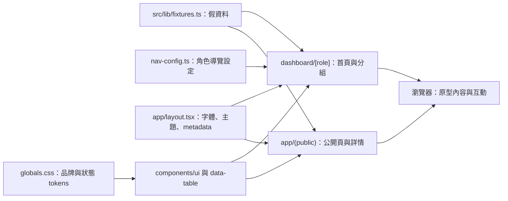
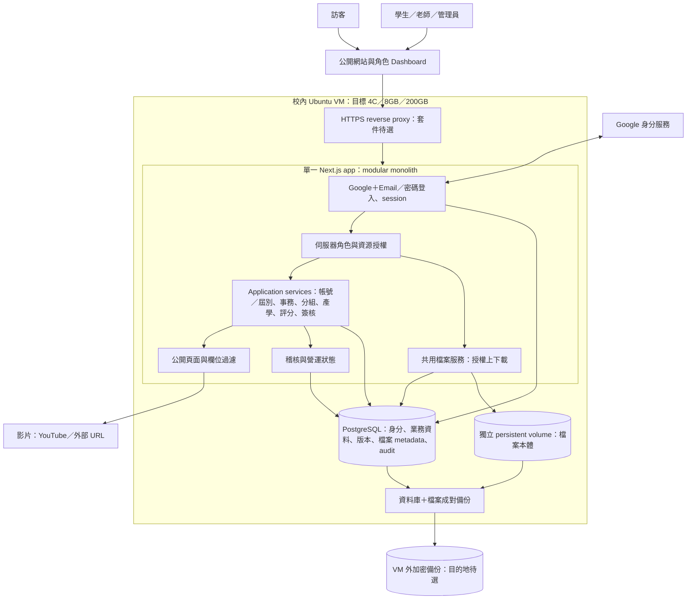
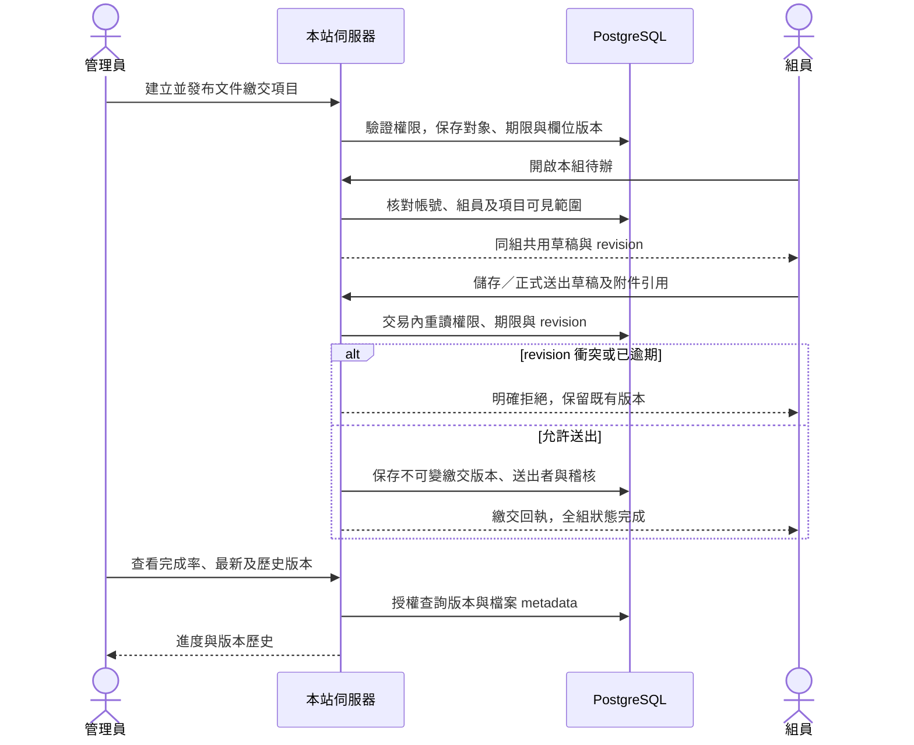
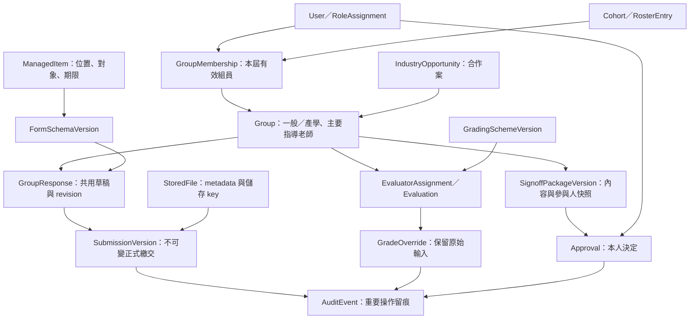
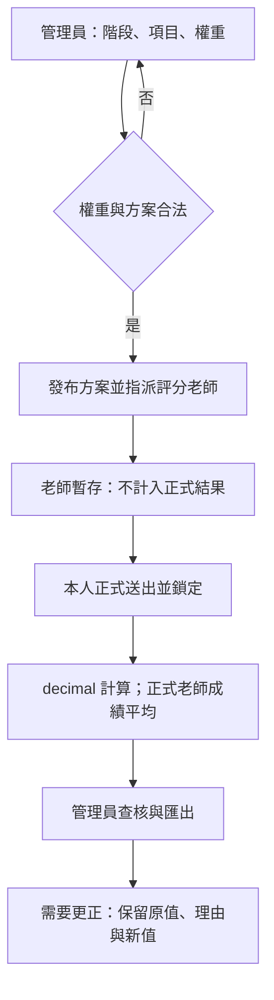
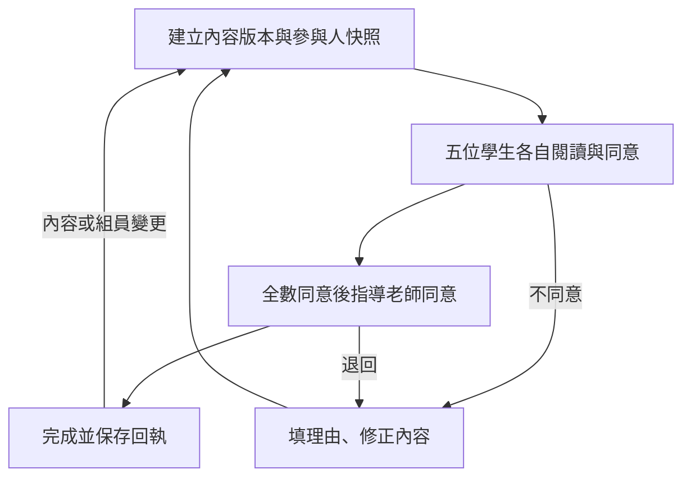
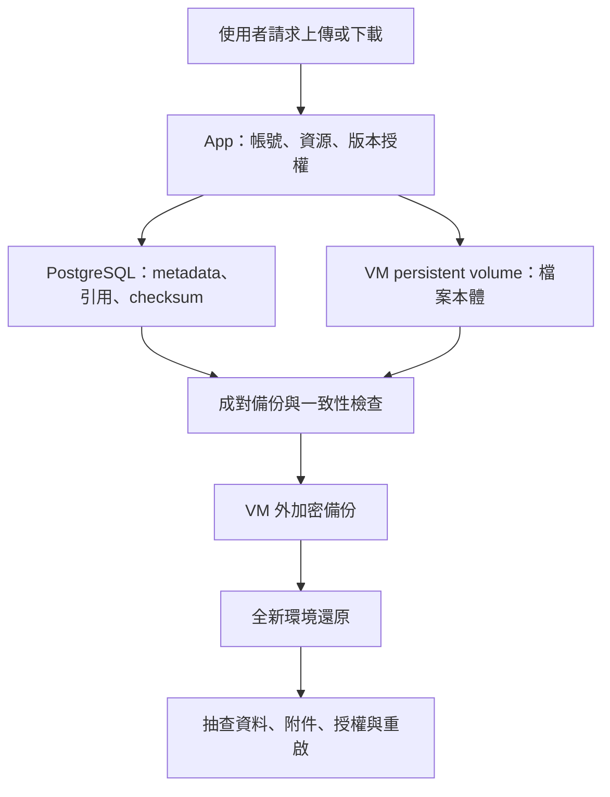

> 2026-09-07 文件鏡像。編輯來源：[Vault 正文](</Users/lubaiyu/Documents/roy422的人生online/專案/🌐 網站與互動/📁 輔大資管系專題網站/🧭 設計與決策/🏗️ 系統架構與資料流.md>)；來源檔 SHA-256：`18146fb28e37b500e5577f4528276854886da75da9516fc6fa0cbe151aba630b`。先更新來源，再重新同步。本文是文件，不是功能驗收。

# 🏗️ 系統架構與資料流

## 這張圖表示什麼

這是既有主規格 §2、§4–§8、§11–§14 的**目標架構**，於 2026-09-06 整理；不是目前已部署系統。現有 repo 仍以 fixtures 提供前端原型。圖中的服務名稱是責任邊界，不表示要拆成獨立服務或已存在同名程式檔。

## 1. 技術棧：目前程式與目標系統

2026-09-07 唯讀核對 `/Users/lubaiyu/fju-project`，HEAD `15abaccee79a446f7727e1c06e7406acfe31a1ee`。工作樹已有文件改動，本輪未啟動應用。下列版本來自 `package.json` 的宣告，帶 `^` 者為允許範圍，不冒充 lockfile 最終解析版本或最新推薦。

| 層 | 技術／版本 | 在本站的職責 | 證據與狀態 |
|---|---|---|---|
| 框架 | Next.js 16.3.1、React／React DOM 19.2.8 | App Router、公開頁、角色 Dashboard、metadata | package.json；`src/app` 已有原型 |
| 語言與樣式 | TypeScript ^5、Tailwind CSS ^4 | 型別、樣式與品牌 tokens | package.json、globals.css |
| UI 基礎 | shadcn ^4.18.0、Base UI ^1.7.0 | 表單、側欄、對話框等元件 | components.json 為 base-nova；components/ui |
| 表格 | TanStack React Table ^8.21.3 | 分組搜尋、排序、篩選及分頁介面 | components/data-table；目前資料仍為 fixtures |
| 圖示與互動 | Tabler ^3.46.0、next-themes ^0.4.6、nuqs ^2.9.5 | 圖示、主題、查詢狀態工具 | package.json；安裝不代表所有用法已驗收 |
| 結構驗證 | Zod ^4.4.3 | 已列入依賴的 schema 工具 | 不能因此認定正式 API contract 已完成 |
| 套件與檢查 | pnpm 11.0.9、ESLint ^9、Playwright ^1.62.1 | 套件管理、靜態檢查與瀏覽器工具 | 本輪沒有重新 build 或執行測試 |
| 正式資料 | PostgreSQL | 身分、組別、內容、版本、分數及稽核 | 已決定目標；目前未接正式 DB；版本／ORM 尚未封板 |
| 正式身分 | Google OAuth＋Email／密碼 | 驗證身分，再以資料庫授權 | 已決定產品行為；Auth library／session storage 未封板 |
| 部署 | Ubuntu 24.04、Docker／Compose、4C／8GB／200GB VM | 校方持有應用、DB、檔案 | 既有規格環境；本輪未登入 VM 核實運作 |
| 檔案與備份 | VM persistent volume＋VM 外加密備份 | 私有附件與成對還原 | 目標契約；proxy、備份目的地、正式網域未封板 |

### 現有前端如何組成

`/dashboard` 直接轉到 `/dashboard/student`；`[role]/layout.tsx` 只檢查角色字串有效性，並非驗證登入者是否擁有該角色。登入頁按鈕尚未接 Auth；`nav-config.ts` 中有入口，也不表示對應正式頁面已實作。公開產學詳情從 fixtures 取資料與生成路由，欄位示範不能替代正式伺服器授權。

### 設計資產與實作差異

現有 tokens、Base UI 元件、Data Table、Sidebar、假資料及封存 HTML 原型可繼續使用。`README.md` 的中文標題字體與 `docs/ANTI-PATTERNS.md` 有既知差異；本輪記錄差異，未重新指定字體。form-builder 是編輯器的互動／元件來源，Kiranism 是 Dashboard UX 來源，兩者不另部署成第二套產品。Open Design 保留設計探索用途。

正式架構要接續這套前端的可用資產；以權限、資料與業務服務取代假資料依賴，仍需逐流程驗證。

## 系統全貌

同一個 app 提供公開前台、Dashboard、管理介面與伺服器功能。Google 提供身分驗證，本站仍依自己的帳號狀態、角色、名單、組員與老師指派判斷可做什麼。公開瀏覽不要求登入，但伺服器仍只輸出符合公開範圍的內容與欄位。

## 模組各自負責什麼

| 模組 | 擁有的責任 | 必須向其他模組取得的事實 |
| --- | --- | --- |
| 身分、帳號與屆別 | 人的身分、登入、角色、帳號狀態、CSV 名單及年度 | 權限決策供所有業務讀寫使用 |
| 專題事務 | 一筆內容、一個主要發布位置、對象、期限、欄位版本、組別草稿及正式繳交 | 帳號／組員、檔案 metadata、稽核 |
| 分組 | 五人逐一確認、同屆組員關係、指導老師與成立狀態 | 學生身分、屆別、產學案 |
| 產學 | 老師建立合作案、公開／私有欄位、老師認領與組別關聯 | 老師身分、組別、可見欄位 |
| 評分 | 評分方案版本、階段／項目／權重、老師指派、暫存／正式送出及更正 | 授權老師、組別、方案版本；保留原值與更正原因 |
| 簽核 | 內容版本、當時組員與老師、個人同意紀錄 | 操作者本人身分與該版本的參與人集合 |
| 公開內容 | 依發布位置產生列表／詳情、精選與 SEO | 同一內容來源、audience 與欄位白名單 |
| 檔案與稽核 | 檔案本體／metadata、下載授權、保留引用、重要操作留痕 | 所屬內容、組別、版本及操作者權限 |

服務介面、ORM 與實際 schema 可以在實作時細化；主規格的角色、版本、期限及資料所有權約束保持不變。完整 Entity 清單在主規格 §12，術語定義在 repo 的 `CONTEXT.md`。

## 第一條正式流程的資料流

沿用主規格 §16.7 的驗收方向，下一次 `to-tickets` 再依實際依賴拆成可獨立驗證的小切片；此處沒有建立或發布 tickets。

正式送出的版本綁欄位版本及檔案版本；截止前重送建立新版本，管理員重開不刪掉舊版。同組同時編輯需有衝突回應，不能靜默覆寫。檔案本體與資料庫不是同一交易資源；上傳暫存、寫入失敗與孤兒檔回收的實作契約留待檔案切片定義，不把圖中的 DB 交易誤當跨檔案系統的原子交易。

## 影響架構的既定約束

- 專題事務共享內容／欄位／生命週期，前台依用途呈現；註冊與本人同意是固定流程。
- 前端 role、group ID 等只是請求參數；伺服器按資料庫事實檢查，寫入交易內重讀必要權限、期限與版本。
- 公私有附件共用儲存核心；私有檔案授權後串流，proxy 不直接公開私有目錄。
- 分數原始輸入、管理員更正與版本分開保留；學生 v1 無成績讀取權。
- 簽核固定在內容版本與參與人集合上；修改導致同意失效時依 §8 重走，管理員不能代簽。
- PostgreSQL 與檔案成對備份到 VM 外，還原演練是 release Gate。
- 部署使用 Docker／Compose；不引入微服務、Kubernetes、MinIO、GPU 或舊系統 adapter。

## 已選定與尚待選定

| 類別 | 已有主規格決定 | 尚待實作期封板 |
| --- | --- | --- |
| 程式形態 | Next.js App Router、TypeScript、React、shadcn、Tailwind、單一 app | 各切片服務介面與 schema 細節 |
| 資料與帳號 | PostgreSQL；Google＋Email／密碼；校方持有業務資料 | ORM／query layer、Auth 套件與 session storage |
| 部署 | Ubuntu VM、Docker／Compose、檔案 persistent volume | Caddy 或 Nginx、正式網域、DNS、OAuth redirect URI |
| 資料保全 | VM 外備份、成對還原 | 外部備份目的地、容量政策 |

README 的「傾向 Drizzle／Auth.js」不是已封板；七月 Better Auth 探索也不是新版套件決策。主規格 §18 的 CSV 樣本、容量、一般組老師行政流程與產學基數等未決項照原順序在相關實作前處理。

## 資料關係與版本邊界

下圖是完整規格 §12 的概念模型，不是已建立的資料庫 schema。中介表、索引與外鍵細節在 ORM／schema 工作中落實。

分組確認與文件簽核是兩種不同的本人決定；指導老師與評分老師指派也是不同關係。事務欄位版本、正式繳交版本、評分方案版本及簽核內容版本各自固定語意，不能用同一個「最新版」指標覆蓋所有歷史。產學基數的既有預設仍受 §18 TBD-07 約束。

## 評分與簽核怎麼完成

按組評分，學生 v1 不可取得分數、評語、平均或排名。所有必須的正式評分送出後才標記階段完成。60／40 等會議例子是方案設定的例子，不是產品固定權重；計算與精度以規格 §7 為準。

這是規格 §8 的目標流程，尚未實作驗收。管理員可重開、作廢或重置，不能代簽；舊決定保留且標明對應版本。行政採認／效力未由本輪文件查核證實。管理員建立的非五人例外組如何套用簽核人數，既有條文尚未明訂，列入實作前待決，不由本圖推定。

## 檔案、部署與復原

對外請求由 HTTPS proxy 進入 App；私有檔案只能經授權後串流，不能直接暴露 volume。上傳暫存、資料庫寫入失敗與孤兒檔清理需要明確實作契約。部署檢查包含 production build、migration、TLS、OAuth callback、重啟不失資料、備份以及全新環境還原；這些仍是待執行的驗收，不是本輪已通過結果。

## 驗證邊界

這次完成文件抽取、資料流繪製及連結核對。圖示不證明 runtime、VM 或備份已存在；實際交付依主規格 §15 逐項驗收。Mermaid 原始碼可由 Obsidian／支援 Mermaid 的閱讀器呈現。

## 來源與接續

[完整主規格](<specs/product-v1.md>)

[🎯 專案目標與範圍](<PROJECT.md>)

[🧭 文件分工與開發接續](</Users/lubaiyu/Documents/roy422的人生online/專案/🌐 網站與互動/📁 輔大資管系專題網站/🧭 設計與決策/🧭 文件分工與開發接續.md>)
