# 共用契約 01｜資料模型與一致性（v2.5）

> 2026-09-12 v2：依母 spec v3.2 與 Codex 審查 R01、R02、R05、R06、R07、R08 重寫。本文定義所有模組共用的資料規則、資料庫角色、共用基礎表的**完整字典**、UoW 與鎖、版本分配、操作帳本、事件與到期工作、時間、檔案引用、migration 政策與建表順序。各模組自己的表由各子 spec 的「附錄 A 資料字典」完整定義，本文 §3 只列索引與擁有者並連到附錄，不再互相指回。狀態：已寫、待 review；沒有任何 migration 已執行。

> 2026-09-12 v2.1（Codex 第二輪 RR01、RR02、RR09、RR12 與小項）：§5 改為**逐表**權限矩陣（含 Better Auth 四表、有效區間列的欄級 UPDATE、`fju_backup` 的 `backup_runs` INSERT）；§4.1 `sessions` 加 `login_method`；§4.7 `due_work.kind` 加 `test_noop`；§7 `proposal_invitations` 移到可變；§11 `file_references` 改部分唯一；§12 S01 migration 含最小 `stored_files`／`file_references` 與 `session_revocations`。

> 2026-09-13 v2.2（Codex 第三輪 A1、A3）：新增模組 09 可變草稿表 `showcase_drafts`（§3、§5、§7）；`session_revocations` 加 cancelled 與每人一筆有效工作（§5 說明）。

> 2026-09-13 v2.5（票草稿集中 review F02、F05）：§4.7 補 `due_work` 的 global／targeted identity 與「合法但未註冊 handler／defer 保持 pending」生命週期，指向模組 08 §6 生命週期表。

> 2026-09-13 v2.4（Codex 第五輪 D1）：§4.1 補 admin plugin 在 `users` 產生的套件欄 `banned`／`ban_reason`／`ban_expires`（只由 Better Auth 寫，模組 01 收斂核對唯讀）；§5 `session_revocations` 改為一個狀態事件一筆主工作＋多筆收斂工作（欄位與三條部分唯一見模組 01 附錄 A）。

## 1. 命名、型別、ID、時間與通用欄位

- 表名 snake_case 複數；欄位 snake_case；列舉用 `text NOT NULL CHECK (col IN (...))`，不用 pgEnum，方便 expand／contract。
- **主鍵一律 `id uuid PRIMARY KEY`，由應用產生 uuidv7**，包含 Better Auth 的 `users／accounts／sessions／verifications`（以 `advanced.database.generateId` 自訂函式，安裝後以 pin 的版本核對簽章）。所有 user FK 都是 `uuid REFERENCES users(id)`。
- **actor**：`actor_kind text NOT NULL CHECK (actor_kind IN ('user','system','worker'))` 加 `actor_user_id uuid NULL REFERENCES users(id)`；CHECK：`(actor_kind='user') = (actor_user_id IS NOT NULL)`。不再以字串 `system` 塞 uuid 欄。
- **scope**：沒有屆別的紀錄用 `scope text NOT NULL CHECK (scope IN ('cohort','global'))` 加 `cohort_id uuid NULL`；CHECK：`(scope='cohort') = (cohort_id IS NOT NULL)`。
- 時間欄一律 `timestamptz`（UTC）；業務事件同時存 `*_real_at` 與 `*_business_at`；純日期用 `date`；日界與分鐘界固定 +08:00。
- 可變頭列：`revision integer NOT NULL DEFAULT 1`，寫入條件 `WHERE revision = :expected`，成功時 +1；`updated_at timestamptz NOT NULL DEFAULT now()`、`updated_by_user_id uuid NULL`。
- 建立欄：`created_at timestamptz NOT NULL DEFAULT now()`、`created_by_kind`、`created_by_user_id`（同 actor 規則）。
- FK 預設 `ON DELETE RESTRICT ON UPDATE RESTRICT`；使用者列永不硬刪（去識別化），因此沒有 CASCADE 到業務表；例外逐表在附錄 A 寫明。
- 分數與權重 `numeric(10,4)`；應用內以 `decimal.js` 計算，只在顯示層 round-half-up 兩位。
- 唯一鍵含可 NULL 欄位時，PostgreSQL 預設 NULL 互不相等；需要「NULL 視為相同」的地方用部分唯一索引或占用表，附錄 A 逐一寫明。
- 跨狀態的唯一性用**占用表**（列存在即占用；插入唯一違反即拒；釋放用 DELETE），不用跨表 predicate 的部分索引。

## 2. 概念 ERD

```mermaid
erDiagram
  users ||--o| user_profiles : has
  users ||--o{ role_assignments : has
  users ||--o{ registration_applications : submits
  cohorts ||--o{ student_identities : occupies
  roster_versions ||--o{ roster_entries : contains
  cohorts ||--o{ cohort_stages : has
  cohorts ||--o{ project_events : has
  cohorts ||--o{ groups : has
  groups ||--o{ group_memberships : has
  groups ||--o{ group_leaders : has
  groups ||--o{ advisor_assignments : has
  group_proposals ||--o{ proposal_invitations : has
  group_proposals ||--o{ proposal_occupancy : occupies
  industry_opportunities ||--o{ opportunity_links : linked
  cohorts ||--o{ managed_items : has
  managed_items ||--o{ form_schema_versions : versions
  managed_items ||--o{ item_versions : content
  managed_items ||--o{ response_rosters : requires
  managed_items ||--o{ drafts : has
  managed_items ||--o{ submission_versions : receives
  submission_versions ||--o{ submission_files : has
  stored_files ||--o{ file_references : referenced
  groups ||--o{ stage_requirements : has
  groups ||--o{ evaluator_assignments : has
  evaluator_assignments ||--o{ evaluations : produces
  evaluations ||--|| evaluation_status : status
  groups ||--o{ signoff_packages : has
  signoff_packages ||--o{ signoff_package_versions : versions
  signoff_package_versions ||--|| signoff_version_status : status
  signoff_package_versions ||--o{ approvals : collects
  domain_events ||--o{ event_projections : projected
  domain_events ||--o{ notifications : yields
  groups ||--o{ showcase_entries : showcased
  showcase_entries ||--o{ external_authorizations : basis
```



## 3. 表索引與擁有者（唯一正文位置）

| 表 | 擁有模組 | 完整字典位置 |
|---|---|---|
| `users`、`accounts`、`sessions`、`verifications`（Better Auth，含業務擴充欄） | 01（欄位由套件與本文 §4 定） | 本文 §4.1 |
| `cohorts`（最小欄由本文定，其餘由 02） | 02 | 本文 §4.2（最小）＋模組 02 附錄 A |
| `audit_events`、`operation_records`、`domain_events`、`event_projections`、`due_work`、`schema_meta` | 10（前二）、08（中三）、基礎（末） | 本文 §4.3–4.8 |
| `user_profiles`、`registration_applications`、`application_revisions`、`roster_versions`、`roster_entries`、`role_assignments`、`user_status_events`、`session_revocations`、`student_identities` | 01 | 模組 01 附錄 A |
| `cohort_stages`、`project_events`、`business_clock_overrides`、`cohort_status_events` | 02 | 模組 02 附錄 A |
| `group_proposals`、`proposal_invitations`、`proposal_occupancy`、`groups`、`group_memberships`、`group_leaders`、`advisor_assignments`、`industry_opportunities`、`opportunity_links` | 03 | 模組 03 附錄 A |
| `managed_items`、`item_audience_groups`、`item_versions`、`form_schema_versions`、`item_attachments`、`item_publications` | 04 | 模組 04 附錄 A |
| `response_rosters`、`roster_snapshots`、`snapshot_annotations`、`drafts`、`submission_versions`、`submission_files`、`targeted_reopens`、`advisor_visibility_settings` | 05 | 模組 05 附錄 A |
| `grading_schemes`、`grading_scheme_versions`、`stage_requirements`、`evaluator_assignments`、`evaluations`、`evaluation_status`、`evaluation_status_events`、`grade_overrides`、`override_review_state` | 06 | 模組 06 附錄 A |
| `signoff_packages`、`signoff_package_versions`、`signoff_version_status`、`approvals`、`signoff_exports` | 07 | 模組 07 附錄 A |
| `notifications`、`digest_events`、`worker_heartbeat` | 08 | 模組 08 附錄 A |
| `showcase_entries`、`showcase_drafts`、`showcase_versions`、`external_authorizations`、`asset_reviews`、`honors`、`public_assets_meta`、`page_meta` | 09 | 模組 09 附錄 A |
| `stored_files`、`file_references`、`backup_runs`、`restore_drills`、`storage_stats` | 10 | 模組 10 附錄 A |

## 4. 共用基礎表完整字典

欄位表格式：欄位｜型別｜NULL｜default｜約束與 FK（刪改動作）｜理由。

### 4.1 Better Auth 表的業務擴充

Better Auth 標準欄位（`users.id/name/email/emailVerified/image/createdAt/updatedAt`、`accounts`、`sessions`、`verifications`）由 adapter 產生，migration 由本專案控制（drizzle schema 取自 Better Auth 產生器後納入 repo）。業務擴充只加在 `users`：

| 欄位 | 型別 | NULL | default | 約束 | 理由 |
|---|---|---|---|---|---|
| `status` | text | NO | `'pending'` | CHECK IN ('pending','active','disabled')；`input:false` | 首次註冊一律待審；只由 01 用例改 |
| `must_change_password` | boolean | NO | `false` | `input:false` | 臨時密碼後強制改密 |
| `deidentified_at` | timestamptz | YES | NULL | — | 永久刪除改為去識別化 |

admin plugin 另在 `users` 產生**套件欄** `banned`（boolean）、`ban_reason`、`ban_expires`（欄名以安裝後產生的 drizzle schema 為準，S01 gate）：只由 Better Auth 的 `banUser`／`unbanUser` 寫，不是業務擴充；模組 01 的收斂核對以 `fju_app` 的唯讀 SELECT 讀它（不經 `auth.api.listUsers`），業務判定仍只看 `status`（v2.4，D1）。

`sessions` 業務擴充一欄：`login_method text NOT NULL CHECK IN ('google','password')`，由 `databaseHooks.session.create.before` 依本次登入流程（Google callback 或密碼登入）寫入；`OperationContext.loginMethod` 與簽核紀錄的「這次登入方式」只從**目前 session 列**讀取，不用帳號層級的 `user_profiles.login_method_last`（那只是列表顯示用的最近一次登入方式，多個登入視窗各有自己的 session 列）。

索引：`users(status)`。`sessions`、`verifications` 由套件刪除，`fju_app` 對這兩表有 DELETE。

### 4.2 `cohorts` 最小欄（S00 建表；其餘欄由模組 02 附錄 A 以後續 migration 擴充）

| 欄位 | 型別 | NULL | default | 約束 | 理由 |
|---|---|---|---|---|---|
| `id` | uuid | NO | — | PK | — |
| `code` | text | NO | — | UNIQUE | 例如 115-TEST |
| `name` | text | NO | — | — | 顯示名 |
| `status` | text | NO | `'preparing'` | CHECK IN ('preparing','active','archived') | 三狀態 |
| `is_default_working` | boolean | NO | `false` | 部分唯一索引 `WHERE is_default_working` | 只有一個預設工作屆別 |
| `is_registration_open` | boolean | NO | `false` | 部分唯一索引 `WHERE is_registration_open` | 只有一個開放註冊屆別 |
| `revision`、`created_*`、`updated_*` | — | — | — | 通用 | — |

### 4.3 `audit_events`（10；不可變）

| 欄位 | 型別 | NULL | default | 約束 | 理由 |
|---|---|---|---|---|---|
| `id` | uuid | NO | — | PK | — |
| `actor_kind`、`actor_user_id` | text／uuid | NO／YES | — | §1 actor 規則；FK users | 誰做的 |
| `role` | text | YES | NULL | CHECK IN ('student','teacher','admin') | 當時角色 |
| `action` | text | NO | — | — | 動作代碼 |
| `target_type`、`target_id` | text／uuid | NO／YES | — | — | 對象 |
| `scope`、`cohort_id` | text／uuid | NO／YES | — | §1 scope 規則；FK cohorts | 屆別或全站 |
| `reason` | text | YES | NULL | — | 理由 |
| `verification_method` | text | YES | NULL | CHECK IN ('id_document','school_channel','other') | 核准與臨時密碼必填 |
| `real_at`、`business_at` | timestamptz | NO | — | — | 雙時間 |
| `payload` | jsonb | NO | `'{}'` | 不含秘密與私有正文 | 追溯 |

索引：`(target_type, target_id)`、`(cohort_id, real_at)`、`(actor_user_id, real_at)`。權限：`fju_app` SELECT、INSERT；trigger 拒絕 UPDATE／DELETE／TRUNCATE。

### 4.4 `operation_records`（10；操作帳本）

| 欄位 | 型別 | NULL | default | 約束 | 理由 |
|---|---|---|---|---|---|
| `id` | uuid | NO | — | PK | — |
| `actor_user_id` | uuid | NO | — | FK users | 帳本以本人為作用域 |
| `operation_kind` | text | NO | — | — | 例如 `submission.submit` |
| `request_id` | uuid | NO | — | UNIQUE `(actor_user_id, operation_kind, request_id)` | 去重鍵 |
| `fingerprint` | text | NO | — | sha256 of canonical JSON | 同 key 不同內容判定 |
| `state` | text | NO | — | CHECK IN ('committed','failed') | — |
| `result_ref` | jsonb | NO | `'{}'` | 只存 ID 與版本 | 永久保留 |
| `receipt` | jsonb | YES | NULL | 不含一次性秘密 | 30 天後清空 |
| `scope`、`cohort_id` | — | — | — | §1 | 帳號操作為 global |
| `committed_real_at` | timestamptz | NO | — | — | — |
| `receipt_expires_at` | timestamptz | NO | — | = committed + 30 天 | 回執本體保留期 |

規則：去重鍵、fingerprint、state、result_ref **永久保留**，屆別封存與帳號停用都不清；封存後重播只會得到 `COHORT_ARCHIVED`。`receipt` 到期由 worker `UPDATE receipt = NULL`；查詢回「回執已清除，結果參照仍在」。

### 4.5 `domain_events`（08；不可變 outbox）

| 欄位 | 型別 | NULL | default | 約束 | 理由 |
|---|---|---|---|---|---|
| `id` | uuid | NO | — | PK（uuidv7，時間序） | 投影順序 |
| `type` | text | NO | — | — | 事件型別（模組 08 矩陣） |
| `scope`、`cohort_id` | — | — | — | §1 | — |
| `source_type`、`source_id`、`source_version` | text／uuid／integer | NO／NO／YES | — | — | 來源與版本 |
| `actor_kind`、`actor_user_id` | — | — | — | §1 | — |
| `occurred_real_at`、`occurred_business_at` | timestamptz | NO | — | — | — |
| `recipients` | uuid[] | NO | `'{}'` | — | 寫入時固定 |
| `recipient_basis` | jsonb | NO | `'{}'` | membership／名單／指派版本 ID | 追溯 |
| `payload` | jsonb | NO | `'{}'` | 只含 ID 與標題 | 不含私有正文 |

索引：`(occurred_real_at)`、`(source_type, source_id)`。權限：SELECT、INSERT。

### 4.6 `event_projections`（08；可變）

| 欄位 | 型別 | NULL | default | 約束 |
|---|---|---|---|---|
| `event_id` | uuid | NO | — | FK domain_events；PK `(event_id, consumer)` |
| `consumer` | text | NO | — | CHECK IN ('notifications','digest','showcase') |
| `state` | text | NO | `'pending'` | CHECK IN ('pending','done','failed') |
| `attempts` | integer | NO | 0 | — |
| `claimed_at`、`done_at` | timestamptz | YES | NULL | — |
| `last_error` | text | YES | NULL | — |

索引：`(state, event_id)`。權限：SELECT、INSERT、UPDATE。

### 4.7 `due_work`（08；可變）

| 欄位 | 型別 | NULL | default | 約束 |
|---|---|---|---|---|
| `id` | uuid | NO | — | PK |
| `kind` | text | NO | — | CHECK IN ('proposal_expiry','deadline_snapshot','snapshot_reconcile','overdue_digest','stage_end_unassigned','file_gc','receipt_purge','test_noop') |
| `subject_type`、`subject_id` | text／uuid | NO | — | — |
| `deadline_version` | integer | NO | 1 | UNIQUE `(kind, subject_type, subject_id, deadline_version)` |
| `due_business_at` | timestamptz | NO | — | — |
| `state` | text | NO | `'pending'` | CHECK IN ('pending','done','cancelled','failed') |
| `attempts` | integer | NO | 0 | — |
| `next_attempt_at` | timestamptz | YES | NULL | 退避重試 |

**identity 與生命週期（v2.5，票草稿 review F05／F02）**：全體截止的工作以 `(subject_type='item', subject_id=item, deadline_version=項目版本)` 為 identity；指定重開的 targeted 工作以 `(subject_type='targeted_reopen', subject_id=targeted_reopens.id, deadline_version=1)`，同一項目多個收件者各自重開互不撞鍵，同人再次重開＝新的 `targeted_reopens` 列（舊列工作取消）；`digest_events` 的 `(kind, subject_id, deadline_version)` 同此 identity。CHECK 白名單內但尚未註冊 handler 的 kind、以及 handler 回 `defer`（前置未就緒）的工作，都保持 `pending`、退避、`attempts` 不累計，不算失敗；只有 handler 例外才累計 attempts 並在 ≥5 標 failed＋告警；各 kind 的排程者、首筆、週期與 handler 供應切片見模組 08 §6 生命週期表。
| `done_at`、`result_ref`、`last_error` | timestamptz／jsonb／text | YES | NULL | — |

規則：期限變更在同交易寫新 `deadline_version` 並把舊版本 `cancelled`；`snapshot_reconcile` 在快照不存在時保持 pending 並依 `next_attempt_at` 退避重試，直到快照存在或該版本被 cancelled；回撥不重跑 done；handler 例外 attempts≥5 標 failed 並告警（v2.5，R02：與 `event_projections` 的 ≥5 同一上限；`defer` 與未註冊 handler 不累計；`session_revocations` 的 10 輪收斂上限是另一種計數，不受影響）。`test_noop` 只供 S02 的 worker 驗收與整合測試：handler 只在 `BUSINESS_CLOCK_OVERRIDE_ENABLED=true` 的環境註冊，production 沒有 handler 且排程用例拒 `VALIDATION_FAILED`。索引：`(state, due_business_at)`、`(state, next_attempt_at)`。

### 4.8 `schema_meta`（基礎）

| 欄位 | 型別 | NULL | 約束 | 用途 |
|---|---|---|---|---|
| `key` | text | NO | PK | 例如 `schema_version`、`seeded_a1_at` |
| `value` | text | NO | — | 最後套用的 migration 名由 migrate 容器寫入；`/api/health` 讀此值 |
| `updated_at` | timestamptz | NO | — | — |

只有 `fju_owner` 可寫；`fju_app` SELECT。

## 5. 資料庫角色與逐表權限（回覆 R02；v2.1 依 Codex RR01 改為逐表矩陣）

角色沿母 spec §4.6：`fju_owner` 只在 `migrate`／reset 容器；`fju_app` 為 app 與 worker 共用的 runtime 角色（是否拆兩個待 Roy；拆分時 worker 角色只取本表「worker 也用」欄打勾的表）；`fju_backup` 讀全庫並只能寫 `backup_runs`；演練用獨立資料庫與憑證。**本表是唯一正文位置**：migration 由本表產生 GRANT，CI 的 `roles.test.ts` 以 `fju_app` 逐表跑允許操作與禁止操作，再跑正向用例（核准、改密、修改個資、確認提案、成員移出、主指導重派、正式送分、簽核同意、精選發布），兩者都要通過；只測「禁止操作被拒」不算通過。

寫法：S＝SELECT、I＝INSERT、U＝UPDATE（括號內為欄級 UPDATE，只能改列出的欄）、D＝DELETE；沒列的權限一律沒有；「不可變」表另加 `BEFORE UPDATE OR DELETE OR TRUNCATE` trigger `RAISE EXCEPTION` 作第二層；所有表對 `fju_app` 都沒有 TRUNCATE 與 DDL。

| 表 | `fju_app` | worker 也用 | 說明 |
|---|---|---|---|
| `users` | S I U | ✓ | Better Auth 更新；`status`、`must_change_password`、`deidentified_at` 只由 01 用例改（application 層保證） |
| `accounts` | S I U | — | 密碼雜湊更新、Google 連結；不給 DELETE（unlink 不在產品範圍，UI 無入口） |
| `sessions` | S I U D | ✓ | 套件建立、更新、撤銷（DELETE）；含擴充欄 `login_method` |
| `verifications` | S I U D | — | 套件建立與清除 |
| `cohorts` | S I U | ✓ | 頭列 |
| `schema_meta` | S | ✓ | 只由 migrate 寫 |
| `audit_events` | S I | ✓ | 不可變 |
| `operation_records` | S I U(`state`, `receipt`, `receipt_expires_at`, `result_ref`) | ✓ | 帳本；`receipt_purge` 清 `receipt` |
| `domain_events` | S I | ✓ | 不可變 outbox |
| `event_projections` | S I U | ✓ | 投影狀態 |
| `due_work` | S I U | ✓ | 到期工作 |
| `user_profiles` | S I U | — | 本人與系辦改 |
| `student_identities` | S I D | — | 占用表：核准插入、停用／去識別化刪除 |
| `registration_applications` | S I U | — | 待審修改與核准 |
| `application_revisions` | S I | — | 不可變 |
| `roster_versions` | S I | — | 不可變 |
| `roster_entries` | S I | — | 不可變 |
| `role_assignments` | S I U(`revoked_by_user_id`, `revoked_real_at`, `reason`) | — | 有效區間列：只更新結束欄 |
| `user_status_events` | S I | — | 不可變 |
| `session_revocations` | S I U | ✓ | 撤 session 的可變工作列（每人序列化執行器：queued→executing（租約）→done／failed／cancelled；收斂核對）。v2.4：一個狀態事件一筆主工作＋多筆收斂工作（`trigger`、`reconcile_round`，三條部分唯一，無 `attempts`）；收斂核對讀 `users.banned` 只用 S |
| `cohort_stages` | S I U | — | 階段開始日 |
| `project_events` | S I U | — | 活動 |
| `business_clock_overrides` | S I | — | insert-only |
| `cohort_status_events` | S I | — | 不可變 |
| `group_proposals` | S I U | ✓ | worker 做逾期終止 |
| `proposal_invitations` | S I U(`state`, `decided_real_at`) | ✓ | 狀態列；成立或終止後不再變 |
| `proposal_occupancy` | S I D | ✓ | 占用表 |
| `groups` | S I U | — | 頭列 |
| `group_memberships` | S I U(`valid_to`, `removal_reason`, `updated_at`) | — | 有效區間列 |
| `group_leaders` | S I U(`valid_to`) | — | 有效區間列 |
| `advisor_assignments` | S I U(`valid_to`, `reason`) | — | 有效區間列 |
| `industry_opportunities` | S I U | — | 合作案頭列 |
| `opportunity_links` | S I U(`valid_to`, `ended_by_user_id`, `reason`) | — | 有效區間列 |
| `managed_items` | S I U | — | 頭列 |
| `item_audience_groups` | S I D | — | 受眾集合（有回答後只經 `applyAudienceChange` 同交易改） |
| `item_versions` | S I | — | 不可變 |
| `form_schema_versions` | S I | — | 不可變 |
| `item_attachments` | S I U(`sort`) D | — | 附件集合；移除即 D 並釋放 `file_references` |
| `item_publications` | S I | — | 不可變 |
| `response_rosters` | S I U | ✓ | 名單區間列（結束欄、免填） |
| `roster_snapshots` | S I | ✓ | 不可變；worker 產生 |
| `snapshot_annotations` | S I | ✓ | 不可變 |
| `drafts` | S I U | — | 可變頭列 |
| `submission_versions` | S I | — | 不可變 |
| `submission_files` | S I | — | 不可變 |
| `targeted_reopens` | S I | — | 不可變 |
| `advisor_visibility_settings` | S I | — | 不可變 |
| `grading_schemes` | S I U | — | 頭列 |
| `grading_scheme_versions` | S I U(`status`, `locked_at`) | — | 內容不可變、狀態欄只前進 |
| `stage_requirements` | S I U | — | 分母 |
| `evaluator_assignments` | S I U(`valid_to`, `removal_choice`, `reason`, `revision`, `updated_at`) | — | 有效區間列 |
| `evaluations` | S I | — | 不可變 |
| `evaluation_status` | S I U | — | 可變頭列 |
| `evaluation_status_events` | S I | — | 不可變 |
| `grade_overrides` | S I | — | 不可變 |
| `override_review_state` | S I U | — | 可變頭列 |
| `signoff_packages` | S I U | — | 頭列 |
| `signoff_package_versions` | S I | — | 不可變內容（含 `authorization_scope`） |
| `signoff_version_status` | S I U | — | 可變狀態頭列（解散連動在 app 交易內） |
| `approvals` | S I | — | 不可變 |
| `signoff_exports` | S I | — | 不可變 |
| `notifications` | S I U(`read_at`) | ✓ | worker 建立、本人已讀 |
| `digest_events` | S I | ✓ | 不可變 |
| `worker_heartbeat` | S I U | ✓ | 單列 upsert |
| `showcase_entries` | S I U | ✓ | 頭列；worker `autoWithdraw` |
| `showcase_drafts` | S I U | — | 可變草稿（不需授權引用即可儲存；發布時凍結成 `showcase_versions`） |
| `showcase_versions` | S I | — | 不可變 |
| `external_authorizations` | S I U(`revoked_at`, `revoke_reason`) | — | 失效欄 |
| `asset_reviews` | S I | — | 不可變 |
| `honors`、`public_assets_meta`、`page_meta` | S I U | — | 管理內容 |
| `stored_files` | S I U(`status`, `size_bytes`, `checksum`, `mime_detected`, `finalized_at`, `soft_deleted_at`, `purged_at`, `revision`, `updated_at`) | ✓ | 狀態欄；purge 是狀態加實體檔，不 DELETE 列 |
| `file_references` | S I U(`released_at`) | ✓ | 釋放只設欄位；重新附加插入新列（§11） |
| `backup_runs` | S（`fju_backup`：I） | ✓ | 只由 backup 服務以 `fju_backup` INSERT |
| `restore_drills` | S I | — | 由 `pnpm ops:record-drill`（app 連線）寫入 |
| `storage_stats` | S I | ✓ | worker 每小時寫 |

```sql
-- 在 fju_owner 執行；migration 由上表產生，以下只是寫法示例
REVOKE ALL ON ALL TABLES IN SCHEMA public FROM fju_app, fju_backup;
GRANT SELECT, INSERT ON users, accounts, sessions, verifications, cohorts, audit_events, ... TO fju_app;   -- 上表全部 S I 的表
GRANT UPDATE ON users, accounts, sessions, verifications, cohorts, drafts, groups, ... TO fju_app;          -- 整列可更新的表
GRANT UPDATE (valid_to, removal_reason, updated_at) ON group_memberships TO fju_app;                          -- 有效區間列：欄級
GRANT UPDATE (revoked_by_user_id, revoked_real_at, reason) ON role_assignments TO fju_app;
GRANT DELETE ON sessions, verifications, student_identities, proposal_occupancy, item_audience_groups, item_attachments TO fju_app;
GRANT SELECT ON schema_meta, backup_runs TO fju_app;
GRANT pg_read_all_data TO fju_backup;  GRANT INSERT ON backup_runs TO fju_backup;
-- 不可變表：trigger 拒 UPDATE／DELETE／TRUNCATE（清單＝上表標「不可變」者）
```

驗收：CI 的 `roles.test.ts` 以 `fju_app` 連線（1）逐表執行上表允許的操作成功、未列的操作被拒；（2）跑正向用例：核准、改密、修改個資、確認提案、成員移出、主指導重派、正式送分、簽核同意、精選發布；（3）對每張不可變表與有效區間列的非結束欄執行 UPDATE 被拒；（4）`fju_app` 無法 `SET ROLE fju_owner`；`fju_backup` 除 SELECT 外只能 INSERT `backup_runs`。

## 6. UoW、隔離、鎖與重試（回覆 R03 交易部分、R06）

```ts
interface UnitOfWork { run<T>(ctx: OperationContext, fn: (tx: Tx) => Promise<T>): Promise<T> }
interface Tx { ports: TxPorts }   // 綁定同一連線的 repository／query／command
```

- 一個用例一個 `run`；被呼叫的 command 接受 `tx`，不自開交易；交易內禁止外部 I/O。
- Read Committed；不變量靠列鎖：`FOR SHARE` 讀必須維持的前提（屆別 active、組別 active、指派 active），`FOR UPDATE` 鎖要改的頭列。
- 鎖順序：`cohorts` → `groups` → `managed_items` → 頭列（`drafts`、`signoff_version_status`、`evaluator_assignments`、`group_proposals`、`showcase_entries`）→ `stored_files`。
- **有效結果的資料庫保證**：`evaluation_status` 部分唯一 `(assignment_id) WHERE state='counted'`；`signoff_packages.current_version_id` 頭列加 `signoff_version_status` 狀態機；`group_memberships` 部分唯一 `(user_id, cohort_id) WHERE valid_to IS NULL`；`advisor_assignments`、`group_leaders`、`opportunity_links` 各自 `(group_id) WHERE valid_to IS NULL`。
- 唯一違反映射：版本號 → `CONFLICT`；認領 → `ALREADY_CLAIMED`；membership → `ALREADY_MEMBER`；占用表 → `INVITED_ELSEWHERE`／`STUDENT_NO_TAKEN`；帳本 → §8 協議（不會拋錯）。
- 可安全重試：只有回滾的交易；`CONFLICT` 由前端帶同一 requestId 重試一次；死鎖（40P01）由 UoW 自動重試一次。
- 外部呼叫（Better Auth session 撤銷）在 commit 後執行並留 audit；業務狀態已 commit，入口層依業務狀態同步拒絕。

## 7. 版本分配與不可變／可變分界（回覆 R09、v3.2）

| 聚合 | 不可變（insert-only） | 可變頭列（revision） | 「目前有效」 |
|---|---|---|---|
| 收件回答 | `submission_versions`、`submission_files`、`roster_snapshots`、`snapshot_annotations` | `drafts`、`response_rosters` | 最大 `version_no`；名單 `eligible_to IS NULL AND NOT exempt` |
| 評分 | `evaluations`、`evaluation_status_events`、`grade_overrides` | `evaluation_status`、`override_review_state`、`evaluator_assignments`、`stage_requirements` | `evaluation_status.state='counted'`（部分唯一） |
| 簽核 | `signoff_package_versions`、`approvals` | `signoff_packages`、`signoff_version_status` | `current_version_id` 且狀態 complete |
| 分組 | `group_memberships`、`group_leaders`、`advisor_assignments`、`opportunity_links`（有效區間列：只更新結束欄） | `groups`、`group_proposals`、`proposal_invitations`（`state`）、占用表 | `valid_to IS NULL` |
| 內容 | `item_versions`、`form_schema_versions`、`item_publications` | `managed_items` | `current_*_version_id` |
| 精選 | `showcase_versions`（發布時從草稿凍結，含授權引用） | `showcase_entries`、`showcase_drafts` | `current_version_id` 且閘門通過 |
| 事件 | `domain_events` | `event_projections`、`due_work` | — |

正式版本號＝同 receiver 最大版本＋1，在頭列 `FOR UPDATE` 之後計算；唯一索引作後盾。

## 8. 操作帳本協議（回覆 R08）

```sql
INSERT INTO operation_records (id, actor_user_id, operation_kind, request_id, fingerprint, state, result_ref, receipt, scope, cohort_id, committed_real_at, receipt_expires_at)
VALUES (...) ON CONFLICT (actor_user_id, operation_kind, request_id) DO NOTHING RETURNING id;
```

- 有回傳列 → 首次執行，繼續用例；沒有回傳列 → 已存在（並發者會等前者 commit 或 rollback 後才得到結果），同一交易內 `SELECT` 讀回紀錄（不會進 aborted 狀態）：`fingerprint` 相同 → 重做當下讀取授權後回原回執；不同 → `REQUEST_MISMATCH`；前者 rollback 則本次正常執行。
- 帳本列在用例交易內寫入，用例失敗時整體回滾（不留 failed 列）；`state='failed'` 只用於「已 commit 但後續外部步驟失敗」的紀錄。
- 一次性秘密例外：`receipt` 不含秘密；`operation_kind='account.issue_temp_password'` 的重播回「已核發，無法取回」。
- `getOperationResult(requestId)` 只回本人紀錄；回執到期回 `RECEIPT_EXPIRED` 與 `result_ref`。

## 9. 事件、投影與到期工作（回覆 R05、R08 worker）

母 spec §4.10。補充實作規則：`EventPublisher.publish(tx, ...)` 在同交易寫 `domain_events` 與每個 consumer 的 `event_projections(pending)`；`DueWorkScheduler.schedule(tx, kind, subject, deadlineVersion, dueAt)` 與 `cancel(tx, ...)`；worker 認領用 `FOR UPDATE SKIP LOCKED`；每筆一交易；`snapshot_reconcile` 的唯一輸出鍵是 `snapshot_annotations(snapshot_id, submission_version_id)`。

## 10. 時間

`OperationContext.receivedBusinessAt` 決定準時並寫入 `received_business_at`；`received_real_at` 同存；期限相關表每次變更 `deadline_version+1` 並同交易改 `due_work`。

## 11. 檔案引用

`file_references` 部分唯一 `(file_id, ref_type, ref_id) WHERE released_at IS NULL`；釋放只設 `released_at`；同一檔案對同一引用者移除後再附回，插入新的有效列（舊列保留為歷史），不會撞唯一鍵；GC 判斷「有引用」＝存在 `released_at IS NULL` 的列；條件與鎖見模組 10。

## 12. migration 政策與建表順序（回覆 R01）

- drizzle-kit 產生純 SQL；expand／contract：新增欄位 nullable 或有預設；不改名、不改型別；刪除或加 NOT NULL 隔至少一個已部署版本。
- CI：空庫 migration；前一版 seed 庫升版；前一版映像在新 schema 跑整合測試；`fju_app` 權限拒絕測試。
- **第一支 migration（S00）建表順序**：(1) Better Auth `users`（含擴充欄）、`accounts`、`sessions`、`verifications`；(2) `cohorts` 最小欄；(3) `schema_meta`；(4) `audit_events`、`operation_records`、`domain_events`、`event_projections`、`due_work`（FK 指向 users 與 cohorts）；(5) 角色與權限、trigger。S01 的 migration 建模組 01 全部表（含 `session_revocations`）與模組 10 的最小檔案表 `stored_files`、`file_references`（名單 CSV 原檔用；欄位即模組 10 附錄 A，S07 只加 GC 相關索引），且在同一支內先建檔案表再建 `roster_versions`（FK 目標先存在）；其餘依切片，每支 migration 的 FK 目標必須已存在（CI 逐切片空庫升級）。**S11 的 migration**（v2.3，Codex C3）建模組 09 的 `showcase_entries`、`showcase_drafts` 與**空的** `showcase_versions`（三表一起建，`showcase_entries.current_version_id` 的 FK 目標才存在；S11 不寫入 versions），S12 只建 `external_authorizations`、`asset_reviews`、`honors`、`public_assets_meta`、`page_meta` 與索引；`showcase_drafts.authorization_ref`、`showcase_versions.authorization_ref` 是多型參照（簽核版本或外部授權），不設 FK、由用例驗證。
- 索引以 `CREATE INDEX CONCURRENTLY` 另檔。

## 13. 未決與依賴

Q-GRP05：`groups.exception_basis` 已含核可人、日期、適用人數、來源、`simulated`；上下限設定值待校方後加 `cohort_rules`。Q-SUB04：收件不用 `teachers` 受眾。容量（Q-FIL01）：`storage_stats` 實測後定上限。待 Roy：`fju_app` 是否拆成 app 與 worker 兩角色。
