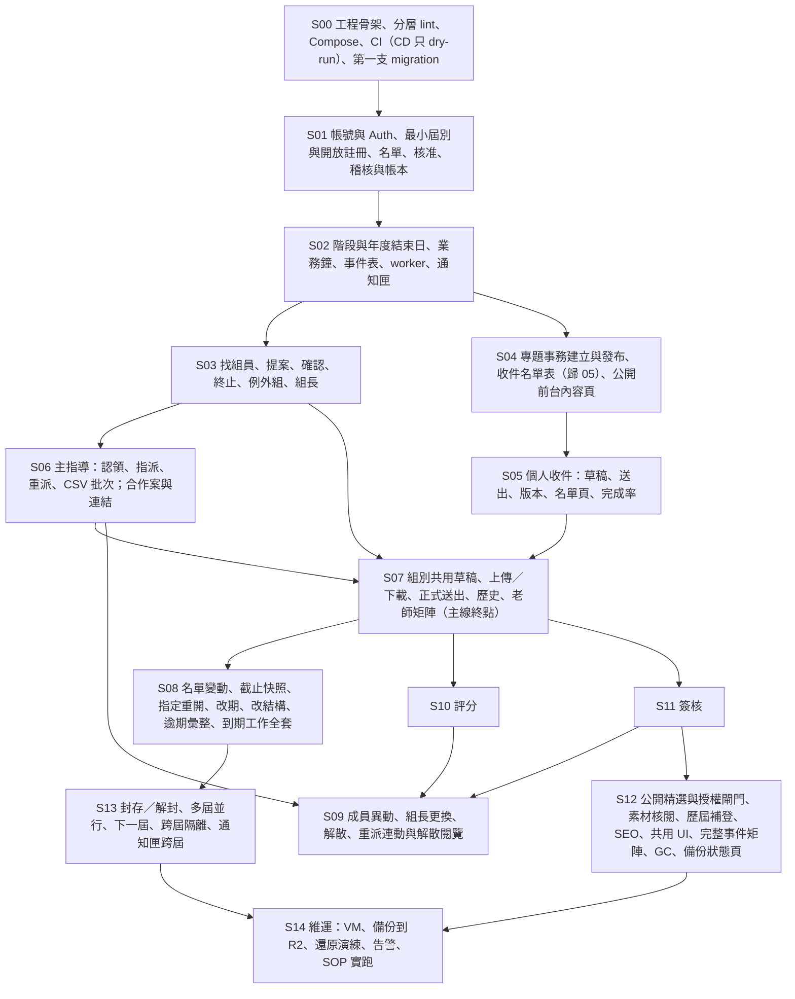

# 實作切片總圖與依賴（v2.1）

> 2026-09-12 v2：依母 spec v3.2 §8 與 Codex R12／R13 修正依賴與責任：最小 `cohorts` 與 A1 建屆別、設開放註冊移入 S01；`response_rosters` 與 `buildRoster` 由 S04 交付但歸模組 05；新增 S06→S07（老師矩陣需要有效指導關係）；SUB-03 最終責任 S07；PUB-11 責任 S04；SUB-18、19 最終在 S08；FIL-05、06 在 S14；環境階梯 local／staging／VM／人工分列。每個非延後案例的**最終驗收責任切片**只在 [01 案例責任表](<01 案例責任表.md>) 一處維護；切片卡只列自己負責的案例 ID。狀態：全部「文件已寫、待 review」；正式碼未開始；ticket 未建立。**v2.1（2026-09-12，Codex RR03、RR09）**：新增「切片出場與年度案例 PASS 的分界」與每張切片的操作起點表；切片出場不再要求案例 PASS、不得依賴後繼切片（S01 不需階段、業務鐘或 worker）；S01 含最小檔案能力（CSV 原檔）；S00 的 DB 角色改為逐表矩陣。

## 依賴總圖

依賴的意思：箭頭來源切片的出場條件是箭頭目標可開工的前置。S14 的 VM 首次設定（SOP 01、02）可在 S01 出場後提前做（第一次 staging 部署時點待 Roy，預設 S01 後），但 S14 的完整證據在最後。

## 每張切片一句話、主要模組與最終責任案例

| 切片 | 可由角色操作的成果 | 主要模組 | 最終責任案例（詳見責任表） | 環境 | 狀態 |
|---|---|---|---|---|---|
| [S00](<S00 工程骨架與 CI.md>) | 本機跑起 `web/`、lint 擋跨層、CI 綠燈、CD 只 dry-run、第一支 migration（Auth 四表→最小 cohorts→基礎表）與 DB 角色 | 骨架、契約 01／05 | 無業務案例；契約 04 §4 的 DB 角色與不可變測試 | local | 文件已寫，待 review |
| [S01](<S01 帳號與 Auth.md>) | A1 登入改密、建 115-TEST（最小屆別）並設開放註冊、匯入名單、學生註冊待審與修改、核實核准、老師建立與預授權、停用、臨時密碼、連結入口 | 01、02（最小）、10（audit、ledger、最小檔案能力：CSV 原檔上傳／下載） | ACC-01–11、14、15、17（ACC-13、16、18 人工 Roy） | local→staging | 文件已寫，待 review |
| [S02](<S02 屆別、業務鐘與事件基礎.md>) | 階段開始日、年度結束日、活動；staging 業務鐘；worker 投影；通知匣與已讀；首頁階段文字 | 02、08 | COH-01、02、03、04；NTF-08 | staging | 文件已寫 |
| [S03](<S03 提案與成組.md>) | 找組員、提案、逐人確認、終止釋放、例外組、組長更換 | 03 | GRP-01、03、04、05、06、12、18 | staging | 文件已寫 |
| [S04](<S04 專題事務發布.md>) | 建立→編輯→發布公告／資源／收件；撤回、下架、重新發布；發布同交易建收件名單（表歸 05）；公開前台內容頁 | 04、05（名單表）、09（公開頁） | PUB-01–07、10–14；NTF-01、06、13；SHW-01、02、05 | staging | 文件已寫 |
| [S05](<S05 個人收件.md>) | 個人填報、儲存、送出、重送；名單頁與完成率；本人歷史 | 05 | SUB-01、02、04、14、15 | staging | 文件已寫 |
| [S06](<S06 指導與產學.md>) | 認領、指派、重派、CSV 批次；合作案與連結 | 03 | GRP-07、08、09、10、14、15、16、17、19 | staging | 文件已寫 |
| [S07](<S07 組別繳交主線.md>) | 組別共用草稿、上傳／下載、正式送出、歷史、老師矩陣、通知（主線終點） | 05、10、08 | SUB-03、05–10、17、25；FIL-03、04；NTF-02 | staging | 文件已寫 |
| [S08](<S08 名單變動與到期工作.md>) | 名單變動、免填、移出、加回、截止快照與對帳、指定重開、改期、改結構、逾期彙整、到期工作全套 | 05、08、04 | SUB-11、12、13、16、18–24；COH-07；PUB-08、09；NTF-03、04、16、18、19 | staging | 文件已寫 |
| [S09](<S09 成員異動與解散.md>) | 換成員、換組長、解散、重派連動評分與簽核、解散後閱覽 | 03、05、06、07 | GRP-11、13、20；SGN-09；NTF-15 | staging | 文件已寫 |
| [S10](<S10 評分.md>) | 方案、要求份數、指派、暫存／正式、計算、退回、改派三選一、更正復核、匯出、學生零可見 | 06 | GRD-01–15；NTF-17 | staging | 文件已寫 |
| [S11](<S11 簽核.md>) | 建版、逐人同意、老師同意、退回、重置、匯出、授權查詢 | 07 | SGN-01–08、10、11；NTF-05 | staging | 文件已寫 |
| [S12](<S12 公開精選、授權與收尾.md>) | 精選發布閘門、素材核閱、歷屆補登、SEO、共用 UI、事件矩陣補齊與失權遮罩、GC、檔案工作台與備份狀態頁 | 09、08、10 | SHW-03、04、06–11；NTF-07、14；FIL-01、02、07 | staging＋人工 | 文件已寫 |
| [S13](<S13 封存、多屆與下一屆.md>) | 封存預覽與封存、解封、兩屆並行、116 建立與隔離、通知匣跨屆、業務鐘倒退 | 02、08 | COH-05、06、08、09、10；NTF-20 | staging | 文件已寫 |
| [S14](<S14 維運執行.md>) | VM 首次設定、Secrets、首次部署、health cron、備份到 R2、還原演練、告警、SOP 實跑 | 10、契約 05 | FIL-05、06；正式 Gate G6 | VM | 文件已寫；執行 NOT_RUN |

延後案例 NTF-09–12 不在任何切片（DEFERRED）。

## 環境階梯與 Gate 界線（契約 04 §5 的切片對應）

| 層 | 誰在哪裡證明 | 升級規則 |
|---|---|---|
| lint／型別／單元 | CI（S00 起） | 每個 PR 必過 |
| DB 整合（含角色拒絕、並行、中斷） | CI 的 Compose postgres | 每個 PR 必過；契約 04 §4 表列項目只在這層算證明 |
| local browser | 開發者 Compose；staging 未就緒時任何切片的操作起點都可在此走 | 切片出場證據（`steps/<切片>/`）；不產生案例 PASS |
| staging browser（校方 VM） | 切片操作起點（出場證據）；S13 出場後完整年度 P00–P09、B01–B08 | 案例 PASS 只在完整年度 |
| VM／SOP | Fable 執行 SOP 01–06 | S14 出場；正式 Gate G6 |
| 人工 | Roy（UI、手機、Google 三案、Turnstile 真實服務）、校方核可 | 人工 Gate；不由 Codex 代替 |

lint、DB 整合、browser、VM、人工接受分列記錄，不因前一層通過自動升級；早期子步驟證據存 `steps/`，不升為案例 PASS。

## 主線與年度劇本的對應

| 劇本 | 需要的切片 |
|---|---|
| P00 進場、P01 開學準備、P02 註冊與審核 | S00、S01、S02 |
| P03 成組前收件 | S04、S05（免填練習需 S08） |
| P04 正式成組與指導 | S03、S06、S07（SUB-03） |
| P05 發布期中、P06 共用草稿與版本 | S04、S07、S08 |
| P07 截止、補交、期中評分與結果確認 | S08、S10、S11 |
| P08 期末繳交、評分與授權 | S07、S10、S11 |
| P09 成果公開、封存與下一屆 | S12、S13 |
| B01–B08 分支 | 依責任表；全部在隔離副本 |
| 工程證據 | S14 |

完整年度驗收只能在 S13 出場後以同一版本一次跑完；在那之前各劇本只產生子步驟證據，切片出場不以劇本步驟或案例 PASS 為條件（見下節）。

## 切片出場與年度案例 PASS 的分界（v2.1，回覆 Codex RR03）

- **切片出場**＝（1）本切片新增的自動測試綠（lint、單元、DB 整合，含契約 04 §4 表列項目）；（2）**切片操作起點**走通：只用本切片與前置切片已交付的功能，從指定畫面走一遍下表的操作並留 `steps/<切片>/` 證據（截圖、回執、SQL），local 或 staging 皆可；（3）Fable review；（4）卡上註明的 Roy 看畫面。出場**不要求**任何產品案例 PASS，也不得引用後繼切片才有的功能（S01 不需要階段、業務鐘或 worker；S02 的 NTF-08 不需要 S04 的收件；S06 的重派對話框在評分不存在時列空清單）。
- **年度案例 PASS**＝S13 出場後，以同一版本從只 seed A1 一次跑完 P00–P09 與 B01–B08，依責任表判定；責任表的「最終責任切片」是指該案在完整年度出現缺陷時由哪張切片負責修，不是出場門檻。
- 每張切片卡的「最終責任案例」與「Codex 劇本」欄保留供完整年度對照；「出場條件」一律改寫為上述四項。逐張模擬（Codex RR03 後續驗證）：下表每一步只需要本列與前列切片。

| 切片 | 切片操作起點（只用已交付功能） | 環境 |
|---|---|---|
| S00 | `docker compose up`、`/api/health`、lint fixtures 反例與合法例（含 `actions.ts` 規則）、空庫 migration、`roles.test.ts` 逐表矩陣 | local＋CI |
| S01 | A1 一次性密碼登入→改密→建最小屆別（code、名稱）＋兩旗標→上傳 CSV 預覽／匯入（原檔可下載）→學生密碼註冊→待審修改→A1 核實核准→學生登入首頁殼（無階段文字）→停用→臨時密碼→連結入口截圖 | local 或 staging |
| S02 | 建階段與年度結束日→模擬鐘推進→首頁階段文字→帳號核准事件投影到通知匣→`test_noop` 到期工作被 worker 處理→worker 停啟時 health 變化→`session_revocations` 重試 | staging（local 可） |
| S03 | 開找組員→提案→逐人確認→終止與釋放→例外組→換組長 | staging |
| S04 | 三步驟建公告→完整編輯與附件（S01 檔案能力）→建收件→發布（名單建立）→撤回／下架／重新發布→前台頁 | staging |
| S05 | 個人填報→儲存→送出→重送→名單頁完成率→免填只驗分母顯示 | staging |
| S06 | 認領（整合測試並發）→指派／重派（評分清單為空）→CSV 批次六類→合作案建立／連結 | staging |
| S07 | 共用草稿→同版競爭→上傳三種→正式送出→重送→歷史→老師矩陣 | staging |
| S08 | 名單變動→推鐘跨截止快照→指定重開→改期→改結構預覽→逾期彙整 | staging |
| S09 | 換成員→換組長→解散→評分與簽核連動（只失效）→解散後閱覽 | staging |
| S10 | 方案→要求份數→指派→暫存／正式→計算→退回→改派三選一（basis_hash 衝突）→最終結果更正→匯出→學生頁掃描 | staging |
| S11 | 建版（含授權範圍）→逐人同意→老師同意→退回→重置→失效後等待新版→匯出 | staging |
| S12 | 精選草稿→素材核閱→閘門與涵蓋→發布→歷屆補登→GC→檔案工作台 | staging＋人工 |
| S13 | 封存預覽→封存→解封→116 建立→跨屆隔離→通知匣跨屆 | staging |
| S14 | SOP 01–06 執行紀錄（VM） | VM |

## 切片卡固定欄位

成果；模組與前置切片；進場資料與產生方式；schema／API／狀態依賴；責任範圍、公開介面、跨模組協議；正常與拒絕路徑；重試／回滾／恢復；最終責任案例、子步驟案例、自動測試、Codex 劇本、四欄證據；出場條件（含環境；v2.1 起固定四項，不含案例 PASS）；未涵蓋；Roy／校方／環境依賴；狀態分列。
