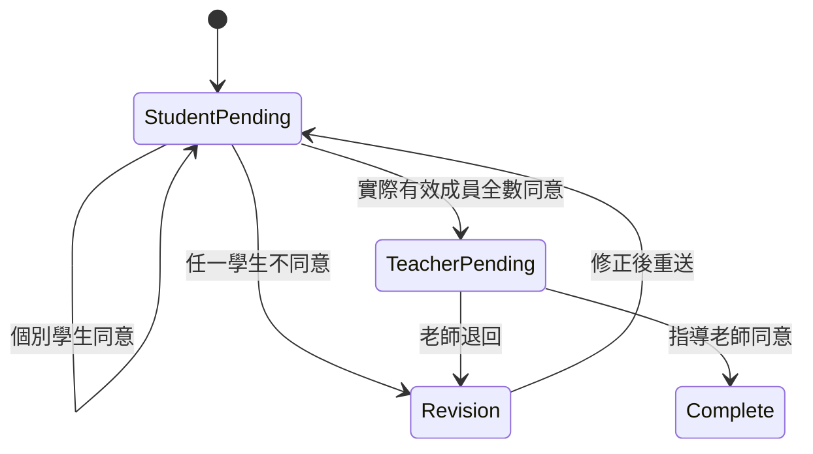

# 07 線上簽核

> 2026-09-11 產品拆分版。規則依已確認來源承接；新增案例為驗收設計，不代表已實作或已通過。未決以 Q-ID 明示。

## 0. 看著畫面理解這個模組（2026-09-11 原型截圖）

> 截圖：2026-09-11 擷取自 repo `prototype/`（branch `proto/role-ux-round1`，commit `8e1cff8`），localhost:3100，桌機 1440 寬。身分由 cookie `fju-role` 模擬，沒有真正登入；資料全是 `fixtures.ts` 假資料，示範時鐘 2026-08-17。畫面上的「已儲存」「已發布」「已收件」是原型回饋，不代表資料真的保存。標「尚無原型」的行為只是產品預期，沒有臨時補做畫面。

### 誰、什麼時候、從哪裡進來
期末（或系辦指定的時點）系辦上傳同意書 PDF 並發布給各組。每位組員用自己的帳號登入，讀完全文後按「我已閱讀並同意」或「不同意」並填原因；本組全部有效成員都同意後，才輪到指導老師表態。任何人不同意就回到修正狀態；系辦改了內容、換了成員或老師，就是新版本，大家重新同意。系辦只能看進度、提醒、重置，不能替任何人按同意。

### 一步一步怎麼操作
1. 學生進「同意書」：上方是條文摘要與版本、PDF 全文（另開或下載），必須勾「我已完整閱讀同意書全文」才能按「我已閱讀並同意」，會跳出「確認同意，只代表你自己的一票」；按「不同意」要填原因才能送出退回。
2. 下方「進度」列出五位組員各自的表態時間與尚未表態的人，最後一格是指導老師，寫「等五位都同意後輪到老師」。
3. 老師進「簽核」：每個指導組一張卡，狀態「輪到你」「等待學生 2 人」；輪到自己時出現同意／不同意按鈕，同意時一樣跳確認框。
4. 系辦進「簽核管理」：整體進度、各組一列格子（每格一位學生、右邊短格是老師），點「缺 N 位」看是誰；「提醒未同意者」；每組可「重置」，對話框列出將失效的簽署與原因必填。下方可上傳新版 PDF，說明「換新版會重置所有人的同意」；「新增簽核」可指定對象與版本。

### 操作後自己與其他角色看到什麼
學生：自己那格變成有時間，首頁「同意書」磚從「等你同意」變「已同意」；全員同意後老師的通知匣收到「等待老師同意」。老師：卡片狀態變「輪到你」；同意後該組完成，三方進度一致。系辦：整體完成數與各組格子更新，操作紀錄多每一筆同意與重置。

### 畫面現況
已有畫面：學生同意書頁（含條文摘要、PDF、進度）、學生確認同意與同意後狀態、不同意對話框、老師簽核頁與確認框、系辦簽核管理、缺誰、重置、新增簽核。只是預期（尚無原型）：三人例外組按實際成員計算、內容改版後舊同意失效的歷史顯示、舊頁面送同意被拒、換老師後舊老師失權。要討論：校方是否採認站內同意（Q-SGN01）。

### 畫面

*學生｜/dashboard/student/signoff｜條文摘要、PDF 全文、勾選已閱讀、同意／不同意、五人進度*

*學生｜按同意後的確認框｜只代表你自己的一票*

*學生｜同意後｜自己那格記錄時間*

*學生｜不同意｜原因必填，會回到修正狀態*

*老師｜/dashboard/teacher/signoff｜第 02 組輪到你、第 07 組等待學生*

*老師｜確認同意｜以老師身分同意，只代表自己一票*

*老師｜不同意並退回｜原因必填，全組重走*

*管理員｜/dashboard/admin/signoff｜整體進度、各組格子、同意書檔案；系辦不能代簽*

*管理員｜點「缺 2 位」｜看是哪些人尚未同意*

*管理員｜重置｜列出將失效的簽署，原因必填*

*管理員｜新增簽核｜標題、版本、對象、上傳 PDF，發布並通知*

### 原型與規格的差異（並列，不改產品決定）

| 畫面上 | 產品規則 | 待處理 |
|---|---|---|
| 原型文案固定寫「五位組員」「五人全同意」 | Q8：按實際有效成員全數同意，例外組是三人就三人 | 文案改為「全部組員」；SGN-07 驗證 |
| 學生頁寫「表態後在老師簽核前可以重送，改回同意會覆蓋上一筆」 | 每次同意記錄 actor、版本、時間；覆蓋規則規格未寫 | 列入 SGN 模組待確認：改票是否保留舊紀錄 |
| 9/10 複測：同意結果不延續、老師看不到完整正文 | 已完成提示必須有保存證據；老師要先讀到全文 | 正式版以伺服器狀態為準，SGN-04、SGN-10 為回歸案例 |

---
## 1. 目的與範圍
以目前有效成員與主指導逐人確認特定版本，留可追查同意紀錄。

## 2. 角色與入口
學生本人待同意；主指導待同意；管理員內容／進度／重置。

## 3. 主要操作
先依下一節業務規則操作；正常跨模組順序見 [年度主線](<../🔁 年度情境/01 完整年度主線.md>)，本模組逐案步驟在第 11 節。

## 4. 產品規則
### 8.1 v1 流程 `DECIDED`

- 管理員建立要簽核的內容版本與適用組別。
- 所有實際有效組員必須各自登入、閱讀並按同意；每人只有自己的同意權。
- 實際有效成員全部同意後，指導老師才能按同意。
- 任一人選擇不同意／退回，必須填原因並回到修正狀態。
- 內容、組員集合或主要指導老師改變，舊同意失效，必須對新版本重走。
- 全程不下載、不簽、不回傳 PDF。

### 8.2 管理員能力與限制

- 查看各組進度、缺少哪位學生／老師、最後事件時間。
- 重開、作廢或重置簽核流程，必須填原因。
- 不可代替學生或老師按同意；資料庫也不得留下「管理員假裝某使用者同意」的路徑。
- 每次同意記錄 actor、role、內容版本、時間、結果與必要原因。

### 8.3 v1 類型

- 最終文件／授權內容同意。
- 系統驗收或結果確認。

這是受限的專題簽核模組，不擴張成任意公司級 workflow engine。

### 參與者版本與失效
非五人例外組按實際有效成員數逐人同意。每次內容、成員或主指導變更均開新版本；舊同意留歷史但不計入新版。舊頁送出須因版本不符被拒，舊老師不能再簽，新加入者能讀全文並參與。管理員不能代簽。重新計算以新版參與者集合為準。
系統證明的是站內閱讀／同意紀錄。是否符合校方授權與法律採認尚待 Q-SGN01；不把技術紀錄當成學校已核可。

## 5. 狀態與權限
待學生→待老師→完成；任一不同意→修正；內容或參與者變更→新版重新同意。

## 6. 欄位與資料歸屬
內容版本、組別、參與者集合、每人 actor／role／結果／時間／原因。

## 7. 保存、版本與回執
舊版留歷史不計新票；重試不重複；舊頁版本不符拒絕。

## 8. 其他角色所見
各角色看同一版本進度與缺誰；管理員無代簽；換老師後舊老師失權。

## 9. 例外與未決事項
Q-SGN01。完整問題、建議與決策影響見 [待討論清單](<../💬 討論與決策/2026-09-11 產品待討論清單.md>)；不可將建議直接當成定案。

## 10. 依賴與原型差距
GRP 實際成員與老師、ACC 有效身分、NTF 待本人通知、FIL audit。

現有 prototype 只作已確認畫面與互動的對照；不能證明 Auth、DB、權限或服務已完成。細節對照 [前台頁面清單](<../🗺️ 前台頁面清單.md>)、[後台頁面清單](<../🗺️ 後台頁面清單.md>)。新操作改動先原型讓 Roy 看，再回寫產品條文與正式實作。工程接續見 [產品交接](<../💬 討論與決策/2026-09-11 交給 Fable 的工程接續.md>)。

## 11. 驗收案例
各案使用年度資料集或明標獨立分支。待決案例須先補決定，延後案例不納本輪 Gate；兩者都不能記 PASS。未特別列出的他角色以第 8 節權限核對，拒絕案例也要證明資料未變。

### SGN-01｜建立簽核內容

- 前置與操作：A1 建成果授權內容版本，選 G1／G2／G3。
- 預期與跨角色核對：各組看到應閱讀全文、內容版本與目前參與者；資料可追查。
- 證據：內容、版本、參與者集合；按接受條件分別記 UI、操作邏輯、保存、權限。
- 案例狀態：可執行設計；執行結果：**NOT_RUN**。

### SGN-02｜逐人同意

- 前置與操作：G1 五位有效成員分別登入同意。
- 預期與跨角色核對：每人只能自己一票；重試不重複計數；缺任何一人都未全同意。
- 證據：五帳號回執、進度；按接受條件分別記 UI、操作邏輯、保存、權限。
- 案例狀態：可執行設計；執行結果：**NOT_RUN**。

### SGN-03｜老師提前操作拒絕

- 前置與操作：G1 只有四人同意，T1 由舊頁或請求送同意。
- 預期與跨角色核對：伺服器拒絕，沒有老師有效同意；顯示仍缺誰。
- 證據：老師畫面、拒絕、進度；按接受條件分別記 UI、操作邏輯、保存、權限。
- 案例狀態：可執行設計；執行結果：**NOT_RUN**。

### SGN-04｜老師最後同意

- 前置與操作：G1 全員對同版本同意後，T1 閱讀並同意。
- 預期與跨角色核對：該組該版本完成；三角色同見完成與時間。
- 證據：老師回執、學生／管理進度；按接受條件分別記 UI、操作邏輯、保存、權限。
- 案例狀態：可執行設計；執行結果：**NOT_RUN**。

### SGN-05｜不同意與退回

- 前置與操作：S08 或老師不同意但不填原因，再填原因送出。
- 預期與跨角色核對：缺原因被拒；有原因進修正；顯示可理解原因與下一步。
- 證據：驗證、退回紀錄、他角色所見；按接受條件分別記 UI、操作邏輯、保存、權限。
- 案例狀態：可執行設計；執行結果：**NOT_RUN**。

### SGN-06｜內容新版重簽

- 前置與操作：G2 v1 曾有同意；A1 修正成 v2，所有人重新閱讀同意。
- 預期與跨角色核對：v1 留歷史不計 v2；不能自動沿用；全員後老師才可完成。
- 證據：兩版內容、同意集合；按接受條件分別記 UI、操作邏輯、保存、權限。
- 案例狀態：可執行設計；執行結果：**NOT_RUN**。

### SGN-07｜三人例外組

- 前置與操作：G3 實際成員 S11–S13 全部同意，T3 同意。
- 預期與跨角色核對：門檻為實際有效三人加主指導，不等待不存在第四第五人。
- 證據：成員集合、3/3、老師回執；按接受條件分別記 UI、操作邏輯、保存、權限。
- 案例狀態：可執行設計；執行結果：**NOT_RUN**。

### SGN-08｜不可代簽與重置

- 前置與操作：A1 嘗試替 S09 同意，改走填原因重置 G2。
- 預期與跨角色核對：不可代簽；重置保留原同意歷史，現在進度回待同意；需重新走完才算完成。
- 證據：拒絕、重置 audit、舊新版進度；按接受條件分別記 UI、操作邏輯、保存、權限。
- 案例狀態：可執行設計；執行結果：**NOT_RUN**。

### SGN-09｜參與者改變與舊頁

- 前置與操作：簽核中 A1 更換成員或 T2→T3；舊成員／T2 用舊頁同意，新人查看。
- 預期與跨角色核對：產生新版本；舊版請求拒絕，舊老師失去操作權；新參與者看到全文與待同意；依新集合重算，不沿用票。
- 證據：四項證據：舊頁拒絕、舊老師拒絕、新人畫面、重算集合；按接受條件分別記 UI、操作邏輯、保存、權限。
- 案例狀態：可執行設計；執行結果：**NOT_RUN**。

### SGN-10｜跨角色進度一致

- 前置與操作：分別停在部分同意、待老師、退回、完成，學生老師管理員查看。
- 預期與跨角色核對：首頁與詳情一致，缺誰與版本一致，不把歷史完成當新版完成。
- 證據：四狀態三角色記錄；按接受條件分別記 UI、操作邏輯、保存、權限。
- 案例狀態：可執行設計；執行結果：**NOT_RUN**。

## 12. 來源與修訂
承接拆分前完整規格、2026-09-11 Q1–Q9、Fable 同日討論及 Roy 最新分工／延後指示；[逐節來源對照](<../💬 討論與決策/2026-09-11 原規格承接對照.md>)可追到原件。草案既有案例 ID 保留，不把草案範例結果當本次實測。本次只整理产品文件，全部案例 NOT_RUN。
