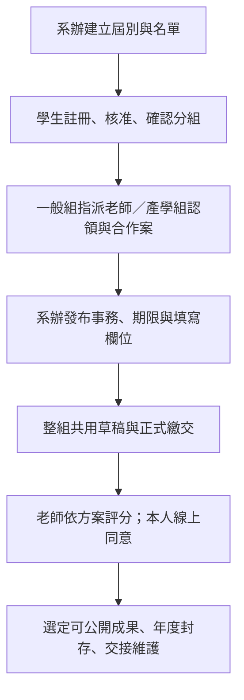

# 🎯 專案目標與範圍

## 為什麼做

讓系上的專題資訊容易被找到，讓學生、老師、管理員能在同一套平台完成一個專題年度的工作。公開網站承接成果展示與資訊入口；登入後的平台承接發布、收件、分組、產學、評分與簽核。核心資料與檔案留在校方可控制的環境。

本頁的問題與目的追溯到 7/6、7/15、7/22 會議；產品範圍與驗收依 8/17 完整主規格 §1、§2、§11、§15。2026-09-06 Roy 要求補清楚會議來源，並沿用已決定的規格。會議說明為什麼需要重建，主規格記錄後續採用的具體解法，兩者分開閱讀。

## 會議怎麼形成這些目標

| 來源 | 記錄中的問題／需求 | 對本專案目的的意義 |
| --- | --- | --- |
| 7/6 會議 §10 | 老師提出系上網站重做或維護，舊系統可能問題多，需另約細談 | 重建源自系方實際使用與維護需求；當時尚未確定 LDAP 與舊碼處理方式 |
| 7/15 會議 §1 | 外籍生／轉學生在 LDAP 缺欄位，資料取得出錯；改為自行註冊與本屆 CSV 名單 | 讓不同學生能正確建立身分，解除對舊帳號資料的依賴 |
| 7/15 會議 §2、§6 | Google 表單繳檔後在 Gmail 難找；圖片／文件需要集中儲存，影片可能塞滿容量 | 把繳交與檔案集中到可追查的平台，影片採外部連結 |
| 7/15 會議 §7 | 原先用 Excel 計算權重，老師需要暫存與評分指派 | 減少人工搬分，支援老師實際評分流程；現行公式邊界依主規格 |
| 7/15 會議 §5、§9、§10 | 同意、公告、規則、產學與題目填報都有具體操作需求 | 平台需要串起專題年度的完整工作，首頁與後台都要能使用 |
| 7/22 會議 §6.1–§6.3 | Google 驗證仍要配合名單授權；歷屆成果要成為學習參考庫；表單與檔案依角色管理 | 保留身分核准、成果延續、角色分工三個目的 |
| 7/22 會議 §6.4–§6.5 | 討論本人電子確認與版本留痕；開學前老師端測試、十月學生首次填報 | 系統需能對應實際教學／行政節奏；後續版本才具體確定純線上簽核與完整交付範圍 |

7/22 的公開範圍、電子確認候選流程和當時時程保留為沿革；目前產品按 8/17 主規格執行。7/22 §7 的「專題文件改革」是對學生專題文件制度的提案，不能當成該會議已要求本站採用 ADR／CONTEXT 的證據。

### 原件入口與日期核對

統一入口：[[專案/🌐 網站與互動/📁 輔大資管系專題網站/🎯 專案目標/🤝 會議/🗺️ 會議與討論紀錄|會議與討論日期總覽]]。以下保留與目標直接相關的原件對照。

- [[專案/🤖 機器人/📁 PawAI/💬 會議/20260706專題會議紀錄#10. 專題網站 / 系統重做|7/6：重建起源]]。
- [[專案/🌐 網站與互動/📁 輔大資管系專題網站/🎯 專案目標/🤝 會議/專題網站 - 0715會議紀錄|7/15：系方需求詳談]]。
- [[專案/🤖 機器人/💬 跨專案會議/2026-07-22 完整會議紀錄#六、專題網站需求|7/22：後續網站需求會議]]；[[日記/2026/07/2026-07-22|當日日記]] 也明記下午與老師討論網站重構細節。
- [[專案/🤖 機器人/💬 跨專案會議/2026-07-22 完整逐字稿－Qwen3-ASR|7/22 完整逐字稿]]：會議摘要的原始文字依據；本輪未重新聽錄音。
- [[日記/2026/07/2026-07-19#8. 專題網站|7/19 進度討論]]：當時已有 UI 雛形、仍不滿意，八月再續。
- [[日記/2026/08/2026-08-17|8/17 日記]]：Roy 記錄需求與前端第一版討論完成，不能把它改稱另一場校方會議。

2026-09-06 搜尋本 Vault 專案會議資料與七、八月日記，目前找到較新的明確網站需求會議是 7/22；尚未找到另一篇八月獨立網站需求會議。這是目前文件查找結果，不表示其他未保存／未辨識材料不存在。

## 誰遇到什麼問題

| 對象 | 原來的問題 | 希望得到的結果 |
| --- | --- | --- |
| 訪客與校外合作方 | 專題成果與規則入口太深，內容不易搜尋 | 不登入即可找到已發布的公告、規則、產學、歷屆／優秀專題、競賽與榮譽 |
| 學生 | 繳交散落 Email／表單，難知道全組完成與否 | 登入看見期限、組別、待辦、共用草稿、繳交回執及個人同意狀態 |
| 老師 | 指導、產學、評分與同意分散處理 | 同一平台查看組別、認領產學組、輸入成績與完成同意 |
| 管理員 | 公告、檔案、需求和收件重複管理，進度難追 | 在一致的工作台發布、收件、處理例外、匯出並追查歷史 |
| 校方維運者 | 系統延續、資料控制和故障恢復需要可交接 | 自有 VM、資料庫與檔案可部署、備份、還原及查核 |

## 要交付的產品

一套公開網站，加上學生、老師、管理員共用登入入口的業務平台。管理後台包含帳號、專題事務、分組、產學、評分、簽核六區；專題事務統一管理公告、資源、繳交及需求，使用者仍從各自用途的頁面進入。

歷屆成果依現行主規格走公開列表／詳情；發布位置與資料公開權限是兩件事，私有繳交、敏感聯絡欄位與成績依 audience、欄位白名單及角色授權處理。7 月會議保留需求沿革價值，衝突時沿用 8/17 主規格，不再次把已決定的公開入口列為待問。

## 一個專題年度如何使用這套平台

這是產品使用情境，不能當成當前已可操作流程。公開站讓訪客了解成果，登入後則讓每一位參與者完成自己的責任。分組、指導關係、評分指派及文件同意各有資料與權限，不因都屬同一專題就混成一個開關。

## 完整成果與維護責任

這次完整 v1 包含公開前台、三角色 Dashboard 及六個核心管理區。交付後以維護為主，需要讓下一位維護者找得到需求來源、版本、部署方法、資料與檔案還原步驟；不依賴 Roy 記得某次聊天內容才能接手。

| 成果面 | 完整內容 | 本輪文件如何承接 |
|---|---|---|
| 內容與入口 | 公告、規則、產學、歷屆／優秀作品、競賽、榮譽 | 規格 §3、§9–§10；公開素材依授權與欄位邊界 |
| 身分與協作 | 雙登入、名單、人工例外、多角色、五人分組 | 規格 §2、§5 |
| 專題行政 | 統一編輯器、收件、共用草稿、版本、老師查閱 | 規格 §4、§11 |
| 評量與確認 | 結構化評分、平均、更正、學生與老師本人同意 | 規格 §7–§8 |
| 營運與交接 | 校方 VM、檔案授權、稽核、備份與還原 | 架構頁與規格 §11–§15 |

九個原始 Epic 的逐項對照與來源差異已放在完整規格 §19.5–§19.6。原始表格、會議與日記保留；新規格說明最後採用的產品行為。

## 怎樣才算做好

| 成果 | 需要的證據 |
| --- | --- |
| 找得到公開資訊 | 訪客能完成主規格 §15.2 的公開瀏覽旅程，另驗 SEO 可抓取與收錄狀態 |
| 能完成真實專題業務 | 登入、名單審核、組別、繳交版本、評分及簽核跨角色 E2E |
| 身分與資料隔離成立 | 真實 session、資料庫及私有下載的正向／負向測試，學生取得不到成績 |
| 校方可以接手營運 | VM、TLS、OAuth callback、持久化、重啟、外部備份與全新環境還原演練 |
| Roy 可接受開放 | Roy 的瀏覽器手動驗收、已知問題與是否擴大帳號開放的決策 |

詳細條件逐條保留於主規格 §15。現行完整規格已承接 Roy 於 9/6 更新的 **2026-09-10 交付，之後以維護為主**，取代 8/17 基線的 9/14 日期；產品範圍與驗收條件沒有因此縮減。來源：[當期計畫討論](codex://threads/01a07578-6b28-7a01-bc43-3e5cdd115870)。文件完成不等於網站交付完成。

## 範圍邊界

沿用主規格 §1.4：全新系統；舊站作流程與人工精選內容參考，不沿用舊碼、遷移舊業務資料庫或串 LDAP。不做完整 LMS、公司帳號、自動媒合、任意 workflow engine 或 Excel clone。影片存外部連結；v1 學生不看成績，簽核採本人線上同意；匿名信箱維持 deferred。

## 現在站在哪裡

2026-09-06 原始碼查核：新版已有 fixtures 公開頁面、Dashboard／分組畫面與設計資產；正式 Auth、PostgreSQL、收件、評分、簽核及部署尚未形成可驗收流程。七月後端探索和八月原型是已有經驗，接續時需讀其版本與證據，不能誤認為完全沒做過，也不能混作目前新版完成狀態。

## 來源與接續

[[專案/🌐 網站與互動/📁 輔大資管系專題網站/🎯 專案目標/📋 完整產品規格|完整主規格]]

[[專案/🌐 網站與互動/📁 輔大資管系專題網站/🛠️ 工程開發/🏗️ 系統架構與資料流]]

[[專案/🌐 網站與互動/📁 輔大資管系專題網站/🛠️ 工程開發/🧭 文件分工與開發接續]]
