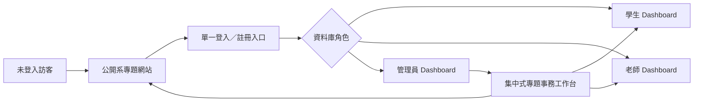
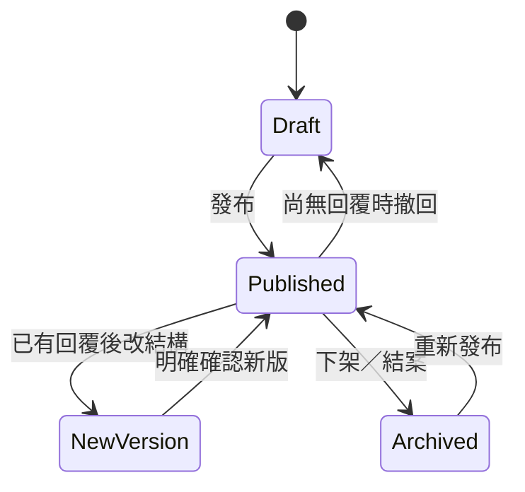
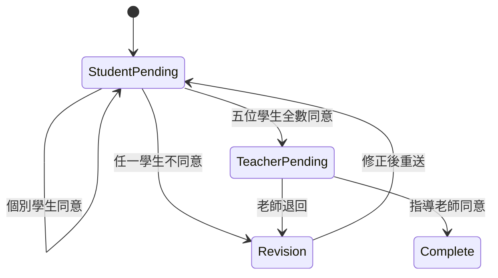

# 📋 完整產品規格

> 2026-09-11 最新決定見 §22：個人／組別收件、通知、日曆、時間軸、例外簽核及週一試用範圍。衝突時以 §22 為準，舊條文保留供追溯。

讓訪客找得到系上的專題成果，讓學生與老師登入就知道現在該做什麼，讓管理員在一致的後台完成發布、收件、分組、評分與簽核；核心資料與檔案留在校方可控環境。

本頁承接 8/17 完整規格 §0–§20 與 9/6 交付修訂。9/7 依 Roy 授權集中全文、補導讀並分開歷史排程；**沒有縮減功能、替換既有選型或把文件完成當成系統完成。** 目前是既定需求的完整閱讀版；工程選型與外部資料仍依 §13.3、§18 保留待確認。

## 閱讀入口

| 想查什麼 | 章節 |
|---|---|
| 產品目的、角色、登入及 Dashboard | §1–§3 |
| 事務編輯、草稿、繳交與檔案版本 | §4、§11 |
| 分組、指導老師與產學 | §5–§6 |
| 評分計算與本人線上同意 | §7–§8 |
| 公開內容、首頁與操作體驗 | §9–§10 |
| 資料、技術、部署與品質 | §12–§15 |
| 接續策略、交付日期、未決與來源 | §16–§20 |

## 0. 文件治理與使用方式

### 0.1 權威順序

1. Roy 已確認並回寫本檔的最新決策，取代相衝突的舊條文。
2. 本檔其餘有效條文：完整產品範圍與驗收基線。
3. Google Sheet 與會議紀錄：需求來源，不可在衝突時直接覆蓋本檔。
4. 舊站、參考網站與 GitHub 專案：行為、內容與 UX 參考，不是需求權威。
5. issue、程式碼與測試：必須實作本檔；若與本檔不同，先釐清並更新規格，不可默默讓程式碼反過來定義產品。

### 0.2 修改規則

- 任何新增、刪除或改動需求，都要更新 `last_updated`、版本號與「決策紀錄」。
- 會改變角色權限、資料模型、公開範圍、計分方式或交付日期的變更，必須由 Roy 明確拍板。
- 小型文案、欄位排序、視覺間距可在不改語意下迭代；仍需由驗收畫面確認。
- 不在本檔保存密碼、OAuth secret、SSH key、資料庫連線字串或真實學生個資。
- 週計畫負責時間分配；本檔負責產品範圍。週計畫不得自行改寫產品需求。

### 0.3 狀態標記

| 標記 | 意義 |
|---|---|
| `DECIDED` | Roy 已確認，v1 必須遵守 |
| `ENGINEERING DEFAULT` | 為了能實作而先定的安全預設，可在不改核心需求下調整 |
| `TBD` | 尚需外部資料或 owner 決策；必須列出何時封板 |
| `DEFERRED` | 保留方向，但不是 2026-09-14 release Gate |
| `NON-GOAL` | v1 明確不做，禁止順手擴張 |

---

## 1. 產品定位

### 1.1 要重建的產品

這是一套完整的「資管系專題入口＋專題管理平台」：

- **公開前台**：提供公告、專題規則、產學合作、歷屆成果、優秀專題、榮譽與競賽資訊，改善舊站入口太深、搜尋不到、內容少人使用的問題。
- **登入後平台**：學生、老師、管理員從同一入口登入，依角色看到不同 Dashboard、導覽與操作權限。
- **管理後台**：管理員集中管理帳號、專題事務、分組、產學、評分與簽核，避免在多個不一致頁面之間來回切換。
- **校方自有資料面**：PostgreSQL、上傳檔案與核心服務部署在學校 Ubuntu VM；不依賴舊資料庫與 LDAP。

### 1.2 要解決的問題

| 現況問題 | v1 解法 |
|---|---|
| 舊站超過十年、入口難找、Google 幾乎搜不到 | 重建公開 IA、SEO、清楚導覽與可維護內容頁 |
| 後台新增／編輯帳號不完整，忘記密碼難處理 | Google＋Email/密碼雙登入、管理員新增帳號、停用／還原、重設臨時密碼 |
| 文件靠 Email、Google Form 與人工翻找 | 統一專題事務工作台、組別共用繳交、版本與截止追蹤 |
| 公告、檔案、繳交、專題需求看似不同，後台卻重複操作 | 後台共用拖拉式內容／表單編輯器；前台仍維持清楚的不同入口 |
| 分組與老師指定受分類、建立順序限制 | 所有老師可看群組；產學未指派組可被老師直接認領；管理員可覆寫 |
| 評分要人工搬到 Excel 算權重 | 站內建立評分方案、老師暫存／送出、系統自動計算與匯出 |
| 紙本／PDF 簽核繁瑣 | 五位學生逐一線上同意，再由老師線上同意；完整留痕、不上傳 PDF |
| 舊前端／後台不好看也難操作 | 公開站沿用系網品牌；登入後採現代 dashboard、清楚工作佇列與一致 Data Table |

### 1.3 v1 成功樣貌

- 訪客不用登入就能找到最新消息、專題規則、優秀專題與榮譽；產學合作與歷屆一覽登入後可看（2026-09-07 修訂）。
- 學生登入首頁即可看見截止日、待辦、分組、指導老師、繳交與簽核狀態。
- 老師登入即可看見自己的學生／組別、全體分組、可認領產學組、待評分與待同意事項。
- 管理員不用理解底層表單或資料庫，就能在同一工作台發布內容、建立收件、查看進度與匯出資料。
- 任一組員繳交後，全組狀態同步完成；截止前可重送、舊版本可追查。
- 成績能依方案自動計算，多位老師結果正確平均，學生 v1 完全看不到分數。
- 所有高權限操作、分數修改、簽核與版本變動皆可稽核。
- 校內 VM 可重建、可備份、可還原；限制測試帳號完成跨角色 E2E 後才擴大開放。

### 1.4 v1 明確不做

- 不沿用或改造舊程式碼；不建立舊系統相容層。
- 不搬舊帳號、舊分組、舊繳交或舊成績資料庫。
- 不接 LDAP／LMS 作為登入或密碼來源。
- 不明文保存密碼，也不提供任何人查看既有密碼。
- 不做完整 LMS、線上課程、測驗、聊天室、履歷投遞、公司帳號或自動媒合。
- 不做無限制 workflow engine、任意程式公式或完整 Excel clone。
- 不把影片直接存進系統；三分鐘影片使用系上 YouTube 或外部連結。
- 不放學生照片。
- 不做紙本簽名、PDF 下載簽名再回傳的同意流程。
- 不讓學生在 v1 看成績。
- 不把匿名信箱納入核心模組或 v1 release Gate。

---

## 2. 使用者、登入與權限

### 2.1 四種觀看狀態

| 身分 | 主要目的 | 入口 |
|---|---|---|
| 未登入訪客 | 看公開消息、規則、產學、成果與榮譽 | 公開網站 |
| 學生 | 分組、看待辦、填資料、整組繳交、逐一同意 | 同一登入入口後進學生 Dashboard |
| 老師 | 管理產學、看組別、認領產學組、評分、同意 | 同一登入入口後進老師 Dashboard |
| 管理員 | 管理所有資料、帳號、發布、例外與稽核 | 同一登入入口後進管理 Dashboard |

- 一個帳號可持有多個角色，例如老師兼管理員；登入後可切換「目前工作角色」。
- 前端隱藏按鈕不是權限控制。所有讀寫權限均須在伺服器端依資料庫事實重新驗證。
- 管理員是最高業務權限，但不能讀取密碼、偽造學生／老師的同意，或無痕修改歷史。

### 2.2 權限矩陣

| 能力 | 訪客 | 學生 | 老師 | 管理員 |
|---|:---:|:---:|:---:|:---:|
| 查看公開內容／公開產學 | ✓ | ✓ | ✓ | ✓ |
| 查看個人 Dashboard | — | ✓ | ✓ | ✓ |
| 建立／加入／確認組別 | — | ✓ | — | 代管／例外 |
| 查看全體分組 | — | 同屆可見範圍 | ✓ | ✓ |
| 認領未指派產學組 | — | — | ✓ | 覆寫／重派 |
| 建立自己的產學合作案 | — | — | ✓ | 可代管全部 |
| 編輯發布內容與收件項目 | — | — | — | ✓ |
| 填寫／繳交組別項目 | — | ✓ | 依需求檢視 | 可檢視／代管，不冒充組員 |
| 輸入成績 | — | — | 僅受指派組別 | 全部＋更正 |
| 查看成績 | — | — | 自己輸入／授權範圍 | 全部 |
| 線上同意 | — | 自己一票 | 指導老師一票 | 只可重開／重置 |
| 管理帳號／角色／屆別 | — | 自己有限資料 | 自己有限資料 | ✓ |
| 查看 audit log | — | 自己相關回執 | 自己相關事件 | ✓ |

### 2.3 登入方式 `DECIDED`

- **主要方式：Google OAuth**。
- **備援方式：Email＋密碼註冊／登入**，供沒有 Google 帳號或無法使用 Google 的人使用。
- 兩種方式完成登入後，都要有相同的帳號狀態、角色、名單比對與審核流程。
- 不使用 LDAP；舊站第一次登入保存 LDAP 密碼的行為只屬歷史背景，禁止重現。
- Email/密碼以強密碼雜湊保存；實作需使用成熟函式庫與現代參數，不自製加密。
- 忘記密碼走重設流程；管理員也可建立一次性臨時密碼並強制下次登入更改。

### 2.4 註冊、名單比對與審核

#### 學生註冊資料

- 姓名（必填）
- 學號（必填）
- 屆別／專題年度（必填或由名單帶入）
- 手機（必填，可由管理員後續調整）
- 聯絡 Email（必填）
- 登入 Email／Google identity（系統帶入）
- 不收生日，不收學生照片。

#### 本屆名單 CSV 固定格式

```text
student_no,name,cohort,email
```

- UTF-8 CSV；`student_no`、`name` 必填，`cohort`、`email` 可由主任提供時填入。
- 系統先 preview 總筆數、有效、重複、缺欄、衝突；管理員確認後才匯入。
- `student_no + 正規化姓名` 命中本屆名單時可自動核准；若名單有 Email，登入 Email 也必須一致。
- 找不到、資料不一致、學號重複或跨屆衝突時，不阻擋送件，改進管理員待審核清單。
- 自動核准與人工核准都要留下比對依據、操作者／系統、時間與名單版本。

#### 老師帳號

- 管理員可直接新增老師，或先用 Email 建立預授權。
- 老師第一次登入補姓名與聯絡資料，不需要學號。
- 老師可用 Google 或 Email/密碼；同一人不可因兩種登入方式產生兩個獨立帳號。

### 2.5 管理員帳號能力

- 新增學生、老師與管理員帳號。
- 編輯姓名、學號、屆別、手機、Email、角色與帳號狀態；必要的 immutable identity 另以系統 ID 保存。
- 停用帳號、還原帳號、永久刪除帳號。
- 建立／重設一次性臨時密碼、強制下次登入改密碼、撤銷所有 session。
- **不能查看任何既有密碼**；系統不存在可被查看的明文密碼。
- 永久刪除前須顯示影響預覽並二次確認；不得 cascade 刪掉需要保留的繳交、成績、簽核與 audit。
- 刪除個資與保留業務紀錄衝突時，以去識別化／保留必要關聯處理，不能破壞稽核鏈。

### 2.6 批次管理、排序與匯出

- 帳號表可依學號、建立時間、屆別與狀態排序。
- 可搜尋姓名、學號、Email；可依角色、屆別、狀態篩選。
- 可勾選部分或全選目前篩選結果，匯出 UTF-8 CSV，至少含姓名、學號、屆別、手機、Email、角色、狀態。
- 批次停用接受 UTF-8 TXT：**一行一個學號**，允許空白行，不接受其他自由格式。
- 批次動作必須先 preview「將命中／找不到／重複／已停用」，預設執行停用而非永久刪除。
- 永久批次刪除為獨立高風險動作，需再次輸入確認文字並產生 audit。

#### AUTH 驗收

- [ ] Google 與 Email/密碼都能完成註冊、登入、登出與 session 撤銷。
- [ ] 名單命中可自動核准；未命中進人工審核；重送不建立重複帳號。
- [ ] 多角色帳號可切換工作角色，切換不會提升未授予權限。
- [ ] 停用後下一個受保護 request 即被拒絕。
- [ ] 管理員可新增、編輯、停用、還原、永久刪除與重設臨時密碼。
- [ ] 資料庫、log、匯出與 UI 都無法取得既有明文密碼。
- [ ] 批次 preview、排序、篩選、部分／全選匯出均可重現。

---

## 3. 資訊架構與三角色 Dashboard

### 3.1 一個產品、兩個表面



- 公開前台與登入後 Dashboard 使用同一套 Next.js 應用與品牌 tokens，但版面目的不同。
- 公開前台是內容與成果導覽；Dashboard 是工作佇列與狀態總覽。
- 前台頁面仍清楚分成公告、資源／下載、文件繳交、專題需求等；**只有管理後台把建立流程統一**。

### 3.2 公開前台建議路由

| 頁面 | 核心內容 |
|---|---|
| `/` | 系上品牌、重要公告、近期截止、精選專題、榮譽與產學入口 |
| `/news`、`/news/[slug]` | 公告與競賽資訊列表／詳情 |
| `/industry`、`/industry/[id]` | 產學合作列表／詳情（登入後；列表可排序搜尋） |
| `/projects/featured`（公開）、`/projects`（登入後）、`/projects/[id]` | 優秀專題公開且可點開詳情；歷屆一覽登入後，卡片式、依屆別分段、可搜尋排序，王冠＝優秀、獎盃＝佳作（Roy 2026-09-07） |
| `/honors` | 榮譽榜、競賽得獎與相簿 |
| `/competitions` | 競賽資訊與照片 |
| `/rules` | 目前專題規則（Roy 2026-09-07：只顯示現行版，不做歷史版本；內容與舊站九節一致） |
| `/login`、`/register` | 單一登入與註冊入口 |

路由名稱可在實作時微調，但上述資訊入口不可消失或被藏進多層選單。

### 3.3 登入後六個核心區域

1. **帳號管理**
2. **專題事務管理**：公告、檔案／資源、文件繳交、專題需求與公開內容的共用後台工作台
3. **分組管理**
4. **產學合作**
5. **成績管理**
6. **簽核管理**

Dashboard 首頁是以上功能的摘要與入口，不算第七個業務模組。匿名信箱也不屬於六個核心區域。

### 3.4 學生 Dashboard

- 下一個截止日與倒數。
- 待完成、草稿、已繳交、需重送、已逾期的專題事務。
- 自己的組別、五位成員確認進度、組別類型與指導老師。
- 近期公告與重要規則。
- 產學合作入口。
- 待本人同意與全組簽核進度。
- 共用草稿與歷次繳交版本。
- **不顯示任何分數、評語或排名。**

### 3.5 老師 Dashboard

- 我的學生／指導組別。
- 全體分組與未分組名單。
- 尚未指派、可認領的產學組。
- 自己建立的產學合作案。
- 待評分、已暫存、已送出的評分工作。
- 待老師同意的簽核。
- 近期截止與各組繳交狀態。

### 3.6 管理員 Dashboard

- 待審核帳號、停用／異常帳號。
- 本屆已分組／未分組、組別例外與產學未指派數。
- 各收件項目的完成率、逾期與重新開放狀態。
- 評分完成率、缺評老師、簽核進度。
- 檔案儲存量、最近備份與最近還原演練。
- 簡單實用的瀏覽量、公告閱讀、下載量；不放營收、訂閱或 SaaS 假數據。
- 最近高權限操作與需要處理的系統警示。

---

## 4. 專題事務管理：統一後台、分開前台

### 4.1 核心概念 `DECIDED`

Google Sheet 原本分開的公告、檔案管理、文件繳交與專題需求，在**管理後台**共用一套拖拉式編輯器與生命週期；在**使用者前台**仍依用途出現在不同頁面。產品介面不出現模糊的「一般表單」分類。

管理員建立一個「專題事務項目」時，組合下列能力：

- 標題、摘要、內文、封面與分類。
- 可供下載的附件。
- 要求填寫的欄位。
- 要求上傳的檔案。
- 開放／截止時間。
- 對象與可見範圍。
- **一個主要發布位置**。

同一份內容只維護一份；Dashboard 與截止日元件可自動引用，不算多重發布位置。

### 4.2 主要發布位置

| 位置 | 前台呈現 | 常見能力 |
|---|---|---|
| 公告／最新消息 | 公開或登入後消息列表 | 內文、封面、附件、發布時間 |
| 檔案／資源下載 | 資源列表與詳情 | 說明、分類、可下載附件 |
| 文件繳交 | 學生待辦與組別繳交頁 | 說明、截止日、欄位、檔案上傳 |
| 專題需求 | 專題需求填寫／查看頁 | 可組裝欄位、組別共用回答 |
| 專題規則 | 公開規則頁 | 長文、附件、版本 |
| 歷屆／優秀專題 | 公開專題列表／詳情 | 圖片、摘要、海報、影片連結 |
| 榮譽／競賽 | 公開卡片與詳情 | 圖片、內文、日期、附件 |

- 管理員以單選決定一個主要位置。
- 發布位置決定前台模板，不改變內容的單一來源。
- 需要跨頁曝光時，由首頁精選、Dashboard 待辦與搜尋自動帶出，禁止複製成多筆難以同步的內容。

### 4.3 發布對象

- 公開訪客。
- 所有已登入使用者。
- 本屆學生（預設）。
- 全部老師。
- 指定組別。

公開位置不代表所有欄位都公開；伺服器仍依 audience 與欄位白名單過濾。

### 4.4 拖拉式編輯器

採 [hasanharman/form-builder](https://github.com/hasanharman/form-builder) 的互動與元件做法作為主要 donor，改造成本站專用編輯器，不把另一套應用硬塞進產品。

建議版面：

- 左側：可加入的區塊／欄位。
- 中間：實際內容與表單 canvas，可拖拉排序。
- 右側：目前選取元件的設定。
- 上方：主要發布位置、對象、狀態、預覽與發布。
- 預覽：桌機／手機、訪客／學生／老師視角。

v1 可用元件：

- 說明文字、富文字、圖片、分隔線、區段標題。
- 短文字、長文字 textarea、數字、Email、URL。
- 單選、複選、下拉選單。
- 日期、時間。
- 下載附件。
- 檔案上傳。
- 唯讀的組別、組長、成員與指導老師資訊區塊。

不做：任意 JavaScript、任意 SQL、條件流程編程、第三方執行碼、完整試算表公式語言。

### 4.5 項目生命週期



- 沒有任何回覆前，標題、內容、欄位、附件、對象與期限都可直接編輯。
- 已有回覆後，標題、說明與截止時間可修改，但要留下 audit。
- 已有回覆後，不得原地刪除／改型別／重排會改變答案語意的欄位。
- 結構變更必須建立新 schema version；舊回覆仍綁舊版，新版發布前要預覽影響。
- 發布、撤回、下架、重新發布與版本切換都要記錄操作者與時間。

### 4.6 組別共用填寫與繳交

- v1 的專題事務收件以**整組一份**為原則；個人註冊與個人同意屬各自固定流程，不塞進表單編輯器。
- 同組所有成員看到同一份草稿，均可編輯；以 optimistic concurrency 避免彼此無聲覆蓋。
- 任一成員正式送出，即代表全組已繳交；全組 Dashboard 同步打勾。
- 系統記錄實際送出者、時間、schema version 與檔案版本。
- 截止前可重送；每次正式送出保留不可變版本，預設顯示最新版本。
- 截止後鎖定；管理員可只對指定組別重新開放，必須填理由與新期限。
- 重新開放不刪舊版；管理員與授權老師可切換查看歷史。
- 成功送出後提供清楚回執，不可以只有按鈕變色。

### 4.7 檔案與資源不另造一套系統

- 公告附件、公開資源、表單上傳與組別繳交共用同一檔案服務、metadata、權限與版本模型。
- 管理端可由專題事務工作台依類型、項目、組別、屆別、上傳人與日期查找。
- 「檔案管理」是工作台中的檢視與篩選能力，不是另一個互不相通的產品。
- 檔案刪除預設為軟刪除；仍被發布內容、繳交版本或 audit 引用時不得永久移除。

#### AFFAIRS 驗收

- [ ] 管理員能用拖拉編輯器建立公告、下載資源、文件繳交與專題需求。
- [ ] 每個項目只能選一個主要發布位置，但可自動出現在相關 Dashboard／首頁摘要。
- [ ] 同一內容在後台只有一筆 canonical record。
- [ ] 組別五位成員看到同一草稿；任一人送出後全組完成。
- [ ] 截止前重送、歷史版本、截止鎖定與指定組別 reopen 均正確。
- [ ] 已有回答後的結構修改一定產生新版本，不污染舊答案。
- [ ] 公開附件與私有繳交使用相同儲存核心，但授權完全隔離。

---

## 5. 分組管理

### 5.1 名單與找組員

- 已驗證的本屆學生可查看本屆已分組與未分組名單。
- 未分組學生的「公開找組員」預設關閉，必須本人主動開啟。
- 開啟後，僅向同屆已驗證學生、老師與管理員顯示姓名、學號與聯絡 Email；電話不公開。
- 關閉公開、完成分組或帳號停用後，聯絡資訊立即隱藏。
- 名單明確分成本屆與過往屆別；過往資料預設唯讀，不和本屆未分組混在一起。

### 5.2 正常五人分組

1. 組長輸入剛好五位有效學生學號，包含自己。
2. 系統檢查同屆、未在其他有效組別、沒有另一個進行中申請。
3. 五位成員各自登入確認。
4. 五人全部確認後，以單一 transaction 成立組別。
5. 任一人拒絕或申請過期，申請退回修改，不成立半套組別。

- 非五人組只能由管理員建立例外，並記錄理由。
- 並發確認、重複送出或同一學生同時被兩組邀請，不得造成雙重 membership。

### 5.3 一般專題與產學合作

- 分組類型保留：`GENERAL` 一般專題、`INDUSTRY` 產學合作。
- 建組前學生可表達個人意向；成組後以組別類型為準。
- 組長可在允許期間修改組別類型，所有組員可看見；變更要留 audit。
- 若變更會和既有指導老師或產學案連結衝突，系統警告並交管理員處理，不可靜默刪關聯。
- 分類只影響流程與標示，**不限制老師看見哪些學生／組別**。

### 5.4 指導老師規則

- 所有老師都可查看一般與產學組別。
- `INDUSTRY` 且尚未指派的組別，老師可按「指定為我的組別」直接認領。
- 認領採 first-success transaction；同時兩位老師操作時只能一位成功，另一位收到明確衝突訊息。
- 管理員可覆寫、重新指派或解除指派，必須填理由。
- `GENERAL` 組別由管理員依抽籤／行政結果指派，不提供自由搶占。
- 每組 v1 僅有一位主要指導老師；未來若要共同指導再另改資料模型。

### 5.5 管理與匯出

- 管理員可新增、編輯、解散、重組與例外建立組別。
- 任何重組都要先顯示對繳交、成績與簽核的影響，禁止無痕覆寫。
- 分組表可搜尋、排序、依屆別／類型／老師／狀態篩選。
- 可勾選部分或全選篩選結果，下載 CSV／Excel。

#### GROUP 驗收

- [ ] 五位學生逐一同意後自動成組，並發下不會一人兩組。
- [ ] 非五人例外只有管理員能建立且一定有理由。
- [ ] 一般／產學分類可修改，老師可看全部，不因分類隱藏學生。
- [ ] 未指派產學組可由老師認領；競態只有一位成功；管理員可重派。
- [ ] 本屆／上屆分開、未分組 opt-in 隱私與 CSV／Excel 匯出正確。

---

## 6. 產學合作

### 6.1 角色與用途

- 產學合作是公開資訊與老師建立合作案的模組，不做投遞或審批平台。
- **可見性 `DECIDED`（2026-09-07 Roy，依 7/22 會議 §6.2 與需求表）**：產學合作列表與詳情為**登入後**內容，訪客看不到；取代本節「訪客可看公開列表」的舊條文。公司聯絡資料仍只有負責老師與管理員可見。
- 老師可建立、編輯、下架自己的合作案；管理員可管理全部。
- 申請／負責老師由登入帳號帶入，公開顯示老師姓名。
- 訪客與學生可看公開列表及詳情。

### 6.2 欄位

| 欄位 | 輸入 | 預設可見性 |
|---|---|---|
| 公司名稱 | 必填文字 | 公開 |
| 公司地址 | 文字 | 老師本人＋管理員 |
| 需求部門 | 必填文字 | 公開 |
| 聯絡人 | 文字 | 老師本人＋管理員 |
| 聯絡電話 | 文字 | 老師本人＋管理員 |
| 聯絡 Email | Email | 老師本人＋管理員 |
| 專題／合作內容 | 可拉伸長文字 textarea | 公開 |
| 對學生的條件／需求 | 可拉伸長文字 textarea | 公開 |
| 備註 | 可拉伸長文字 textarea | 建立時選公開或內部 |
| 負責老師 | 系統帶入 | 公開 |
| 申請／發布日期 | 系統帶入 | 公開 |
| 狀態 | 草稿／公開／下架 | 依狀態 |

- 不再用短 input 限制長內容；後端用合理安全上限，UI 必須適合段落輸入。
- 列表只顯示摘要欄位；完整內容進詳情頁，避免把長文硬塞在 Data Table。
- 地址、電話、Email 不因合作案公開而自動公開。

### 6.3 與組別關係

- 產學案可連結零個或多個組別，實際基數由管理員操作時清楚呈現。
- 產學組可選擇／連結合作案；公司與部門從合作案帶入，不要求重複輸入。
- 老師認領產學組不等於自動建立合作案；兩個動作各自留痕。

#### INDUSTRY 驗收

- [ ] 老師能新增、編輯、下架自己的合作案；不能改別人的私有資料。
- [ ] 管理員能管理全部；訪客能查看公開列表與詳情。
- [ ] 公開 API／頁面不洩漏地址、電話、Email 等私有欄位。
- [ ] 三個長文字欄位可順暢輸入與閱讀，不受舊站短字數限制。
- [ ] 合作案、產學組與指導老師關係可追查、可由管理員修正。

---

## 7. 成績管理

### 7.1 產品邊界

成績系統的目的，是把現有 Excel 權重計算搬進網站，而不是做任意試算表。採**結構化評分方案**：管理員設定階段、評分項目、滿分、輸入型態與百分比；系統即時計算與驗證。

### 7.2 評分方案

- 可建立多個階段，例如系統驗收、專題發表。
- 每階段設定占總成績權重；計分階段總和必須為 100%。
- 每階段可建立多個項目；項目權重合計必須為 100%。
- 項目支援：
  - 數字分數與滿分。
  - A／B／C／D／F，依該方案版本的對照表轉為數字。
  - 通過／不通過，作為結果型 Gate，不強制納入數字總成績。
- 管理畫面即時顯示公式與示例計算，權重不合法時不能發布。
- 不支援管理員輸入任意 Excel 公式或程式碼。

### 7.3 計算規則

```text
項目百分成績 = 實得分數 / 項目滿分 × 100
單一老師階段成績 = Σ（項目百分成績 × 項目權重）
階段成績 = 該階段所有正式評分老師成績的算術平均
最終成績 = Σ（階段成績 × 階段權重）
```

- 內部計算使用 decimal，不使用 binary float 作最終權威。
- 中間值保留完整精度；畫面與匯出以 round-half-up 顯示兩位小數。
- Letter grade 的數值映射與方案一起版本化。
- Pass/fail 階段單獨顯示結果，不偷偷換成數字加入總分。

### 7.4 指派、暫存與送出

- 管理員依階段與組別指派評分老師。
- 老師只看到自己受指派的組別與該階段評分表。
- 成績以**組別**為單位，不建立同組不同個人成績。
- 老師可逐組暫存；暫存只有本人與管理員可見，不進正式計算。
- 正式送出後鎖定；修改需由管理員退回，或由管理員以更正版本處理。
- 多位老師時，在需要的正式評分都送出後才標記階段完成；平均值自動更新。

### 7.5 方案版本與管理員更正

- 第一位老師開始填任何正式方案後，該方案結構即鎖定。
- 要修改階段、項目、滿分、權重或 letter mapping，必須建立新方案版本。
- 新版套用前顯示重算預覽與受影響組別，由管理員明確確認。
- 管理員可更正最終結果，但必須留下原值、新值、原因、操作者、時間與方案版本。
- 永遠保留原始老師輸入；管理員更正不可覆蓋原始資料。

### 7.6 可見性與匯出

- 學生 v1 看不到分數、老師評語、平均、排名或匯出。
- 老師看自己輸入及獲授權的彙整；管理員看全部原始與最終結果。
- 管理員可依屆別、階段、組別、完成狀態篩選並匯出 CSV／Excel。

#### GRADE 驗收

- [ ] 不合法權重無法發布；公式預覽與後端計算一致。
- [ ] 數字、letter mapping、pass/fail 三種輸入型態正確。
- [ ] 老師只能評受指派組別；暫存不進正式結果；送出後鎖定。
- [ ] 多位評分老師採算術平均，decimal 與兩位顯示規則一致。
- [ ] 方案開始使用後不能原地改結構；新版重算需預覽與確認。
- [ ] 管理員更正保留完整前後值；學生所有 route/API 都取得不到成績。

---

## 8. 簽核管理

### 8.1 v1 流程 `DECIDED`



- 管理員建立要簽核的內容版本與適用組別。
- 五位目前組員必須各自登入、閱讀並按同意；每人只有自己的同意權。
- 五人全部同意後，指導老師才能按同意。
- 任一人選擇不同意／退回，必須填原因並回到修正狀態。
- 內容或組員集合改變，舊同意失效，必須對新版本重走。
- 全程不下載、不簽、不回傳 PDF。

### 8.2 管理員能力與限制

- 查看各組進度、缺少哪位學生／老師、最後事件時間。
- 重開、作廢或重置簽核流程，必須填原因。
- 不可代替學生或老師按同意；資料庫也不得留下「管理員假裝某使用者同意」的路徑。
- 每次同意記錄 actor、role、內容版本、時間、結果與必要原因。

### 8.3 v1 類型

- 最終文件／授權內容同意。
- 系統驗收或結果確認。

這是受限的專題簽核模組，不擴張成任意公司級 workflow engine。

#### SIGNOFF 驗收

- [ ] 五位學生未全同意前，老師無法同意。
- [ ] 使用者只能提交自己的決定；管理員無法代簽。
- [ ] 內容或組員變更後舊同意確實失效，歷史仍可查。
- [ ] 退回、修正、重送與最終完成狀態在三角色 Dashboard 一致。

---

## 9. 公開內容、首頁與匿名信箱

### 9.1 公開內容

- 最新公告。
- 競賽資訊。
- 榮譽榜／得獎相簿。
- 歷屆專題與優秀專題。
- 專題規則。
- ~~公開產學合作~~（2026-09-07 改為登入後內容，見 §6.1）。
- **登入後才顯示的前台內容 `DECIDED`（2026-09-07 Roy）**：歷屆專題一覽（題目、摘要、海報、影片、文件概述）、產學合作列表、專題事務入口（專題需求、檔案下載、文件繳交、同意書簽核）與近期截止。未登入只看到最新公告、競賽資訊、優秀專題、榮譽榜、專題規則。歷屆一覽與優秀專題分開：前者是登入後的學習參考庫，後者是公開榮譽。

舊營運資料不做資料庫遷移；需要保留的歷屆優秀專題、榮譽與競賽照片，由管理員選擇後手動補登。

### 9.2 首頁原則

- 重要消息優先，不做只有大圖、找不到功能的形象頁。
- **首頁區塊 `DECIDED`（2026-09-07 Roy，同日稍晚修訂）**：公開首頁三個內容區＋一條快速入口，版型交錯不重複：最新公告＝兩張照片卡＋四則列表、優秀專題＝四欄照片卡自動輪播、榮譽與競賽＝大照片＋列表＋進行中競賽三卡、頁尾前三欄快速入口（規則章節、使用平台／我的入口、系辦聯絡）。登入後多一區「歷屆專題一覽」寬幅影片卡與 hero 下方「我的工作」列＋近期截止。**近期截止與產學合作不出現在訪客首頁。**
- **首頁 hero 與導覽 `DECIDED`（2026-09-07 Roy）**：照片 hero，按鈕為「查看最新公告」與「查看優秀專題」（登入後改「查看歷屆專題一覽」）；登入只在右上角；不放校級連結深藍頂條；主導覽有下拉選單（最新公告：公告列表／競賽資訊；登入後的歷屆專題：歷屆一覽／優秀專題／榮譽榜；訪客導覽把優秀專題與榮譽榜提到頂層）。活動是公告的一個分類，不另開頁。按鈕與 hover 樣式沿用系網（橘 #E56E00、hover #EE8423、外框 3px 橘、0.3s）。
- 各內容區塊可顯示最新／精選三筆，再進完整列表。
- 卡片包含封面、分類、標題、摘要、日期與清楚動作。
- 封面以 16:9 為預設；重要人物照片不可被粗暴裁掉，需支援 `contain`／焦點位置或留白。
- 手機一欄、桌機依寬度二至三欄。
- 公開頁具有 canonical URL、metadata、Open Graph、sitemap 與可被搜尋引擎讀取的正文。

### 9.3 匿名信箱 `DEFERRED`

- 不屬於核心表單、簽核或六大後台模組。
- 未來可在公開首頁角落放一個會輕微跳動的小信箱動畫，點擊後開啟簡短匿名留言表單。
- 公開訪客不登入也能送出；管理員可在獨立入口查看。
- 不主動保存登入身分；上線前需用 honeypot／基本 rate limit 降低垃圾訊息。
- 不得因匿名信箱拖延 v1 核心交付；沒有它仍可判定 v1 PASS。

---

## 10. 共用 UI／UX 規格

### 10.1 視覺方向

- **公開前台**：配色、字體氣質、留白與正式感參考[輔大資管系網](https://www.im.fju.edu.tw/)，不做逐像素複製。
- **舊專題站**：保留資訊與流程參考，不沿用舊 UI 元件與技術。
- **登入後 Dashboard**：以 [next-shadcn-dashboard-starter](https://github.com/Kiranism/next-shadcn-dashboard-starter) 的 shell、導覽、搜尋、表格、主題切換與流暢互動為主要 UX donor，內容全部換成專題業務。
- 可提供接近 Discord 質感的深色主題，但預設品牌色仍需與系網一致。
- **字體 `DECIDED`（2026-09-07）**：全站黑體，內文與標題皆用 Noto Sans TC 搭配 Geist；中文標題不用襯線體；不使用 Kaisei Tokumin。依據：系網全站黑體、粗體標題，無任何襯線或展示字體。
- **公開站版面語言 `DECIDED`（2026-09-07，依系網實際截圖）**：首屏用照片而非文字 hero；區塊大標「首字橘色、其餘深灰」；區塊版型交錯（照片卡＋文字列表、多欄卡、列表＋大照片），不重複同一節奏；卡片暖白底、照片在上、日期灰字、橘框標籤；列表用深藍左側粗線；每區「查看更多」統一為橘色外框寬按鈕。細節見「🔎 研究與參考／2026-09-07 參考站設計摘要」。
- **原型流程 `DECIDED`（2026-09-07）**：先用 Claude Design 出公開首頁三個方向供 Roy 評選，定案後以同一語言做 Dashboard 與編輯器，再落到 Next.js。沒有系辦真照片前，原型借用系網現有照片作佔位並標「暫用」，上線前替換。
- 移除 donor 中與本站無關的 billing、營收、訂閱、kanban、chat 等展示功能。

### 10.2 Design system

- UI primitive 使用 [shadcn/ui](https://ui.shadcn.com/docs/components)。
- 卡片參考 [shadcn Base Card](https://ui.shadcn.com/docs/components/base/card)。
- 大型名單使用 [shadcn Data Table](https://ui.shadcn.com/docs/components/base/data-table)＋TanStack Table。
- 色彩、圓角、陰影、字級、間距與狀態色全部 token 化，先由系網實際取樣後在 prototype 封板。
- [Open Design](https://github.com/nexu-io/open-design) 只作原型與設計探索參考，不直接成為 production runtime dependency。

### 10.3 Data Table 共通規格

- 固定欄寬；表格 cell 預設單行、不因長內容撐高整列。
- 超出內容以 ellipsis／tooltip／詳情 drawer 呈現；整張表可水平捲動。
- 平時可弱化捲軸，但須保留滑鼠、觸控板、觸控與鍵盤可操作性，並提供邊緣漸層／提示表示仍有欄位。
- sticky header；必要時固定第一欄與操作欄。
- 搜尋、篩選、排序、分頁、勾選、全選目前篩選結果與批次動作一致。
- 空白、載入、錯誤、無權限與沒有搜尋結果必須是不同狀態。
- 手機可水平滑動；關鍵摘要可在窄螢幕改用 card/detail，但不可隱藏必要資料。

### 10.4 UX 原則

- Dashboard 先回答「我現在要做什麼」，再顯示統計。
- 任何狀態都使用清楚的人話與下一步，不只顯示 error code。
- 破壞性操作先 preview 影響、再確認；不可只靠紅色按鈕。
- 表單自動儲存要有「已儲存／儲存中／失敗」狀態。
- 發布、繳交、評分送出與簽核均需完成頁或回執。
- 預設使用繁體中文；技術代碼、CSV header 與 API 可用英文。

---

## 11. 檔案、資料與生命週期

### 11.1 檔案儲存

- PostgreSQL 保存結構化資料、檔案 metadata、版本、權限與 checksum。
- 檔案本體保存於校內 VM 的獨立 persistent volume，不放進 Git 或資料庫 blob。
- 儲存 key 不使用原始檔名，避免猜測路徑與碰撞；下載時再恢復安全化顯示名稱。
- 所有私有檔案由應用程式授權後串流，reverse proxy 不可直接暴露私有目錄。
- 驗證副檔名、宣告 MIME、檔案 signature、大小與路徑；禁止執行上傳內容。

### 11.2 v1 檔案政策 `ENGINEERING DEFAULT`

- 常用允許類型：PDF、DOCX、XLSX、PPTX、PNG、JPG／JPEG、ZIP；每個專題事務項目可再縮小。
- 單檔預設上限 100 MiB，由環境設定與每個項目上限共同控制。
- 影片檔不接受直接上傳；保存 YouTube／校方雲端 URL。
- 來源碼若需繳交，以 ZIP 並遵守項目個別限制。
- 最終上線前依真實 200GB 容量、備份成本與老師範例檔再確認預設值。

### 11.3 屆別與封存

- 新系統的資料依專題年度／屆別保存。
- 本屆為 active；年度結束可轉 read-only archive，再建立下一屆。
- 過往屆別可查詢與匯出，但不混進本屆預設工作佇列。
- 跨屆學生由管理員調整 cohort 並留 audit。
- 不遷移舊資料庫；公開歷史內容以人工精選補登。

### 11.4 備份與還原

- PostgreSQL 與檔案 volume 必須成對備份，避免只還原其中一邊。
- 每日至少一次自動備份到 **VM 以外** 的目的地；備份目的地 `TBD`，為 production Gate。
- 建議保留 30 個每日版本與 12 個每月版本；若校方容量政策不同，需回寫本檔。
- 備份加密、傳輸加密，且不能把 application secrets 一起打包進一般內容備份。
- 上線前至少完成一次全新環境 restore drill，記錄時間、版本、檔案抽查與結果。
- 管理 Dashboard 顯示最近成功備份與最近成功還原演練；失敗紀錄不得覆蓋最後成功時間。

---

## 12. 核心資料模型

| Entity | 目的 | 關鍵關係／約束 |
|---|---|---|
| `User` | 人的 canonical identity | 可綁 Google 與 password credential；有 account status |
| `RoleAssignment` | 學生／老師／管理員角色 | 可多角色；有授予者與撤銷紀錄 |
| `Cohort` | 專題年度／屆別 | 同時間一個 active cohort；舊屆可封存 |
| `RosterEntry` | CSV 名單比對 | 綁匯入 batch、姓名、學號、Email、比對狀態 |
| `Group` | 專題組別 | 屬 cohort、類型、狀態、主要指導老師 |
| `GroupMembership` | 組員關係 | active cohort 內學生最多一個有效組別 |
| `GroupProposal`／`Confirmation` | 五人分組流程 | 五人逐一確認；成立需 transaction |
| `IndustryOpportunity` | 產學合作案 | 建立老師、公開／私有欄位、狀態、連結組別 |
| `ManagedItem` | 專題事務單一內容來源 | 一個主要發布位置、audience、deadline、狀態 |
| `FormSchemaVersion` | 拖拉欄位定義 | 已有回答後不可原地破壞性修改 |
| `GroupResponse` | 同組共用草稿 | 每組每項目一份 working draft，帶 revision |
| `SubmissionVersion` | 正式繳交快照 | immutable；記 submitter、時間、schema version |
| `StoredFile` | 所有上傳／附件 metadata | 權限、checksum、storage key、引用與軟刪除 |
| `GradingSchemeVersion` | 評分方案 | 階段、項目、權重、letter mapping、鎖定狀態 |
| `EvaluatorAssignment` | 評分老師指派 | 依階段×組別×老師唯一 |
| `Evaluation` | 老師暫存／正式成績 | 原始輸入不可被管理員覆蓋 |
| `GradeOverride` | 管理員更正 | 原值、新值、原因、actor、time |
| `SignoffPackageVersion` | 要同意的內容版本 | 綁當下組員集合與老師 |
| `Approval` | 個人同意／退回 | actor 只能是本人；不可代簽 |
| `AuditEvent` | 高權限與重要狀態留痕 | append-only；actor、target、before/after、reason |

資料庫 schema 可再正規化，但不得破壞上述語意與約束。

---

## 13. 技術架構與部署

### 13.1 已決定技術方向

- 單一新 repo：[roy4222/fju-im-project](https://github.com/roy4222/fju-im-project)。
- 單一 Next.js App Router modular monolith。
- TypeScript、React、shadcn/ui、Tailwind CSS。
- PostgreSQL 為唯一 production database。
- Google OAuth＋Email/密碼 credential provider。
- Docker／Docker Compose 部署。
- Ubuntu Server 24.04；4 CPU cores、8GB RAM、200GB disk。
- 檔案存在校內 VM persistent volume，資料庫存 metadata。
- 同一個 app 提供公開前台、角色 Dashboard、後台與 API。

### 13.2 模組邊界

```text
app shell / public web
  ├─ identity & access
  ├─ accounts & cohorts
  ├─ project affairs & files
  ├─ groups
  ├─ industry collaboration
  ├─ grading
  ├─ signoff
  ├─ public content
  └─ audit / operations
```

- 各模組透過 application service 與明確 contract 溝通；禁止 route handler 直接散落複雜業務規則。
- 前端傳入的 user ID、role、group ID、owner 或 evaluator 只是請求內容，不是授權事實。
- 寫入時在 transaction 內重讀 membership、角色、指派、deadline 與版本。

### 13.3 選型封板狀態

2026-09-07 Roy 封板（見 ADR 0004）：

- ORM／query layer：**Drizzle**。
- Auth library：**Better Auth**（Google 與 Email/密碼 provider、admin 外掛對應 §2.5 的停用／撤 session／臨時密碼）；session 存 PostgreSQL。
- reverse proxy：**Caddy**（自動 TLS）。

仍待封板：

- 外部備份目的地。
- 正式網域與 Google OAuth production redirect URI。

選型不得改變本檔 Auth、授權、資料所有權與部署邊界。

### 13.4 VM 部署策略

- 校內 VM 先作 production candidate，以限制測試帳號進行跨角色驗收。
- 容器至少包含 web 與 PostgreSQL；reverse proxy、backup job 可同 compose 或受控 host service。
- production build 建議在 CI 或可控 builder 完成，避免 8GB VM 同時 build、跑 DB 與服務時資源尖峰。
- persistent volume、migration、restart policy、health check、log rotation 與磁碟警報必須明確。
- secrets 只存在受保護環境，不進 repo、image、log 或本檔。
- 部署後 reboot／container restart 不得遺失 session policy、資料庫或檔案。

### 13.5 不採用的 production 路徑

- 不把 hasanharman/form-builder 或 Kiranism starter 當成第二個獨立產品部署。
- 不採完整 Moodle、Canvas、HeyForm、Formbricks 或 Univer 來取代核心 app。
- 不引入微服務、Kubernetes、GPU、MinIO 或多雲架構。
- 不為舊 PHP／舊 DB 做 adapter。

---

## 14. 非功能需求

### 14.1 安全與隱私

- 全站 HTTPS；secure、httpOnly、sameSite cookie；CSRF 防護依框架與 mutation 型態落實。
- 密碼不可逆雜湊；reset token 一次性、短效；敏感 log 遮罩。
- RBAC 加上資源層授權；所有 private download 都做 server-side check。
- 上傳防 path traversal、雙副檔名、MIME 欺騙與檔名注入。
- 富文字／Markdown renderer 禁止未清理 raw HTML、JSX 與 script；防 stored XSS。
- rate limit 至少覆蓋登入、註冊、密碼重設、匿名信箱與大型上傳。
- audit 為 append-only 業務紀錄；一般管理 UI 不提供修改／刪除 audit。
- 依最小揭露原則處理電話、Email、公司聯絡資料與成績。

### 14.2 可用性與無障礙

- 支援目前主流桌機與手機瀏覽器。
- 目標 WCAG 2.2 AA：鍵盤操作、focus、label、錯誤訊息、對比、reduced motion。
- 中文排版、表格與表單在 360px 寬度仍可完成核心流程。
- 動畫不可阻擋操作；匿名信箱跳動需尊重 `prefers-reduced-motion`。

### 14.3 效能

- 公開頁 p75 目標：LCP ≤ 2.5s、INP ≤ 200ms、CLS ≤ 0.1（校外正常網路）。
- 一般後台查詢 p95 目標 ≤ 1s，不含大檔上下載。
- 大型名單必須 server-side pagination／filter，不一次把 1000+ 筆全塞進瀏覽器。
- 圖片生成 responsive size、lazy loading；Dashboard 不載入無關圖表庫。

### 14.4 SEO 與可發現性

- 公開頁可 SSR／靜態輸出時優先；不可要求登入或只靠 client JS 才有正文。
- 產生 sitemap、robots、canonical、Open Graph 與結構清楚的 title／description。
- 公告、產學、專題與榮譽詳情具有穩定 URL。
- 上線驗收需用搜尋引擎檢查工具提交首頁與代表頁；可抓取不等於已收錄，兩者分開記錄。

### 14.5 可觀測性與營運

- `/health` 分開回報應用存活與必要 dependency 狀態，不洩漏 secret。
- 結構化 log 含 request／trace ID、錯誤分類，不記完整密碼、token、私人文件內容。
- 至少監看 5xx、登入失敗異常、磁碟使用率、備份失敗與 DB 連線。
- 管理員可看到 last backup、last restore drill、storage usage 與重要 queue count。

---

## 15. 測試與 release acceptance

### 15.1 測試層級

- Unit：權重、狀態轉移、CSV normalization、權限 predicate。
- Integration：正式 migrations＋PostgreSQL repository＋transaction／concurrency。
- Contract：前後端 schema、ErrorCode、viewer states、fixtures。
- E2E：真實 route、UI、session、DB、檔案與角色授權。
- Security negative tests：越權、停用 session、IDOR、XSS、path traversal、惡意檔名、學生取成績。
- Deployment smoke：production build、container、migration、restart、TLS、OAuth callback、private download、backup restore。

### 15.2 必過使用者旅程

1. 訪客從首頁找到公告、規則、優秀專題詳情與榮譽榜；登入後再看到產學與歷屆一覽（2026-09-07 修訂）。
2. 本屆學生 Google 註冊，CSV 命中後自動通過。
3. 未命中學生或 Email/密碼註冊進待審，管理員核准後登入。
4. 管理員新增老師、重設臨時密碼、停用／還原帳號並匯出名單。
5. 五位學生建立組別、逐一確認；產學組被老師認領；管理員可重派。
6. 老師建立產學合作案，學生只看到公開欄位，訪客看不到（2026-09-07 修訂）。
7. 管理員用拖拉編輯器建立文件繳交，指定本屆學生與截止日。
8. 同組兩位成員先後編輯共用草稿；一人送出後全組完成；截止前重送留下兩版。
9. 管理員建立合法評分方案；多位老師評分並正式送出；系統平均與匯出正確；學生 API 取不到分數。
10. 五位學生逐一同意、老師最後同意；內容修改後舊同意失效並重走。
11. 公開內容發布／下架、私有檔案越權拒絕、VM restart 與全新環境 restore drill 通過。

### 15.3 2026-09-14 最終 Gate

以下全部具備才算 v1 完成：

- 公開前台與三角色 Dashboard 可操作。
- 六個核心區域的 Must 流程通過。
- Google＋Email/密碼、CSV auto-approve／admin review 通過。
- 真實 PostgreSQL migration、production repository、檔案儲存與權限通過。
- typecheck、lint、tests、production build、Docker build 全綠。
- 校內 VM、正式／候選網域、TLS、OAuth callback、persistent volume 通過。
- 限制測試帳號完成訪客／學生／老師／管理員 E2E。
- 外部備份目的地與至少一次 restore drill 通過。
- Roy 完成瀏覽器手動驗收，並留下已知問題清單與是否開放更多帳號的決策。

Mock、Figma、fixture、單元測試、頁面數量或「程式碼很多」都不能單獨替代這個 Gate。

---

## 16. 原型與實作策略

以下保留已討論的設計探索方式與實作依賴；§16.2–§16.6 是原型候選，並非全部尚未執行或必須重做。已有畫面、封存原型與當前缺口見「文件分工與開發接續」。

### 16.1 原則

- 先用假資料、無 production DB／auth 的 throwaway prototype 回答 UX 問題。
- 可以做多個視覺原型，但只做**一個**真正接 DB 的產品；禁止維護多套 MVP 後端。
- 原型 winner 的設計要重寫／整理進正式 app，不把 prototype 累積成不可維護 production code。

### 16.2 Prototype A：三角色 Dashboard

同一份假資料做三個方向：

- A：Timeline／截止日優先。
- B：待辦看板／狀態優先。
- C：Kiranism 式側欄＋快捷卡＋工作清單。

必須可切學生／老師／管理員，檢查資訊密度、第一眼下一步、桌機／手機與深淺主題。

### 16.3 Prototype B：專題事務編輯器

- A：左元件／中 canvas／右設定。
- B：頂部發布位置＋全寬 canvas。
- C：項目列表＋右側 drawer 快速編輯。

至少模擬：建立公告、建立含附件的資源、建立整組文件繳交、建立專題需求，驗證「後台統一、前台分開」是否真的直覺。

### 16.4 Prototype C：評分工作台

- A：Spreadsheet-first，一次看多組。
- B：逐組 rubric，專注輸入與送出。
- C：左側組別清單＋右側評分表 split view。

以真實階段、項目、權重、多老師平均與鎖定狀態假資料測試，不用假營收圖。

### 16.5 Prototype D：組別共用草稿狀態機

以單頁互動原型驗證：兩位組員編輯、送出、重送、截止鎖定、管理員 reopen、版本切換與 conflict 提示。

### 16.6 Prototype E：公開前台

- 系網品牌的 editorial 版。
- 消息／時程優先版。
- 專題作品 showcase 版。

選定後才凍結首頁 hierarchy、色票、卡片密度與導覽。

### 16.7 第一條正式垂直切片

```text
管理員登入
→ 在專題事務編輯器建立「文件繳交」
→ 選擇主要位置、本屆學生、欄位、檔案與期限
→ 學生 Dashboard 看見待辦
→ 同組共用草稿並由一人送出
→ 管理員看見完成率、最新版本與歷史版本
```

這條切片先證明 Auth、RBAC、編輯器、發布、Dashboard、組別、檔案、版本與管理 UX 能接起來，再展開其餘模組。

### 16.8 建議實作批次

1. 規格封板＋throwaway prototypes。
2. App shell、design tokens、Auth、帳號、cohort、audit。
3. 第一條專題事務垂直切片＋檔案核心。
4. 分組＋產學合作。
5. 成績＋簽核。
6. 公開內容、歷屆成果、SEO。
7. VM、備份／還原、安全、跨角色 acceptance。

批次是風險控制，不代表前台或後台可缺一半交付。

---

## 17. 時程與環境

**現行交付目標：2026-09-14，之後以維護為主。** Roy 於 2026-09-07 確認最終日期為 9/14（取代 9/6 的 9/10），產品範圍與 §15 驗收沒有縮減；目前尚未通過正式交付驗收。

交付前分兩個里程碑，順序固定：

1. **前端定稿**：公開首頁先以 Claude Design 出三個方向評選；定案後六個核心區的所有畫面（含編輯器、繳交、評分、簽核、帳號、產學、檔案、稽核）全部做齊，讀假資料，經 `src/lib/data/*` 存取層；Roy 逐頁調整。
2. **後端第一條切片**：依 §16.7 接 Better Auth、Drizzle、PostgreSQL 與檔案服務，只換存取層內部，不新增畫面。

原 8/17 的 8/18–9/14 排程、旅行窗口與原型批次保留於 [[專案/🌐 網站與互動/📁 輔大資管系專題網站/🎯 專案目標/🗃️ 歷史與原稿/2026-09-07 集中改寫前/🗺️ 輔大資管系專題網站 MOC|集中改寫前完整原稿]]。那些日期不作為今天的新排程。當週容量與執行順序由週計畫承接；本文件不因整理重新分派日期。

交付日期來源：[9/6 本人決定](codex://threads/01a07578-6b28-7a01-bc43-3e5cdd115870)。

### 已知正式環境

| 項目 | 值 |
|---|---|
| OS | Ubuntu Server 24.04 |
| CPU | 4 cores |
| RAM | 8GB |
| Disk | 200GB |
| IP | `140.136.155.167` |
| Database | PostgreSQL |
| Application | Next.js modular monolith |
| Storage | 校內 VM persistent volume＋VM 外備份 |

IP 是部署資訊，不是帳密；SSH 使用者、port、private key 與 secrets 不寫在 Vault 規格中。

---

## 18. 尚待封板事項

| ID | 問題 | 目前預設 | 最晚封板 |
|---|---|---|---|
| TBD-01 | 正式網域與 DNS 控制權 | 學校既有網域，由玉姐協助 | VM OAuth smoke 前 |
| TBD-02 | 外部備份目的地 | VM 外、加密、可做 restore drill | production Gate 前 |
| TBD-03 | 主任真實 CSV 樣本 | 採 `student_no,name,cohort,email` | CSV importer 實作前 |
| TBD-04 | 正式上傳容量政策 | 單檔 100 MiB engineering default、影片禁止 | 檔案垂直切片前 |
| ~~TBD-05~~ | 系網實際色票與字型 tokens | 2026-09-07 封板：色票沿用 8/17 取樣；字型全站黑體，見 §10.1 | 已封板 |
| TBD-06 | 一般組指導老師的實際抽籤／行政輸入方式 | 管理員輸入結果 | 分組實作前 |
| TBD-07 | 產學案與組別最大基數 | 先允許一案多組、每組最多一案 | 產學 contract freeze 前 |

已拍板、不再列 TBD：雙登入、管理員新增與重設密碼、不能看既有密碼、五人線上同意＋老師同意、學生不看成績、組別共用繳交、單一發布位置、不遷移舊資料、匿名信箱 deferred。

---

## 19. 參考與來源

### 19.1 專案與校方

- 新 implementation repo：[roy4222/fju-im-project](https://github.com/roy4222/fju-im-project)
- 需求表：[Google Sheet](https://docs.google.com/spreadsheets/d/1OUIqnLp_vuJ5kNRxFlYMZ5JEe7anfNW2LYutgCZmjmk/edit?gid=1363732906#gid=1363732906)（工作表1，需求擷取範圍 `A1:Z200`）
- 舊專題網站：[project.im.fju.edu.tw/Home](https://project.im.fju.edu.tw/Home)
- 舊產學列表：[project.im.fju.edu.tw/Company](https://project.im.fju.edu.tw/Company)
- 舊產學詳情範例：[Company/Detail/67](https://project.im.fju.edu.tw/Company/Detail/67)
- 舊老師「我的學生」：[project.im.fju.edu.tw/MyStudent](https://project.im.fju.edu.tw/MyStudent)
- 舊專題規則：[project.im.fju.edu.tw/Rule](https://project.im.fju.edu.tw/Rule)
- 新版品牌參考：[輔仁大學資訊管理學系](https://www.im.fju.edu.tw/)
- [[專案/🌐 網站與互動/📁 輔大資管系專題網站/🎯 專案目標/🤝 會議/專題網站 - 0715會議紀錄]]
- [[專案/🤖 機器人/📁 PawAI/💬 會議/20260706專題會議紀錄#10. 專題網站 / 系統重做|7/6 網站重建起源]]
- [[目標/🗃️ 歷史資料/📆 舊年度與寒暑假計畫/2026暑假/暑假週計畫/W9 2026-08-17 至 2026-08-23 系網站 Auth Tracer x FenrisOS P0 出國前收窗週]]
- [[目標/🗃️ 歷史資料/📆 舊年度與寒暑假計畫/2026暑假/🗺️ 2026 暑假總指揮 MOC]]

### 19.2 UI、Dashboard 與表單

- [shadcn/ui Components](https://ui.shadcn.com/docs/components)
- [shadcn Base Card](https://ui.shadcn.com/docs/components/base/card)
- [shadcn Data Table](https://ui.shadcn.com/docs/components/base/data-table)
- [shadcn Blocks](https://ui.shadcn.com/blocks)
- [hasanharman/form-builder](https://github.com/hasanharman/form-builder) — 表單編輯器主要 donor；MIT，採用前保留授權聲明
- [Kiranism/next-shadcn-dashboard-starter](https://github.com/Kiranism/next-shadcn-dashboard-starter) — Dashboard UX 主要 donor；MIT，採用前保留授權聲明
- [nexu-io/open-design](https://github.com/nexu-io/open-design) — 設計探索參考，不作 runtime 核心
- [Google Forms](https://workspace.google.com/products/forms/) — 模組化欄位與填寫體驗參考

### 19.3 表格與評分 UX

- [TanStack Table](https://github.com/TanStack/table) — Data Table 底層候選；MIT
- [ReactGrid](https://github.com/silevis/reactgrid) — spreadsheet-like UX 參考；MIT
- [Univer](https://github.com/dream-num/univer) — 完整試算表能力參考；Apache-2.0，v1 不採用以免過重
- [TronClass 作業](https://support.tronclass.com/tw/question/homework)
- [TronClass 成績](https://support.tronclass.com/tw/question/score)
- [TronClass 學習分析](https://support.tronclass.com/tw/question/analytics)
- [TronClass 資源](https://support.tronclass.com/tw/question/resource)
- [TronClass 課程](https://support.tronclass.com/tw/question/course)

### 19.4 參考採用規則

- 先確認授權、依賴、更新狀態與真正需要的模組，再移植程式。
- donor 只提供 UX／元件／結構，不帶入不相關產品模型。
- 保留 MIT／Apache 授權與 attribution；不複製品牌、假資料、第三方憑證或專案名稱。
- 若 donor 的框架版本、Auth、ORM 與本專案衝突，重寫需要的元件，不為了省一時而堆兩套架構。

---

### 19.5 需求表與會議如何承接到現行規格

9/7 透過 Google Drive 讀取既有需求表，回傳內容最後修改時間為 2026-07-22T08:15:05Z。已核對可讀內容中的九個 Epic、User story 與首頁列表；未宣稱核對全部分頁、儲存格格式或真實學生名單。[[專案/🌐 網站與互動/📁 輔大資管系專題網站/🎯 專案目標/🔎 研究與參考/2026-09-07 需求表讀取快照|可讀來源快照]]保留當次回傳文字，來源網址仍可開啟原表。

| 原始來源／需求 | 現行承接 | 取捨與閱讀邊界 |
|---|---|---|
| 表 1.1–1.3 帳號登入與權限；7/15 §1、7/22 §6.1 | §2 帳號、雙登入、名單核准、多角色、停用及重設 | 已取代早期 LDAP；不是只做登入畫面 |
| 表 2.1–2.2 公告 | §4 專題事務、§9 公開內容 | 公告仍有獨立前台入口，建立與發布共用工作台 |
| 表 3.1–3.4 分類、上傳、版本、下載 | §4.7、§11 | 共用檔案服務、權限與版本，非另一套孤立 CRUD |
| 表 4.1–4.4 繳交期限、格式、控管、學生上傳與老師查看 | §4.4–4.6、§11 | 同組共用草稿、正式回執、截止前版本及管理員重開 |
| 表 5.1–5.4 分組與未分組名單；7/15 §8 | §5 | 五人確認、管理員例外、未分組 opt-in、電話不公開 |
| 表 6.1–6.3 產學建立、管理與查找 | §6 | 老師管理自己的案；公開與私有欄位分開 |
| 表 7.1–7.2 專題名稱、設備等需求填報 | §4 編輯器與專題需求發布位置 | 由可組裝欄位承接，保留組別共用與管理員檢視能力 |
| 表 8.1–8.4 暫存、權重、試算、報表；7/15 §7 | §7 | 結構化方案、decimal、老師平均與更正留痕；60/40 或 A=95 是會議例子，非固定公式 |
| 表 9.1–9.3 簽核建立、提出與退回 | §8 | 8/17 已改為本人逐一線上同意，取代 7/15 PDF 流程 |
| 表一般首頁：登入、得獎照片、優秀組、榮譽、競賽、規則 | §3.2、§9、§10 | 現行公開入口與卡片／長文行為保留 |
| 表登入後首頁：公告、歷屆資料、事務與信箱 | §3.4–3.6、§4、§9.3 | Dashboard 依角色；匿名信箱 deferred；歷屆公開範圍的來源差異見下方 |

7/6 起源、7/15 詳談、7/22 摘要與原逐字稿，以及 7/19、8/17 日記的原件入口見 [[專案/🌐 網站與互動/📁 輔大資管系專題網站/🎯 專案目標/🤝 會議/🗺️ 會議與討論紀錄]]。7/22 摘要與逐字稿是同場來源，不計作兩場會議；逐字稿為 ASR，本輪未重聽錄音。舊原稿曾提 6/22、7/14 會議，本輪未定位對應獨立原件，不將檔案建立日或表格日期當成會議日期。

### 19.6 來源差異與尚未補足的確認

- **歷屆成果公開邊界**：7/22 §6.2 與逐字稿 00:56、01:00、01:12，以及需求表的登入後首頁，將完整歷屆資料／官方不公開影片放在登入後；8/17 規格 §3.2、§9.1 則將歷屆成果列公開。9/6 文件已明確沿用後來規格，本次不自動恢復舊權限。需補清楚哪些已發布欄位、附件及影片獲准公開；未公開來源不能僅因位於成果頁就當成公開素材。
- **例外組簽核**：§5.2 允許管理員建立非五人組，§8 仍以五人描述。實作前需確認例外組按實際有效組員全數同意，或另有行政規則；目前不猜測。
- **簽核行政採認**：已決定線上行為，來源尚不足以證明校方行政效力已完成核准；不能以狀態機或登入測試代替行政確認。
- **容量與選型**：100 MiB 是工程預設，非校方已核准上限；Auth、ORM、proxy 與備份目的地保持 §13.3、§18 未決狀態。

## 20. 2026-08-17 決策紀錄

| 決策 | 現行結論 | 取代內容 |
|---|---|---|
| 產品範圍 | 公開前台＋學生／老師／管理員完整平台同等重要 | 只做單一後台或只做 Phase 1 |
| Repo | 全新 `roy4222/fju-im-project` 為 implementation truth | 舊 `FJU_IM_PROJECT`、舊 67 Issues／commit 狀態 |
| 舊系統 | 只作流程與內容參考，不用舊碼／舊 DB | 等學長移交才能開工 |
| Auth | Google OAuth 主用＋Email/密碼備援，CSV 命中自動核准、否則審核 | Google-only、LDAP |
| 管理員密碼能力 | 可重設臨時密碼、強制改密碼、撤 session；不可看既有密碼 | 舊站可見帳密的做法 |
| 帳號生命週期 | 管理員可新增／編輯、停用／還原與永久刪除 | 只能被動等首次登入建立 |
| 後台 IA | 六區；公告＋檔案＋繳交＋專題需求合為專題事務工作台 | 多個重複管理頁、模糊「一般表單」 |
| 前台 IA | 公告、資源、繳交、專題需求仍是不同使用者入口 | 把所有東西顯示成同一種表單 |
| 表單 | 採 form-builder donor 做站內拖拉編輯器 | 固定四欄專題需求、另做多套 CRUD |
| 發布 | 一筆內容選一個主要前台位置，Dashboard／首頁自動摘要 | 多筆複製或多位置難同步 |
| 繳交 | 每組一份共用草稿；任一人送出全組完成；可重送與保留版本 | Email 找檔、每人各交一份 |
| 分組 | 一般／產學保留；所有老師可見；未指派產學組可直接認領 | 分類限制老師可見、所有組都只能管理員指派 |
| 產學 | 公開列表／詳情；九項輸入＋derived 欄位，敏感聯絡欄位預設不公開 | 「四欄」誤解或短 input 限制 |
| 成績 | 結構化階段／項目／百分比、多老師平均、方案版本 | 任意 Excel 公式或完全固定表 |
| 成績可見 | v1 學生完全不可見 | 尚未決定 |
| 簽核 | 五位學生逐一線上同意，老師最後線上同意 | PDF 下載、電子簽、回傳 |
| 匿名信箱 | 首頁彩蛋、公開匿名、管理員查看、deferred | 混進通用表單／核心模組 |
| 部署 | Ubuntu 24.04、4C／8GB／200GB、PostgreSQL、校內檔案、VM 外備份 | 未知 VM 或雲端多套架構 |
| 設計 | 系網品牌＋Kiranism dashboard UX＋shadcn＋form-builder | 直接開發、沒有原型或沿用舊 UI |

---

## 21. 文件修訂與接續

| 日期 | 修改 | 邊界 |
|---|---|---|
| 2026-08-17 | 完整 v1 需求與決策基線 | 原始各項功能與驗收保留 |
| 2026-09-06 | 交付目標改為 9/10，之後維護 | 取代 9/14；未縮減範圍 |
| 2026-09-07 | 全文集中到設計與決策；舊時程另存；新增來源與工程閱讀入口 | 文件修訂 1.0.1，不代表產品新功能或驗收通過 |
| 2026-09-07 | 前台落成 Next.js：§1.3、§3.2、§9.2、§15.2 依 Roy 同日後續決定同步（規則無歷史版、優秀專題公開可點、歷屆卡片式、產學可排序、首頁自動輪播） | 文件修訂 1.0.5；交叉檢查見「🔎 研究與參考／2026-09-07 前台規格交叉檢查」 |
| 2026-09-07 | 前台分未登入／登入後：歷屆一覽、產學、專題事務入口改登入後（§6.1、§9.1） | 文件修訂 1.0.4；沿用 7/22 會議可見性，取代 8/17 的公開歷屆／公開產學 |
| 2026-09-07 | 首頁方向 A 定案；§9.2 補首頁三區、hero 與導覽決定 | 文件修訂 1.0.3；Claude Design 畫布第二版 |
| 2026-09-07 | 前端重做討論：交付日 9/14 與兩個里程碑；字體與公開站版面語言封板；Drizzle／Better Auth／Caddy 封板（ADR 0004）；假資料矛盾修正；前端階段做齊所有畫面 | 文件修訂 1.0.2；依據 grill-with-docs 討論與參考站實測，見開發紀錄 2026-09-07 前端重做討論 |

[[專案/🌐 網站與互動/📁 輔大資管系專題網站/🛠️ 工程開發/🧭 文件分工與開發接續]] · [[專案/🌐 網站與互動/📁 輔大資管系專題網站/🛠️ 工程開發/🏗️ 系統架構與資料流]]

## 22. 2026-09-11 規格討論定案

來源：本日 Roy 與 Codex 的 grill-with-docs 討論，Q1–Q6 採建議，Q7–Q9 以「先照你建議吧」確認。以下為已確認產品決定，取代相衝突的舊條文；尚未代表功能已實作或驗收。

### 22.1 九項決定及取代關係

| ID | 決定 | 影響／取代 |
|---|---|---|
| Q1 | Google 行事曆採 .ics 訂閱；驗證管理員改期、取消後訂閱端的更新。直接寫入個人日曆仍留後續。 | 延續後台頁面清單 9/10 Q8；不是一次性下載匯入，也不是 Calendar API 寫入。 |
| Q2 | 保留站內通知；Email 涵蓋重要公告、新繳交、期限異動、退回或重開、待本人同意。小幅文字修改由管理員選擇是否重寄。 | 新增明確通知事件範圍；收件人、信箱選擇、寄送服務與重試政策尚待工程 spec 補齊。 |
| Q3 | 2026-09-14（週一）是 VM 上以測試帳號進行完整操作的試用驗收。 | 取代把該日直接視為真實師生正式上線的期待；§15.3 完整正式 release Gate 保留，正式開放日期未另定。 |
| Q4 | 新增、查找、修改集中在專題事務；側欄移除獨立內容編輯器入口，從新增／修改進編輯器。 | 編輯器是同一事務的編輯畫面，不是第二套內容管理。快速建立→完整編輯共用內容及識別。 |
| Q5 | 作業截止日由繳交設定自動帶入日曆；說明會、成果發表等活動由管理員另外新增與維護。 | 補齊管理日曆入口；改作業期限時網站日曆與訂閱資料一起更新，不維護第二份日期。 |
| Q6 | 階段與日期由管理員設定、全屆一致，依日期呈現目前階段；階段內顯示本組實際完成狀態。 | 進入下一階段不等於已完成繳交；不能因日期經過就自動打勾。 |
| Q7 | 學期初出席／分組意向等允許個人填報，專題作業維持整組繳交。管理員建立收件時選收件單位，發布後已有回答不得直接切換。 | 擴充 §4.6「事務收件一律整組」；個人註冊與本人同意仍是獨立固定流程，不混入事務編輯器。 |
| Q8 | 非五人例外組按實際有效成員全數同意，再由指導老師同意；成員、指導老師或同意內容改變，建立新版本重新同意，保留舊紀錄。 | 解決 §19.6 例外組簽核 TBD；§8 的五人描述適用正常五人組，不能阻擋核准的四／六人例外組。行政採認仍需另確認。 |
| Q9 | 原型改動→Roy 確認操作→更新規格／驗收案例→正式實作→對照測試；保留原型與正式程式兩份及差異對照表。正式版業務規則修正亦回補原型。 | 延續 §16.1；同步需求及可觀察行為，不承諾兩份程式碼逐行或自動同步。 |

### 22.2 個人填報與資料契約

收件單位（個人／組別）與發布對象（誰能看見）為不同概念。個人填報以填報學生為回答主體，不要求先成組；組別作業仍要求有效組別並共用草稿。§12 的 GroupResponse 不足以直接涵蓋個人填報，工程 spec 必須補個人草稿與正式版本的歸屬、唯一性、授權、截止／重開、重送與統計契約，避免以虛擬組別承載個人。

不得把「個人已填分組意向」當成「組別作業已繳交」。個人收件的完成率分母、成組後歷史保留、對象異動及重開方式仍需在實作前補齊，未在本轮推定。

### 22.3 試用與正式驗收分開

週一試用以同一屆、同一批測試帳號、組別、作業及受控時間串起整段旅程：名單／註冊→個人意向→分組確認→老師指派／認領→發布與通知→草稿／繳交／重送→截止／重開→評分→逐人同意／退回→成果公開與屆別封存。對照各角色的首頁、徽章、清單、詳情、時間軸及日曆。

試用與正式放行均需記錄實際通過、失敗及未測項；原型、toast、單次角色切換不能代替真實 session、DB、檔案、寄信或訂閱驗收。正式開放前仍依 §15.3 驗收，包含 VM 持久化、私有下載、備份還原及 Roy 本人接受。
