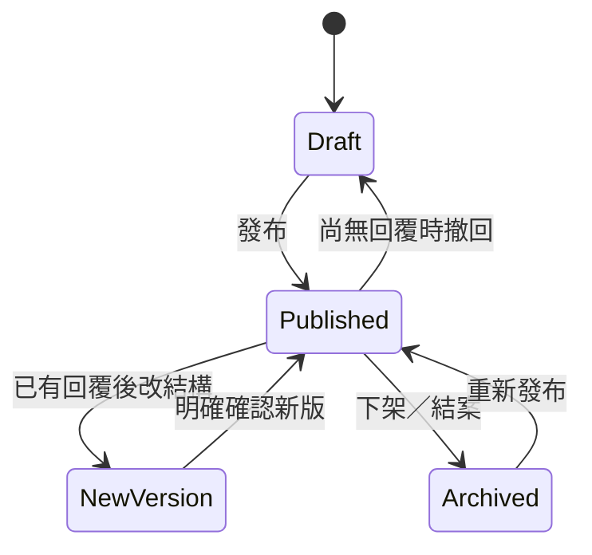

# 04 專題事務發布與編輯

> 2026-09-11 產品拆分版。規則依已確認來源承接；新增案例為驗收設計，不代表已實作或已通過。未決以 Q-ID 明示。

## 0. 看著畫面理解這個模組（2026-09-11 原型截圖）

> 截圖：2026-09-11 擷取自 repo `prototype/`（branch `proto/role-ux-round1`，commit `8e1cff8`），localhost:3100，桌機 1440 寬。身分由 cookie `fju-role` 模擬，沒有真正登入；資料全是 `fixtures.ts` 假資料，示範時鐘 2026-08-17。畫面上的「已儲存」「已發布」「已收件」是原型回饋，不代表資料真的保存。標「尚無原型」的行為只是產品預期，沒有臨時補做畫面。

### 本次逐頁核對與補圖

已有回覆的項目新增欄位後，編輯器會顯示建立新欄位版本、保留舊回覆的提示；不能再寫成「沒有欄位版本介面」。個人／組別收件單位選擇、撤回／下架／重新發布的完整生命週期及富文字圖片編輯仍有缺口；提示不證明後端版本保存。

以下只確認畫面／操作回饋。上方「操作後自己與其他角色看到什麼」描述產品預期，跨角色保存與正式授權仍為 NOT_RUN。完整判定見 [截圖核對與缺口](<../🔎 截圖核對與缺口.md>)，逐角色路由見 [畫面總覽](<../🗺️ 畫面總覽.md>)。

*管理員｜/dashboard/admin/editor/mi-012｜原型已有新欄位版本提示，尚未驗證資料庫保存*

#### 本模組其他角色與路由補图

*學生｜/news｜最新公告*

*學生｜/news/n-31｜114 學年度專題分組作業與指導老師意願調查開始受理*

*老師｜/news｜最新公告*

*老師｜/news/n-31｜114 學年度專題分組作業與指導老師意願調查開始受理*

*管理員｜/news｜最新公告*

*管理員｜/news/n-31｜114 學年度專題分組作業與指導老師意願調查開始受理*

*管理員｜/dashboard/admin/editor/new｜內容編輯器*

### 誰、什麼時候、從哪裡進來
只有管理員會用這個模組。公告、資源下載、文件繳交、專題需求、規則、歷屆與優秀專題、榮譽競賽，全部從同一個「專題事務」工作台建立。日常先用「新增項目」三步驟（選類型 → 寫內容 → 發布前檢查）快速發出去；要細調欄位、附件、對象時才進完整編輯器。學生與訪客不會看到編輯器，只會在前台或作業區看到發布後的結果。

### 一步一步怎麼操作
1. 系辦進「專題事務」，看到 9 項內容的表格：種類、狀態、可見範圍、對象、截止／發布、收件進度，每列有「編輯」。
2. 按「新增項目」：第一步選類型並填標題、對象、截止（收件類必填截止）、公開範圍；第二步寫說明、加附件、勾要學生交的欄位；第三步是發布前檢查，列出標題、對象人數、截止、欄位、公開範圍與「學生看到的樣子」，按「發布」看到已發布回執，可「回列表」或「細調欄位」。
3. 進完整編輯器（同一個項目 ID）：由上往下是內容（Markdown 正文、摘要、附件）→ 收件欄位（新增欄位、點一欄原地改設定、唯讀組別資訊）→ 發布設定（位置單選、對象、公開範圍、截止、發布時通知）→ 預覽確認（訪客／學生／老師視角）。
4. 已發布的項目改內容後按「發布更新」，先看「發布前檢查」再確認；有回答後改欄位結構，正式版要求建立新欄位版本並預覽影響（原型未做）。
5. 在項目詳情按「催繳」，對話框列出信件標題、寄給幾位學生、副本哪些老師；原型不寄信。

### 操作後自己與其他角色看到什麼
學生：作業區多一列待繳、首頁「接下來」與行事曆多一個截止、通知匣多一則新收件；公告則出現在前台最新公告。老師：各組繳交狀態矩陣多一欄。系辦：專題事務表格的統計與收件進度更新，操作紀錄多「發布項目」。

### 畫面現況
已有畫面：專題事務表格、新增項目三步驟與發布回執、完整編輯器（新建與既有）、啟用收件、新增欄位、預覽、發布前檢查與發布回執、項目詳情、催繳對話框、手機版列表、前台公告列表與詳情、資源下載。只是預期（尚無原型）：建立時選「個人」或「組別」收件單位、無回答撤回、下架與重新發布、指定組別對象的實際過濾、富文字（Tiptap）與圖片。要討論：空收件能否發布與時間邊界（Q-PUB01）、對象變更後的資格與分母（Q-SUB02／03）。

### 畫面

*管理員｜/dashboard/admin/affairs｜專題事務工作台：所有公告、資源、繳交、需求在同一張表*

*管理員｜新增項目 第 1 步｜選類型、標題、對象、截止、公開範圍*

*管理員｜新增項目 第 2 步｜說明、附件、勾要學生交的欄位*

*管理員｜新增項目 第 3 步｜發布前檢查與「學生看到的樣子」*

*管理員｜發布回執｜已發布給本屆 9 組 44 位；原型不寄信*

*管理員｜/dashboard/admin/editor｜完整編輯器（新建）：內容→收件欄位→發布設定→預覽確認*

*管理員｜編輯器｜按「啟用收件」後出現欄位區*

*管理員｜/dashboard/admin/editor/mi-012｜既有項目：五個收件欄位與唯讀組別資訊*

*管理員｜編輯器｜新增欄位*

*管理員｜預覽｜切訪客／學生／老師視角*

*管理員｜發布前檢查｜標題、對象、截止、欄位、公開範圍與會通知誰*

*管理員｜發布回執｜出現在專題需求、截止日，通知正式版才寄*

*管理員｜項目詳情｜各組狀態、收件進度環、欄位版本、催繳與編輯內容*

*管理員｜催繳｜信件標題、寄給 34 位學生、副本指導老師；原型不寄*

*管理員｜手機 390 寬｜專題事務列表*

*訪客｜/news｜公告列表：分類、置頂、搜尋*

*訪客｜/news/n-31｜公告全文與附件*

*學生｜/files｜資源下載依分類與屆別*

### 原型與規格的差異（並列，不改產品決定）

| 畫面上 | 產品規則 | 待處理 |
|---|---|---|
| 側欄仍有獨立「內容編輯器」入口（/editor） | Q4：側欄只有專題事務，編輯器從新增／修改進入 | 正式版拿掉側欄項目，路由保留為編輯畫面 |
| 正文是 Markdown textarea，9/10 複測指出預覽直接顯示 Markdown | 正式版採 Tiptap 富文字，存受限 HTML | 正式版新做 |
| 原型所有收件都是「整組一份」，沒有收件單位選項 | Q7：建立時選個人或組別，有回答後鎖定 | 正式版新做；mi-011 在規格中是個人收件 F1 |
| 編輯器已有欄位版本提示；撤回、下架、重新發布流程未齊 | PUB-07、PUB-09、PUB-11 | 依現有版本提示補完整保存與生命週期，Roy 屆時看 |
| 催繳與發布回執都提到寄信 | Email 延後，站內通知保留 | 文案改成「已建立站內通知」 |

---
## 1. 目的與範圍
用同一專題事務工作台發布內容、資源及收件，維護內容與版本的一致來源。

## 2. 角色與入口
管理員建立／完整編輯／預覽；各受眾依位置瀏覽或填寫。

## 3. 主要操作
先依下一節業務規則操作；正常跨模組順序見 [年度主線](<../🔁 年度情境/01 完整年度主線.md>)，本模組逐案步驟在第 11 節。

## 4. 產品規則
### 4.1 核心概念 `DECIDED`

Google Sheet 原本分開的公告、檔案管理、文件繳交與專題需求，在**管理後台**共用一套拖拉式編輯器與生命週期；在**使用者前台**仍依用途出現在不同頁面。產品介面不出現模糊的「一般表單」分類。

管理員建立一個「專題事務項目」時，組合下列能力：

- 標題、摘要、內文、封面與分類。
- 可供下載的附件。
- 要求填寫的欄位。
- 要求上傳的檔案。
- 開放／截止時間。
- 對象與可見範圍。
- **一個主要發布位置**。

同一份內容只維護一份；Dashboard 與截止日元件可自動引用，不算多重發布位置。

### 4.2 主要發布位置

| 位置 | 前台呈現 | 常見能力 |
|---|---|---|
| 公告／最新消息 | 公開或登入後消息列表 | 內文、封面、附件、發布時間 |
| 檔案／資源下載 | 資源列表與詳情 | 說明、分類、可下載附件 |
| 文件繳交 | 學生待辦與組別繳交頁 | 說明、截止日、欄位、檔案上傳 |
| 專題需求 | 專題需求填寫／查看頁 | 可組裝欄位、組別共用回答 |
| 專題規則 | 公開規則頁 | 長文、附件、版本 |
| 歷屆／優秀專題 | 歷屆登入後、優秀精選可公開 | 圖片、摘要、海報、影片連結 |
| 榮譽／競賽 | 公開卡片與詳情 | 圖片、內文、日期、附件 |

- 管理員以單選決定一個主要位置。
- 發布位置決定前台模板，不改變內容的單一來源。
- 需要跨頁曝光時，由首頁精選、Dashboard 待辦與搜尋自動帶出，禁止複製成多筆難以同步的內容。

### 4.3 發布對象

- 公開訪客。
- 所有已登入使用者。
- 本屆學生（預設）。
- 全部老師。
- 指定組別。

公開位置不代表所有欄位都公開；伺服器仍依 audience 與欄位白名單過濾。收件項目可用的對象只有本屆學生與指定組別，見下方「單一入口與收件單位」（2026-09-12）；「本屆」在每個項目上是明確綁定的屆別，不隨目前屆別切換而改變。

### 4.4 拖拉式編輯器

採 [hasanharman/form-builder](https://github.com/hasanharman/form-builder) 的互動與元件做法作為主要 donor，改造成本站專用編輯器，不把另一套應用硬塞進產品。

建議版面：

- 左側：可加入的區塊／欄位。
- 中間：實際內容與表單 canvas，可拖拉排序。
- 右側：目前選取元件的設定。
- 上方：主要發布位置、對象、狀態、預覽與發布。
- 預覽：桌機／手機、訪客／學生／老師視角。

v1 可用元件：

- 說明文字、富文字、圖片、分隔線、區段標題。
- 短文字、長文字 textarea、數字、Email、URL。
- 單選、複選、下拉選單。
- 日期、時間。
- 下載附件。
- 檔案上傳。
- 唯讀的組別、組長、成員與指導老師資訊區塊。

不做：任意 JavaScript、任意 SQL、條件流程編程、第三方執行碼、完整試算表公式語言。

### 4.5 項目生命週期

- 沒有任何回覆前，標題、內容、欄位、附件、對象與期限都可直接編輯。
- 已有回覆後，標題、說明與截止時間可修改，但要留下 audit。
- 已有回覆後，不得原地刪除／改型別／重排會改變答案語意的欄位。
- 結構變更必須建立新 schema version；舊回覆仍綁舊版，新版發布前要預覽影響。
- 發布、撤回、下架、重新發布與版本切換都要記錄操作者與時間。

### 單一入口與收件單位
所有公告、資源、收件與規則從「專題事務」工作台進入。編輯器是建立／編輯方式，不另放獨立側欄入口。快速建立與完整編輯操作同一項目 ID。
建立收件時選「個人」或「組別」。個人收件服務成組前意向／出席等填報；組別收件共用草稿、任一人送出代表整組。已有回答後收件單位不可切換。項目位置與受眾獨立，公開模板不能繞過受眾和檔案權限。

收件對象（2026-09-12 定案）：誰能看內容、誰必須繳交、誰能看回答分開定義。

| 收件單位 | 可要求誰填 |
|---|---|
| 個人 | 指定屆別的有效學生；或指定已成立組別中的有效學生，每人一份 |
| 組別 | 指定屆別全部符合資格的已成立組；或指定組別，每組一份 |

收件不開給公開訪客，也不用籠統的「所有已登入者」。每份收件綁明確屆別，明年切換本屆後去年的收件不會自動要求新生填。發布前的名單預覽要能展開看到實際的人／組，不能只有總數。老師個人填表列 Q-SUB04 待確認；原型的「指導老師意願調查表」是學生填的，不能據此推論老師填表。本期建立收件不出現「全部老師」選項，老師不混入學生收件的分母（2026-09-12 第七輪）。名單怎麼變、免填、移出與加回的規則在 [05 個人與組別繳交](<05 個人與組別繳交.md>) 第 4 節。

沒有回答時可直接調整；有回答後改對象，資格與分母依模組 05 的規則重算並留紀錄，不因編輯器提供選項就略過影響預覽。

### 發布檢查與時間邊界（2026-09-12 定案 Q-PUB01）
- 收件（個人或組別）至少要有一個可填寫欄位，或一項上傳要求；兩者皆無不能發布，錯誤訊息寫「新增填寫欄位或上傳要求，或改用公告／資源」。簡單確認用必勾選欄位；點選紀錄表示本人確認，校方若要驗證實際到場是另一項需求。
- 全站固定臺灣時間（Asia/Taipei）。開放與截止精確到分鐘：從開放時間起，至截止分鐘的下一分鐘之前都在期限內，23:59:59.999 仍可送、00:00:00 拒絕；不用 23:59:59 當最後界線。
- 詳細畫面寫「截止：2026/11/15 23:59（含此分鐘，臺灣時間）」；列表可簡寫；表單說明、回執與匯出要能確認時區。
- 收件截止必填，不得早於開放。開放時間預設「發布即開放」，發布時記下實際開放時間，之後修改或重新發布不能默默重設。每個收件明確設定所屬階段，延長截止到下一階段不自動改變分類。
- 準時與否以後端收到完整正式送出請求的時間判定，附件必須已完成上傳；按下按鈕或開始上傳不算送出，以成功回執為準。舊頁面重新檢查期限、資格與封存狀態。

## 5. 狀態與權限
草稿→發布→下架／重發布；無回答可撤回草稿；有回答結構變更開新版。

## 6. 欄位與資料歸屬
標題摘要正文封面分類、主要位置、受眾與綁定屆別、所屬階段、開放（含實際開放時間）與截止、欄位、附件、收件單位、schema version。

## 7. 保存、版本與回執
同項目 ID；每次發布與變更留痕；舊回答綁舊 schema。

## 8. 其他角色所見
使用者看到相同已發布版本；公開模板不能泄漏私有欄位；A1 看編輯與受眾。

## 9. 例外與未決事項
Q-PUB01 與 Q-SUB02／03 均已於 2026-09-12 定案（第 4 節、模組 05 第 4 節與 [2026-09-12 時間與年度討論定案](<../💬 討論與決策/2026-09-12 時間與年度討論定案.md>)）；Q-SUB04 老師個人填表待確認。完整問題、建議與決策影響見 [待討論清單](<../💬 討論與決策/2026-09-11 產品待討論清單.md>)；不可將建議直接當成定案。

## 10. 依賴與原型差距
SUB 回答、FIL 附件、SHW 公開呈現、NTF 通知。

現有 prototype 只作已確認畫面與互動的對照；不能證明 Auth、DB、權限或服務已完成。細節對照 [前台頁面清單](<../🗺️ 前台頁面清單.md>)、[後台頁面清單](<../🗺️ 後台頁面清單.md>)。新操作改動先原型讓 Roy 看，再回寫產品條文與正式實作。工程接續見 [產品交接](<../💬 討論與決策/2026-09-11 交給 Fable 的工程接續.md>)。

## 11. 驗收案例
各案使用年度資料集或明標獨立分支。待決案例須先補決定，延後案例不納本輪 Gate；兩者都不能記 PASS。未特別列出的他角色以第 8 節權限核對，拒絕案例也要證明資料未變。

### PUB-01｜快速建立公告

- 前置與操作：A1 從專題事務建立含 PDF 的公開說明會公告。
- 預期與跨角色核對：發布後前台可見、附件符合同一受眾；只有一筆項目；步數依現行原型不硬定三步。
- 證據：建立回執、公開頁、項目 ID；按接受條件分別記 UI、操作邏輯、保存、權限。
- 案例狀態：可執行設計；執行結果：**NOT_RUN**。

### PUB-02｜切到完整編輯

- 前置與操作：快速建立後進同一項目完整編輯補內容再存。
- 預期與跨角色核對：ID、原正文及附件保留；不另建一筆；編輯器為建立／編輯方式。
- 證據：編輯前後 ID、正文、附件；按接受條件分別記 UI、操作邏輯、保存、權限。
- 案例狀態：可執行設計；執行結果：**NOT_RUN**。

### PUB-03｜資源位置與受眾

- 前置與操作：發布登入者可見 DOCX 資源；學生及訪客各開頁與下載。
- 預期與跨角色核對：資源位置呈現；學生可讀下載，訪客不可；位置不覆蓋受眾。
- 證據：多角色頁面、下載回應；按接受條件分別記 UI、操作邏輯、保存、權限。
- 案例狀態：可執行設計；執行結果：**NOT_RUN**。

### PUB-04｜組別收件發布

- 前置與操作：A1 建 MID1，對象本屆，整組一份，日期及 PDF 上限。
- 預期與跨角色核對：符合資格組別取得同一項目待辦，未成組者不可代組送出。
- 證據：設定、學生待辦、項目 ID；按接受條件分別記 UI、操作邏輯、保存、權限。
- 案例狀態：可執行設計；執行結果：**NOT_RUN**。

### PUB-05｜個人收件發布

- 前置與操作：未成組期 A1 建 F1，收件單位個人。
- 預期與跨角色核對：F1 綁定 115-TEST；發布前名單預覽可展開看到實際會收到的人；符合受眾學生不需組別即可各答；不能把個人回答掛到未來組別。
- 證據：設定、個人入口；按接受條件分別記 UI、操作邏輯、保存、權限。
- 案例狀態：可執行設計；執行結果：**NOT_RUN**。

### PUB-06｜收件單位鎖定

- 前置與操作：F1 已有回答，A1 嘗試改成組別。
- 預期與跨角色核對：被拒；原回答單位、作者、版本不變，須另建項目處理需求。
- 證據：拒絕、原回答 ID；按接受條件分別記 UI、操作邏輯、保存、權限。
- 案例狀態：可執行設計；執行結果：**NOT_RUN**。

### PUB-07｜無回答撤回

- 前置與操作：MID1 尚無回答，A1 撤回草稿再發布。
- 預期與跨角色核對：只有無回答時可此路徑；受眾不見草稿，重發布恢復同項目，留痕。
- 證據：狀態、訪客／學生、audit；按接受條件分別記 UI、操作邏輯、保存、權限。
- 案例狀態：可執行設計；執行結果：**NOT_RUN**。

### PUB-08｜改期

- 前置與操作：MID1 有回答，A1 改截止並填原因。
- 預期與跨角色核對：已回答保留；站內截止與通知更新，同項目不複製；伺服器採新截止。
- 證據：前後版本 hash、日曆、NTF-03；按接受條件分別記 UI、操作邏輯、保存、權限。
- 案例狀態：可執行設計；執行結果：**NOT_RUN**。

### PUB-09｜有回答改結構

- 前置與操作：MID1 已回答，A1 新增欄位，查看影響後確認新版。
- 預期與跨角色核對：產生新 schema version；舊回答可依舊欄位讀；取消預覽不改變原版。
- 證據：版本預覽、舊新版、歷史；按接受條件分別記 UI、操作邏輯、保存、權限。
- 案例狀態：可執行設計；執行結果：**NOT_RUN**。

### PUB-10｜指定組別

- 前置與操作：A1 發 R1 僅 G1、G2；G3 從網址與通知入口嘗試讀寫。
- 預期與跨角色核對：G1／G2 可用，G3 拒絕；不能靠公開位置或猜 ID 越權。
- 證據：受眾、三組回應；按接受條件分別記 UI、操作邏輯、保存、權限。
- 案例狀態：可執行設計；執行結果：**NOT_RUN**。

### PUB-11｜下架重發布

- 前置與操作：A1 下架有歷史的專用項目，再重發布。
- 預期與跨角色核對：前台可見性隨狀態改變，既有回答與 audit 保留。
- 證據：前後可見性、歷史 ID；按接受條件分別記 UI、操作邏輯、保存、權限。
- 案例狀態：可執行設計；執行結果：**NOT_RUN**。

### PUB-12｜富文字與元件

- 前置與操作：A1 加長文、圖、連結、必填單選、日期、檔案與唯讀組別，調順序後預覽桌機手機。
- 預期與跨角色核對：內容與驗證保留；非管理員不能修改唯讀組別；不執行任意 JS 或危險 HTML。
- 證據：預覽、保存重整、安全清理回應；按接受條件分別記 UI、操作邏輯、保存、權限。
- 案例狀態：可執行設計；執行結果：**NOT_RUN**。

### PUB-13｜不完整發布設定

- 前置與操作：A1 分別設截止早於開放、指定組別未選任何組、收件沒有欄位也沒有上傳要求、只有一項上傳要求沒有欄位。
- 預期與跨角色核對：前三者被拒並有明確錯誤，空收件的提示寫「新增填寫欄位或上傳要求，或改用公告／資源」；只有上傳要求的收件可以發布；被拒者未新增發布紀錄。
- 證據：三種錯誤、一次成功發布、發布紀錄；按接受條件分別記 UI、操作邏輯、保存、權限。
- 案例狀態：可執行設計（2026-09-12 依 Q-PUB01 定案改寫）；執行結果：**NOT_RUN**。

### PUB-14｜發布即開放與階段歸屬

- 前置與操作：A1 建收件不填開放時間直接發布；之後修改標題並重新發布；把截止延到下一階段；另建收件把截止填在開放之前；S01 查看詳細畫面與回執，A1 匯出。
- 預期與跨角色核對：發布時記下實際開放時間，重新發布不重設；所屬階段維持原設定；截止早於開放被拒；詳細畫面顯示「截止：…（含此分鐘，臺灣時間）」，回執與匯出可確認時區。
- 證據：實際開放時間前後、階段欄位、拒絕、畫面與匯出；按接受條件分別記 UI、操作邏輯、保存、權限。
- 案例狀態：可執行設計（2026-09-12 新增）；執行結果：**NOT_RUN**。

## 12. 來源與修訂
承接拆分前完整規格、2026-09-11 Q1–Q9、Fable 同日討論及 Roy 最新分工／延後指示；[逐節來源對照](<../💬 討論與決策/2026-09-11 原規格承接對照.md>)可追到原件。草案既有案例 ID 保留，不把草案範例結果當本次實測。本次只整理产品文件，全部案例 NOT_RUN。
