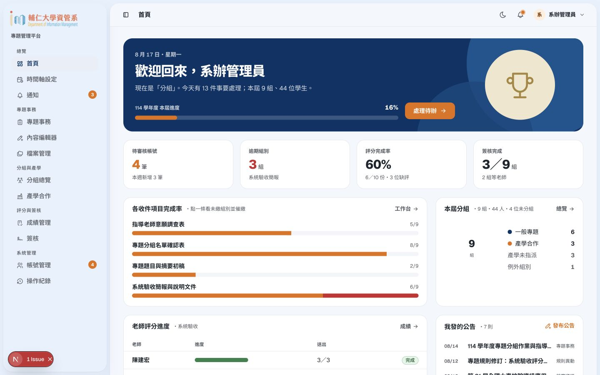
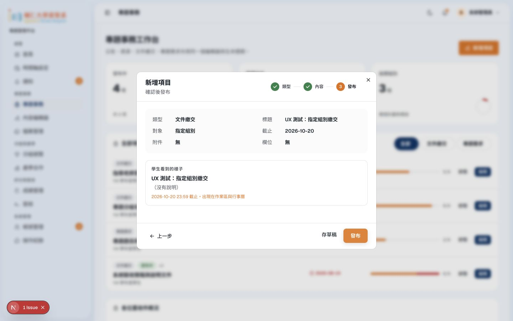
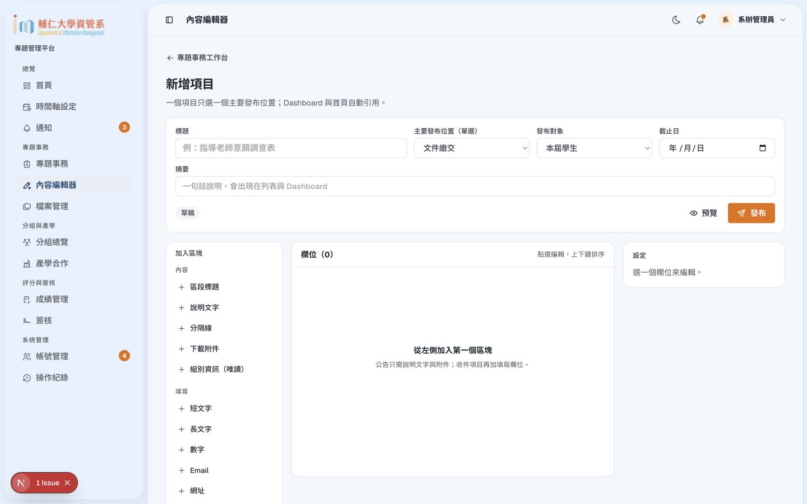
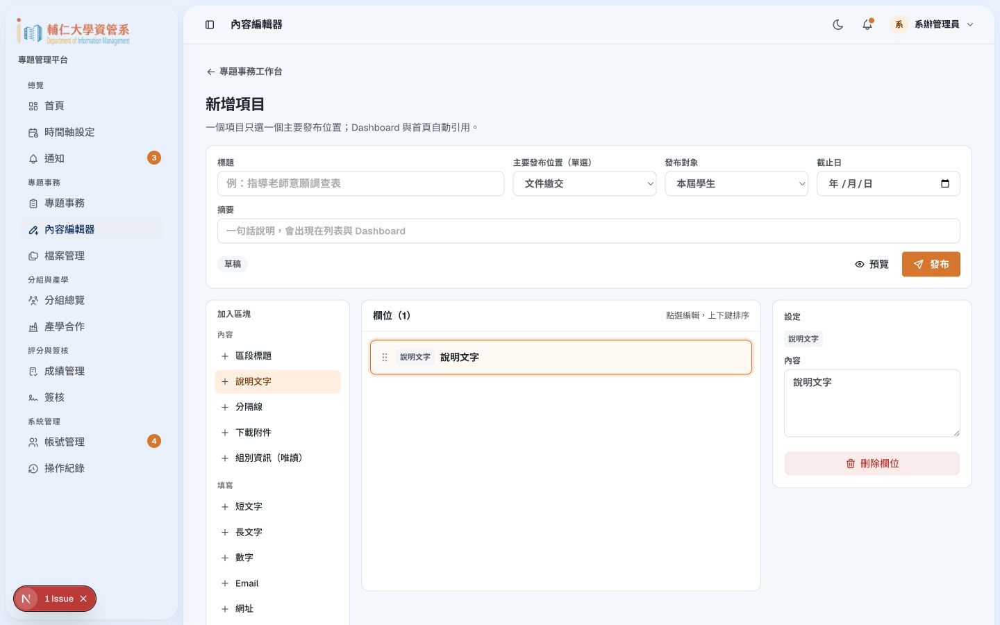
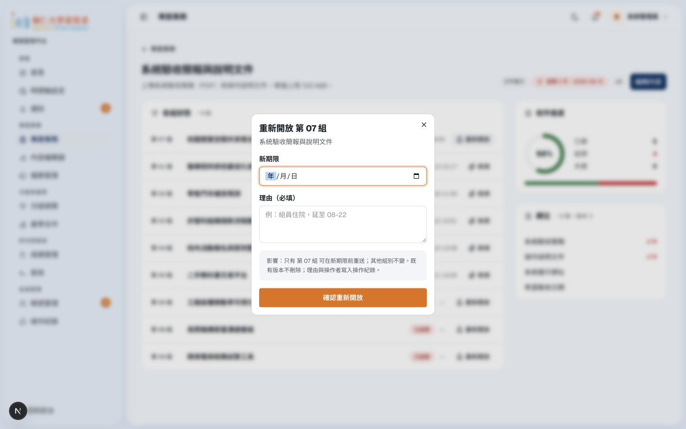

# 管理員角度操作與 UI／UX 報告

2026-09-10｜localhost:3100 前端原型｜[審查方法與來源](README.md)

管理員首頁已有清楚的資料總覽，但目前還不能當作系辦工作台：有數字與按鈕，若干關鍵處理卻沒有接通。編輯器難用的主因是工作順序不明確，並且快速建立與完整編輯分成兩套狀態。優先把「建立內容 → 確認受眾 → 發布 → 收件 → 處理例外」接成同一件事，再調整外觀。

## 值得保留

- 已選的 A 版數據首頁，能把帳號、逾期、評分等管理工作放到同一層。保留自己的公告入口，符合 9/10 決定。
- 事務、內容與收件以同一概念組織，方向符合統一 ManagedItem，不必回到每種表單一套後台。
- 重開對話框有期限、原因與作用範圍，也說明保留舊版本；這比直接解除整件事務鎖定好。
- CSV 示例匯入有預覽：52 筆、49 合法、2 重複、1 缺漏，並可定位列號；這是應保留的事前核對。
- 已被引用的檔案不能直接刪除；成績更正空白理由會阻擋確認。例外操作已有稽核意識。

## 操作覆蓋

| 工作 | 本輪觀察 |
| --- | --- |
| 首頁處理待辦 | 可進帳號頁，但 pending 連結未篩到待審；收件圖表標榜可點，實際無動作。 |
| 快速建立事務 | 可預覽及顯示成功，但指定組別無選擇器；零欄位也可發布繳交。 |
| 進階內容編輯 | 可增加表單欄位；快速建立轉進去會遺失標題、對象、期限等。 |
| 查繳交／重開 | 看到收件與重開 dialog；已繳內容的檢視入口未接通，未確認實際重開。 |
| 帳號 | 搜尋、清除、CSV 示例預覽可操作；新增帳號入口無動作。未正式匯入或核准。 |
| 評分 | 可看狀態、開更正；未找到建立完整方案、配置評審與退回入口。未實際更正。 |
| 同意書 | 可看進度及重置 dialog；新增入口無動作，缺員名單與版本資訊不足。 |
| 分組 | 可開重派老師 dialog；未找到建立、解散、重組及未分組名單入口。 |
| 檔案 | 有引用數與刪除限制；上傳資源入口無動作。未傳檔、刪檔。 |
| 時間軸設定 | 新增階段與編輯日期都無反應；是入口原型。 |
| 公開頁 | 訪客首頁導覽有區分，但成果詳細頁的公開內容與較新文件不一致。 |
| 手機編輯 | 工具庫、畫布、設定垂直分離，改一欄要跨很長距離。 |

## A-01 · P1｜快速建立沒有完整的發布對象與有效內容

**重現：**事務頁新增文件繳交，標題填「UX 測試：指定組別繳交」，對象改指定組別。沒有可挑組別的控制。取消唯一檔案欄位，仍能進預覽，看到指定組別、欄位為無，再得到發布成功與通知訊息。

**影響：**操作員不知道到底通知誰、要收什麼。這不是僅缺後端，前端也沒收集足夠的發布意圖。

**建議：**指定組別必須能搜尋、多選與檢查名稱；預覽顯示「第 02、07 組，共 2 組」。文件繳交／需求填報至少有一個有效輸入；純公告允許零輸入。發布前檢查標題、對象、截止、欄位結構及公開範圍。通知結果不能以固定成功文案代替真實發送結果。

## A-02 · P1｜「細調欄位」遺失剛建立的內容

**重現：**完成上述快速建立，點「細調欄位」，進入 `/dashboard/admin/editor/new`。標題變空白、對象回到本屆學生、期限及欄位未承接。

**建議：**快速建立只是一個精簡入口，與完整編輯共用同一個草稿 ID。按下一步就進該草稿；發布後再編輯同一件，不能重新建空白 item。若尚未保存，必須明確保留草稿或提示處理方式。

**驗收：**快速建立五項資訊後進完整編輯，值全部保留；返回列表只存在一件；發布後的連結仍指向它。

## A-03 · P1｜內容編輯器尚未支援完整的內容工作

左邊同時放約 16 種表單元件，中間是欄位列，右邊窄欄輸入說明。要寫一篇帶標題、段落、連結、圖片與附件的公告，操作員卻先看到表單工具。新增「說明」後也主要在右側輸入，難以直接判斷公開頁結果。頂部可見草稿徽章、預覽與發布，但缺清楚的存草稿操作／保存狀態。

**依據：**完整產品規格 §4.4 的內容編輯需求。現有欄位生成器不足以取代文章編輯器。

**建議的工作順序：**

1. **內容**：中間主區直接寫標題、正文、圖片、連結及附件；工具列只呈現目前需要的格式。
2. **收件欄位**：需要收資料才啟用，學生會填的欄位直接在主區預覽，點欄位原地編輯；進階驗證放側邊。
3. **發布設定**：受眾、可見範圍、截止與通知集中在同一區。
4. **預覽確認**：區分訪客、學生、老師，以及桌面／手機；顯示會通知的實際對象。

頂端固定「標題／保存狀態／存草稿／預覽／發布」，不要讓只想儲存的人被迫發布。手機用三個步驟或分頁，欄位設定採抽屜；不要把桌面三欄整條堆疊。

不需要另造「公告後台」與「繳交後台」兩份資料。底層沿用同一件事務，介面則按工作隱藏無關工具。內容與收件可以切換，但使用者始終知道在編輯哪一件。

## A-04 · P1｜系辦有多項看得到卻做不到的核心入口

以下是本輪點擊無動作或在可見介面找不到的工作，不代表整個正式系統永遠沒有，只代表目前操作無法完成。

| 區域 | 缺口 | 最小可操作補法 |
| --- | --- | --- |
| 時間軸設定 | 新增階段、編輯階段與日期無動作 | 開出名稱、起訖、關聯事務的編輯面板，並能預覽學生看到的結果。 |
| 帳號 | 新增帳號無動作，角色／身分維護入口不足 | 新增／編輯帳號與權限，標清學籍資料與平台角色差別。 |
| 評分 | 只有既有鎖定方案，發表階段尚未建立項目 | 建立方案版本、配置項目權重與評審、鎖定前檢查；補退回重評。 |
| 同意書 | 新增簽核無動作 | 建立版本與對象，檢視正文並發布；不得由系辦代替學生同意。 |
| 檔案 | 上傳資源無動作 | 選檔、權限、引用位置及完成結果。 |
| 收件 | 已繳「檢視」無有效結果 | 檢視該版本的欄位、附件與提交者，再提供歷程。 |
| 分組 | 僅重派可見，找不到建立／解散／重組與未分組名單 | 以組別詳情處理例外，操作前列出影響與原因；不另堆首頁卡片。 |
| 內容管理 | 現有事務四筆主要是繳交／需求，難以找到公開頁既有公告與資源 | 統一內容列表含種類、發布狀態、可見範圍與搜尋，既有公開項目可從此編輯。 |

評分更正 dialog 有理由是好的，但表格是階段分數、對話框卻寫 FINAL，必須明確指出更正的是哪個階段、哪位評審或最終成績。不能用「可更正總分」取代完整方案與退回流程。

## A-05 · P2｜首頁統計與篩選沒有串成真正的處理路徑

**重現：**首頁「處理待辦 13」進帳號頁；pending 連結帶 `?status=pending` 卻仍看到所有 14 筆。收件圖表說可點一條查看未繳組別並催繳，點擊無動作。頁面的催繳入口亦未接上處理。

另外，列表的 6 已繳／3 逾期，進 mi-011 明細變 5／4；教師成績完成數與老師首頁也不一致。「已核准 8」與自動 5、人工 5 的加總不符。

**建議：**數字旁寫清母數與範圍，卡片點下去必須套入相同條件並顯示可移除的篩選標籤。「處理待辦」要能涵蓋對應工作，或改名成具體的「審核帳號」。在資料未串接的原型也要共用同一套 fixture 計算，否則無法判斷版面是否支援真實工作。

帳號姓名不符時，同時列「申請姓名／名冊姓名／學號與來源」，讓系辦有證據判斷；不要只給一個「姓名不符」徽章和核准按鈕。

## A-06 · P2｜例外操作有起點，但缺少前後影響的全貌

重開 dialog 已說明只改本組與保留版本，值得保留；下一步應列出原截止、新截止、目前採計版本與會收到通知的人。系辦的 g07 目前見 v1，而學生見 v2，需先統一。

同意書統計「完成 3／等老師 2」與「學生已齊 4」的口徑需修正。四人例外組卻以五位學生加老師的六格展示，也應依實際名單／已核准規則呈現；四人例外的政策尚有文件未決，不能由 UI 自行定案。「缺 2 位」應能展開姓名及個別狀態。重置前顯示目前版本與哪些簽署將失效，原因不可取代版本資訊。

資源引用數可保留，補連到引用事務；刪除禁用時說明如何解除引用。備份／還原的現況入口本輪未找到，不能從儲存容量數字推論備份已成功。該功能需另驗最新成功備份與實際還原紀錄。

## A-07 · P1｜公開成果邊界與較新文件不一致

**重現：**以訪客看首頁，導覽有區分登入前後；優秀專題卡片連到 `/projects/p-1`。直接進該頁仍可看到完整摘要、組員、文件概述及影片入口，且寫著「優秀專題的摘要、海報與影片公開」。影片與文件目前是 `#` 占位，不能據此宣稱真實檔案已外洩。

**差異：**較新的頁面清單／智財討論要求區分公開優秀成果與登入後完整歷屆資料。舊規格也有較開放的描述，需明確對齊。

**建議：**將公開展示可用欄位寫成清單，管理員預覽能切訪客。公開卡片與登入後詳細資料各自有清楚目的；正式 API／檔案服務須依受眾處理，隱藏導覽本身不足以完成權限。這是原型流程／文案不一致與正式實作前的必補項，本輪沒有做真實 RBAC 穿透測試。

## 套件建議：先補編輯能力，保留現有表格與元件

2026-09-10 已核對下列官方來源；為選型建議，未安裝到專案，也未驗證目前 Next 16.3.1／React 19.2.8 的整合結果。

| 候選 | 對這個專案的用途與取捨 | 建議 |
| --- | --- | --- |
| Tiptap | 可把文字編輯放進現有設計，自己掌握工具列及輸出。Next.js 官方整合示範使用 client 元件與 `immediatelyRender: false` 避免編輯器 SSR／hydration 問題。 | **優先做小樣本**：一則含圖片、連結、附件的公告；保存後重新開啟並比對公開閱讀結果。[官方文件](https://tiptap.dev/docs/editor/getting-started/install/nextjs) |
| BlockNote | 適合想快速取得區塊式寫作體驗；官方有 Next.js 整合方式。介面更具自身風格，需評估是否符合校務內容工作。 | Tiptap 的替代方案，兩者擇一。用同一則公告比較輸入、手機編輯、匯出及再開啟，不同時引入。[官方文件](https://www.blocknotejs.org/docs/getting-started/nextjs) |
| hasanharman/form-builder | React／shadcn 生態的表單建立參考，可借鏡元件庫到畫布的互動。 | 作為互動參考，不能直接替代本專案的受眾、版本、整組繳交與權限模型。採用程式前另查授權及維護適配。[原始專案](https://github.com/hasanharman/form-builder) |
| 既有 TanStack Table／Base UI | repo 已有表格與控制項；問題主要是手機呈現、篩選連結及一致狀態。 | 先修現有組合，不新增另一套整站 UI framework。 |
| Motion for React | 官方提供 reduced motion 支援，適合必要的展開與位置過渡。 | 小過渡先用 CSS；確有跨元件動態需求才加 Motion，尊重減少動態設定。[官方文件](https://motion.dev/docs/react-accessibility) |

套件不能補救資料模型斷裂。第一個 editor 小樣本的成功條件應是「寫完、保存、重開、預覽、發布同一件內容」，不是成功出現一條漂亮工具列。

## 資訊架構：哪些合併，哪些保留

| 整理方式 | 原因 |
| --- | --- |
| 快速建立＋完整編輯共用草稿與 ID | 消除目前資料遺失與重複建立。 |
| 公告／資源／繳交／需求在同一內容清單，以種類篩選 | 系辦能找回公開與內部內容；依種類露出需要的工具。 |
| 首頁指標連到相同列表篩選 | 不再各自維護一組待辦與統計。 |
| 組別的成員、指導、產學連結及例外處理集中在組別詳情 | 避免在不同頁反覆找同一組；全體產學案件清單仍保留。 |
| 檔案庫保留獨立管理，也可從編輯器挑選引用 | 去重與引用追蹤是跨內容工作，不能只埋在單篇附件裡。 |
| 評分、逐人同意保留專門工作台 | 它們有分配、鎖定、版本和個人意願規則，不適合當普通任意表單。 |
| 時間軸設定作為學期設定的一部分 | 保留編輯入口；不再做第二套學生首頁式總覽。 |

## 統一設計感與 Roy 的個人特色

目前缺的是視覺語法的穩定性：大型歡迎區、統計卡、表格、時間軸與編輯器各自強調不同東西。建議以「校務手冊」作共同方向：紙白底、墨色文字、系所深藍主色、少量暖色書籤；具體色值仍須對照既有校方素材與對比檢查後定案。

- **版型**：管理頁標題縮成一列，接範圍與一個主要操作；數字總覽保留，但不要讓大段歡迎語把待處理資料推下去。
- **層級**：頁標題約 24–28px、區塊 18–20px、主要內文 16px；表格輔助文字可較小，但重要狀態不靠淡灰小字。具體尺寸是下一版試作起點。
- **密度**：少一層卡片套卡片，相關欄位用留白與細線分組。每頁只選一個視覺焦點：學生下一步、老師目前組、系辦待處理列表。
- **特色位置**：目前學期像手冊頁籤；成功回執像輕印的收件章；選單選取線短暫描出。這三種細節重複使用，比每頁換特效更容易被記住。
- **動畫規則**：一般回饋 120–180ms，面板展開 180–240ms，無限循環效果不作預設；完成章一次即可。數字、截止日與成績不做跳動動畫。減少動態時直接切換。
- **作者辨識**：若校方同意，可在關於／頁尾放低調的設計製作署名；主要操作區仍以系所與學生工作為主。

公開首頁的系所照片、正式導覽與公告層級已有基礎。前台已定稿，本輪建議只做一致性精修：首屏減少純裝飾高度，讓公告更早出現；作品展示使用同樣的書籤與線條語彙。不要為個人特色重做整個前台。

## 下一輪可交付順序

1. 先接一件文件繳交的共用情境：系辦建立 → 學生有效送出 → 系辦看內容／版本 → 重開 → v2。
2. 修正指定對象、零欄位發布、空白必填與超界分數。成功回執只出現在有效結果之後。
3. 接通核心空入口，並用可操作畫面補方案、評審、同意書與分組例外；未完成的按鈕明標「尚未提供」。
4. 比較一個 Tiptap 與一個 BlockNote 的同內容小樣本，選定後才整合完整編輯器。
5. 最後統一手機列表、時間軸、字級、間距與動畫。以上建議均待 Roy 評選，不代表已實作或改寫規格。
