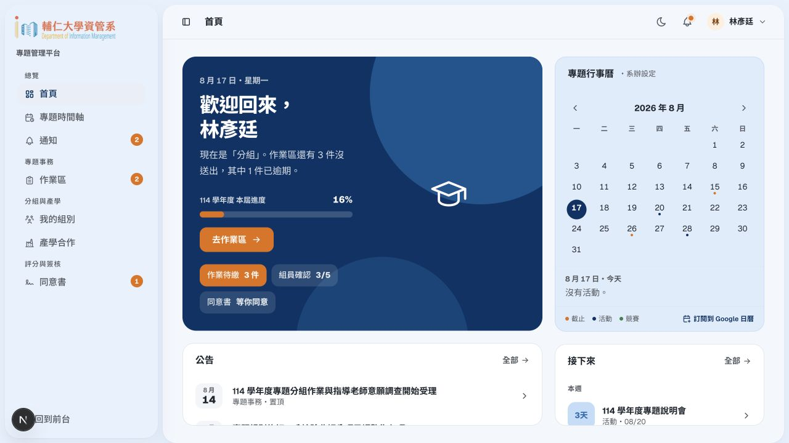
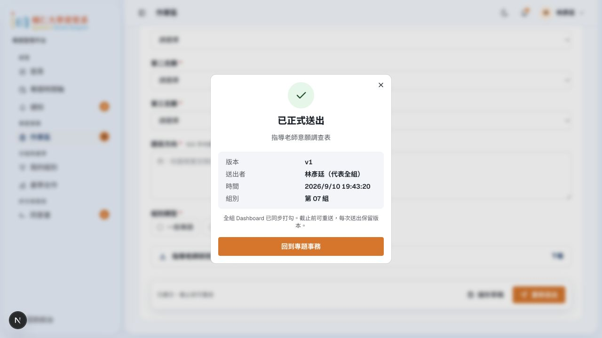
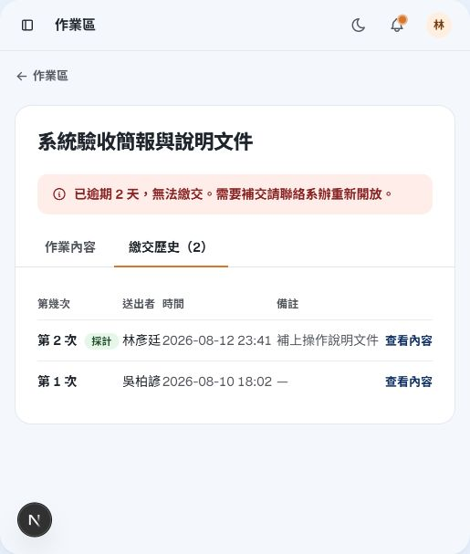
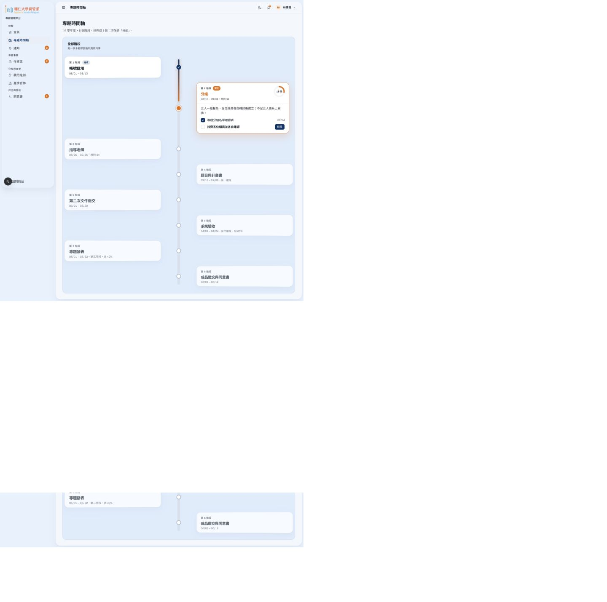
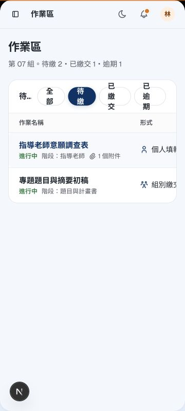

# 學生角度操作與 UI／UX 報告

2026-09-10｜localhost:3100 前端原型｜[審查方法與來源](README.md)

學生首頁方向成立：公告、日程和下一步已比通用儀表板貼近學生。真正缺少的是「我現在到底完成了什麼」的一致答案；目前列表、繳交回執、組別和時間軸會互相矛盾。先把這條路走通，再美化時間軸，效果會比增加卡片或動畫大。

## 值得保留

- 作業區把期限、狀態與操作放在一起；逾期頁會鎖住欄位並指出請系辦重開，處理方向清楚。
- 送出回執已有版本與時間的概念，也提醒整組同步，符合任一成員代表整組送出的要求。
- 同意書先閱讀、再表態；不同意且原因空白時，瀏覽器確實阻擋送出。老師必須等全員完成的順序也有呈現。
- 時間軸會展開目前階段，並連到對應工作，不只是裝飾。
- 首頁四塊與時間軸分頁是已定案的方向，應保留，再調整優先順序與密度。

## 實際走查

| 任務 | 本輪操作與結果 |
| --- | --- |
| 找近期作業 | 首頁進作業區，再開明細；可找到入口，但徽章數量與列表狀態不一致。 |
| 填報與正式送出 | `affairs/mi-014` 必填保持空白仍出現成功回執。 |
| 查逾期與舊版本 | `affairs/mi-011` 鎖定正確，但逾期未繳與採計版本矛盾；查看舊內容無有效頁面。 |
| 看組別 | 顯示 3/5 確認、尚未成立；其他頁卻允許繳交／顯示已成立。 |
| 讀取同意書 | 閱讀勾選、不同意理由驗證可操作；內嵌 PDF 黑畫面，未確認真實 PDF 可讀性。 |
| 時間軸 | 切換階段、桌面淺／深色、手機首頁與表單抽查。 |
| 手機查作業 | 360px 可進入，但表格篩選擠壓，重要欄位需橫向查找。 |

## S-01 · P1｜空白必填仍被當成正式繳交

**重現：**進入 `/dashboard/student/affairs/mi-014`，保留第一至第三志願、題目與組別類型等必填空白，按「正式送出」。原型呈現 v1 成功回執及整組同步訊息。返回列表仍是草稿。

**影響：**學生會以為已完成；系辦收到的卻可能不具備可採計內容。星號不是驗證。

**建議：**草稿允許未填完；正式送出前驗證必填與跨欄位規則。先顯示一段「尚缺 3 個欄位」與跳轉，再把焦點移到第一個錯誤。成功狀態須來自同一筆 submission；回列表、重整、另一位組員登入都應看到相同版本。正式切片亦須有伺服器驗證。

**驗收：**空白不能取得成功回執；有效內容送出後，列表、明細、組員及系辦所見版本相同。這項跨使用者驗收本輪未做。

## S-02 · P1｜個人／整組與成立條件說法衝突

**重現：**mi-014 列表及詳情標「個人」，正文與回執說整組；「我的組別」為 3/5 確認、尚未成立且不能繳交，但剛才仍能送出，老師表格又顯示第 07 組已成立。

**建議：**將事務的「填寫單位」放在標題下固定位置：個人一份／整組一份。涉及整組時列出組名、目前編輯者與最後儲存時間。成立條件、老師指導狀態與是否可繳交共用同一個情境；不要讓每頁自己推算。若某項調查允許成立前個別填寫，就明確命名，不能沿用整組送出文案。

**依據：**完整規格的五人各自確認與共用草稿要求；特殊人數例外仍由既有規格的未決事項處理。

## S-03 · P1｜逾期未繳與「v2 採計」同時存在

**重現：**mi-011 顯示逾期兩天、不能再交；歷程卻有 8/12 的 v2 採計與 8/10 的 v1。「查看內容」沒有可用版本詳情。系辦同一組只見 v1。

**建議：**狀態應分開表達「是否已繳」「最後版本」「是否仍可修改」，例如「已繳 v2；截止後唯讀」。未繳才標逾期未繳。舊版本顯示當時的欄位、附件與提交者，不能導向最新可編輯表單。

## S-04 · P2｜時間軸視覺問題來自閱讀距離與資訊權重

現在左右交錯卡片距離很遠，中線附近留白多，讀完左邊再找右邊容易斷線。未來階段偏淡，日期跨年卻只有月日；28% 圓環與「18 天」也容易讓人以為是個人完成度。

**保留 B 版後的具體調整：**

1. 上方先放「目前：分組｜截止日｜前往確認」一條摘要。將「學期進度」與「我的待辦」分開，圓環若是時間流逝就寫清楚。
2. 縮短左右卡片到中線的距離；過去與未來預設只顯示名稱、日期、狀態。目前階段保留說明和唯一主要按鈕。
3. 卡片標題保持正常文字對比，未來狀態靠標籤表達；不要靠整張淡化。
4. 學年顯示西元對照；跨年區段寫「2026/09–2027/01」，避免學生自行猜測。
5. 手機改單側直線，階段標記在左；不要把桌面左右交錯壓進窄螢幕。
6. 提供「回到目前階段」。切換卡片可用 160–220ms 展開過渡，減少動態偏好時直接展開。

**個人特色：**把「目前階段」做成一本校務手冊中的書籤，小面積暖色與細線路徑即可。完成時節點短暫描線、回執像收件章；避免循環發光、漂浮卡片或慶祝彩紙干擾作業。

## S-05 · P2｜手機的下一步太晚出現，表格不適合直接縮小

360×800 下，歡迎、公告與月曆佔據前段；最重要的下一件工作需要向下找。作業區篩選字樣直向折行，表格標題截斷、日期與操作在右側。頁面本身沒有整體橫向溢出，不等於任務容易完成。

**建議：**保留首頁四塊，在歡迎區加入下一步的短摘要與 CTA；完整月曆預設縮成近期三筆，可展開月曆。手機作業清單改一件一列：標題、狀態、截止、明確的填寫／查看按鈕。篩選使用可橫滑的單行標籤或下拉，不讓中文斷成數行。抽查工具列按鈕約 36px、列表操作約 28px 高，建議統一至專案要求的 44px 觸控面積；此處不是 WCAG 全面符合性結論。

## S-06 · P2｜同意書閱讀與提醒口徑仍需補強

本輪內嵌 PDF 呈黑色，可能受內嵌瀏覽器 PDF 支援影響，不能直接判定檔案不存在。正式流程應提供可讀 HTML 正文、版本日期，以及另開 PDF 的備援；「線上表態」維持主要動作，不改回下載列印簽名流程。全員進度除了分子／分母，也應清楚列出誰尚未表態與自己是否可重送。

首頁待辦 3 與側欄 2、模擬今天 8/17 與實際提交 9/10、首頁競賽日期與公開頁截止也有差異。請固定整套 demo 時鐘並標示示範日期，讓倒數、學期階段及回執在同一個時間基準。

## 功能精簡與下一輪測試

「作業區」維持主要工作入口；首頁下一步只導向同一份事務，通知負責事件歷史，不再複製一份不同狀態的待辦清單。時間軸保留整學期脈絡，同意書保留個人逐一表態的獨立流程。不要為了減少選單，把同意書誤併成任一組員可代交的普通作業。

下一輪用同一組完成：五人確認 → 共用草稿 → 任一成員送出 → 第二人查看 → 截止唯讀 → 系辦重開 → 提交 v2 → 查 v1。手機至少要能完成查期限、修正必填、確認送出和讀回執。這條流程通過後，才值得微調卡片陰影。
