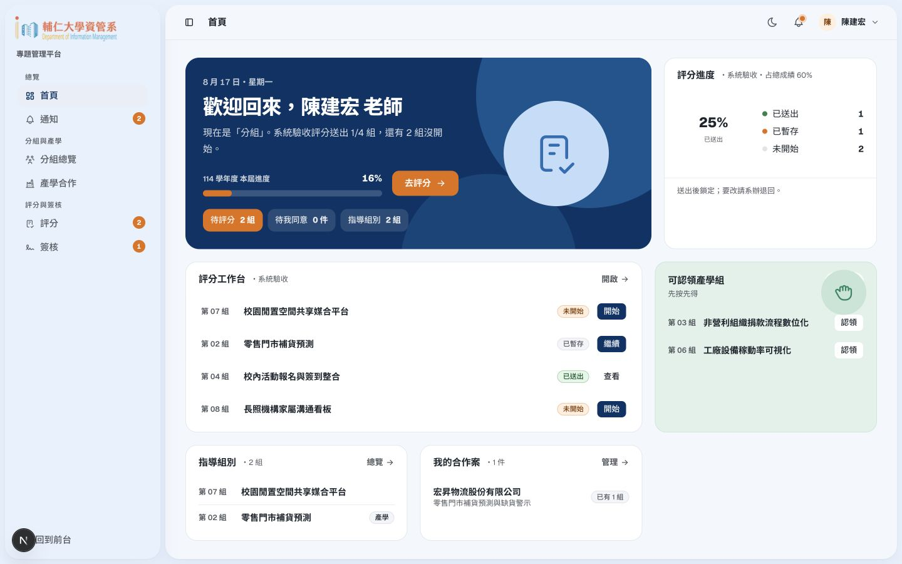
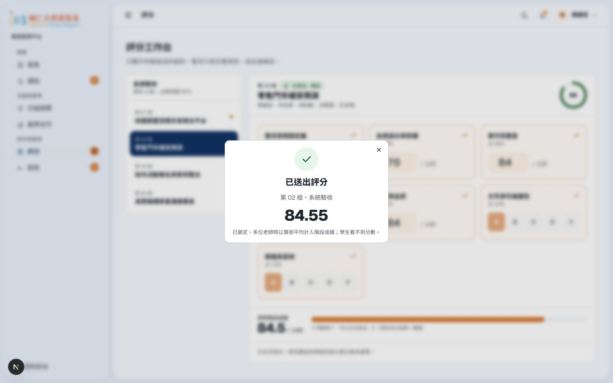
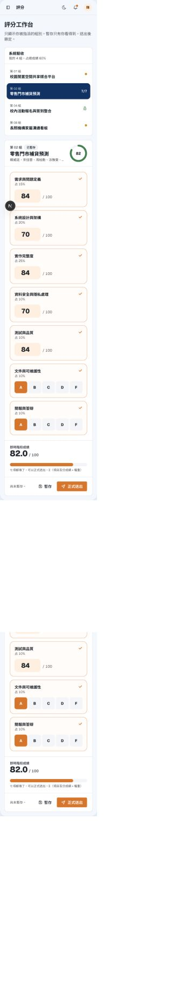

# 老師角度操作與 UI／UX 報告

2026-09-10｜localhost:3100 前端原型｜[審查方法與來源](README.md)

老師首頁和評分工作台的方向是三個角色中最清楚的：能直接找到待評組別，也沒有學生用的月曆干擾。但數字有效性、暫存可信度和組別切換必須先補齊，否則漂亮的評分介面仍可能接受錯誤成績。

## 值得保留

- 已選的 B 版分欄評分工作台，把組別隊列與評分表放在一起，適合連續評多組。
- 空白評分表不能正式送出；填一項暫存、在同一工作台切組再切回，仍能看見該項。
- 已送出有鎖定與回執的概念，符合草稿／正式成績的區別。
- 認領組別有確認步驟，且提供模擬「被其他老師先認領」的衝突回饋；這個例外值得保留，但尚非真實並行驗證。
- 簽核區能區分學生尚未齊與老師現在可處理的案件。

## 實際走查

| 任務 | 本輪操作與結果 |
| --- | --- |
| 找待評項目 | 首頁進評分，能辨別草稿與未開始，但統計口徑不一致。 |
| 不完整評分 | 第 07 組全空不能正式送出；先填 88 暫存再切組，元件內仍保留 1/7。 |
| 超上限評分 | 第 02 組將第一欄改 101，暫存、正式送出後被接受並鎖定。 |
| 切組及重返 | 工作台可切組，但網址仍留原組；離開再回來恢復 fixture。 |
| 認領 | 開確認並測模擬衝突；未執行真實占用與並行競爭。 |
| 產學案件 | 開新增、只填公司後嘗試發布，其他必填阻擋；取消測試草稿。 |
| 同意書 | 可看學生待齊；目前沒有可簽的分配情境，未完成老師簽核。 |
| 手機評分 | 360×800 下隊列堆在評分表前面，長頁可操作但進入第一欄較慢。 |

## T-01 · P1｜101/100 仍可正式送出並鎖定

**重現：**開 `/dashboard/teacher/grading/g02`，把第一個百分制數字改為 101，其餘保留，按「暫存」再「正式送出」。取得成績回執，該欄保留 101/100；回執總分 84.55，工作台呈現 84.5，圓形摘要又是 85。

**影響：**錯誤數字進入正式成績後，需系辦介入才能恢復。不同精度也讓老師不清楚哪個數字真正採計。

**建議：**每項依評分方案的型別及上下限驗證；送出前顯示「第 1 項需介於 0–100」。總分以同一精度政策呈現，明確標「預覽」或「正式採計」。正式切片的伺服器同樣驗證方案版本、評審分配與範圍，不能只靠 input 的外觀。

**驗收：**101、負數與不合法步進均被阻擋；上下限合法；畫面預覽與正式回執按同一規則顯示。權重計算與等級換算需另用既定方案案例核對，本輪未完成該數學測試矩陣。

## T-02 · P1｜「暫存」目前不足以代表可靠保存

同一元件內切換組別可保留輸入，是好的操作方向；但離開頁面重新進入後回到 fixtures。正式送出的鎖定也不是持久化證據。

**建議：**頂部固定顯示「尚未儲存／儲存中／已儲存 14:32／儲存失敗」，只有收到保存確認才顯示已儲存。離開時若有尚未保存輸入，給具體選擇。暫存、正式送出與系辦退回需維持三個清楚狀態；不要用成功 toast 代替保存狀態。

**驗收：**暫存後重新整理仍保留；斷線不得顯示成功；正式成績不能被重新開頁覆寫。這些後端與斷線情境本輪未驗證。

## T-03 · P2｜切換組別沒有更新網址

**重現：**由 g02 開始，點隊列中的 g07，右側內容改變，但網址仍是 `/grading/g02`。重整／分享網址不會回到目前正在評的組。

**建議：**以目前組別作為路由狀態；切換前處理尚未保存輸入，切換後把焦點移到組別標題。瀏覽器上一頁應回到前一組，若選擇不同策略也應讓 URL 能重建目前畫面。

## T-04 · P2｜統計沒回答「我還要做幾組」

首頁顯示待評 2，另有草稿 1；若待評排除草稿，老師實際仍有 3 組未正式送出。側欄簽核 1、首頁 0、簽核頁兩組學生尚未齊，彼此並非同一種計數。產學「我的 1」與未指派 3、連結 3 組也混合了個人及全體口徑。

**建議：**首頁使用「未開始 2／草稿 1／已送出 1」，主要 CTA 寫「繼續評分（3 組）」。簽核徽章只算老師當下可處理；學生未齊另列「等待學生 2 組」。全體統計加範圍標籤，不放在「我的」欄下。

## T-05 · P2｜評分表的語意與手機版仍需照顧

DOM 中數字欄位呈現未命名的 spinbutton，視覺上的項目名稱沒有形成足夠的可及名稱。手機版先列四組隊列才到評分內容，約一個螢幕後才開始輸入。

**建議：**每欄連結評分項目名稱、滿分、說明及錯誤訊息。桌面維持左隊列、右表單，組別與儲存狀態固定在工作區頂端；手機用「第 07 組 ▾」選擇器取代整段隊列，評分項目單欄，底部固定暫存／檢查後送出。避免送出按鈕遮住最後一項；未填數提示可直接跳到缺漏處。

## T-06 · P2｜認領與產學可再少一點判斷成本

認領衝突處理很具體，但勾選願意產學、可被認領、已指導是不同狀態，列表應各有清楚欄位或摘要。新增產學表單的必填驗證有效，視覺上卻未充分標示；「公開」一詞也應拆成「學生可見」及「網際網路公開」，避免老師誤會案件與聯絡資訊的受眾。

簽核頁保留等待學生的解釋與名單，當老師可簽時直接呈現版本和本人動作。下一輪應提供一組全員已同意 fixture，實際走一次老師同意／不同意、確認後鎖定及系辦重置；本輪因情境未提供，沒有把這段列為完成。

## 設計品味、冗餘與下一輪

老師工作區適合安靜的「評閱桌」：白底、清楚分隔線、深藍標題、只有目前組別用一小條暖色。總分不要比每個評分項目更搶眼；大型圓環可縮成等寬數字與「預覽總分」。項目間用留白建立節奏，減少每欄都包卡片。

保留「我的組別」與「評分」的不同任務，但兩邊點同一組應共享同一份組別詳情。首頁是快捷摘要，不重建另一套隊列。產學用一份案件清單加「我的／全部」篩選。不要為了統一外觀，把學生時間軸或管理員統計搬回老師首頁。

若要加 Roy 的特色，讓儲存成功的小點從空心變實心，切組時標題短暫淡入即可；評分數字不做跳動累加，以免妨礙核對。驗收先看老師能否在不丟失輸入的情況下連續完成兩組，再調動畫。
